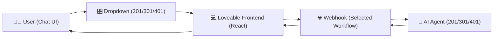

# 💻 411 — Agents Chat Frontend (Loveable)

This folder contains the **Agents Chat Frontend** workflow for n8n, designed to give students a hands-on way to interact with the agents they’ve built (`201`, `301`, `401`).
It provides a **Loveable UI** where users can select which backend workflow to route their chat to.

**URL:** https://agents-in-action-chat.lovable.app/

---

## ✨ Overview

This frontend showcases:

- 🎛 **Dropdown Selector** — choose between `201-basic`, `301-rag`, or `401-rag-search`.
- 💬 **Persistent Chat UI** — continue the conversation with memory support.
- 🎨 **Loveable Components** — styled, user-friendly interface (see `prompt.md` for the Loveable prompt).
- 🔌 **Webhook Routing** — dynamically forwards queries to the chosen n8n workflow.

👉 The full **Loveable system prompt** used to generate this UI is in [`prompt.md`](./prompt.md).

---

## 🔄 How It Works

1. User selects a workflow (201, 301, or 401) from the dropdown.
2. The frontend sends the query + `username` to the corresponding webhook URL.
3. n8n workflow processes the request (basic, RAG, or search).
4. The response is shown inline in the Loveable chat UI.

---

## ⚙️ Setup

1. **Import / Create** the Loveable frontend using the [`prompt.md`](./prompt.md).
2. **Configure Webhook URLs**

   - Update the dropdown options in the frontend to point to the **Production Webhook URLs** of your `201`, `301`, and `401` workflows.

3. **Deploy** the Loveable frontend (e.g. Vercel, Netlify, or local).
4. Open in browser → start chatting.

---

## 🧪 Try It

- Select **201** → Try: “Give me two fun facts about Sydney.”
- Select **301** → Try: “How do I enable S3 versioning?”
- Select **401** → Try: “What is AWS Lambda?”

👉 Watch how the same frontend handles different backend agent logic.

---

## 🧠 Teaching Notes

- **Frontend–Backend Separation** → Demonstrates how a single UI can connect to multiple backend agents (`201`, `301`, `401`) without changing the workflows themselves.
- **Abstraction Layer** → Students see how the UI abstracts complexity: the dropdown hides routing details while still surfacing different agent behaviors.
- **Prompt-Driven Design** → Highlights how clear, structured Loveable prompts can generate production-ready UIs (reinforcing the role of prompt engineering).
- **Experimentation Sandbox** → Encourages learners to extend the UI with new workflows, swap endpoints, or add features like history, auth, or multi-agent switching.
- **Scalability Lesson** → Models how real-world AI apps decouple UI from orchestration logic, making it easier to evolve both independently.

---

## 📚 References

- 📖 [Loveable Docs](https://docs.loveable.dev/)
- 📖 [n8n Webhook Node](https://docs.n8n.io/integrations/builtin/core-nodes/n8n-nodes-base.webhook/)
- 📖 [n8n Respond to Webhook Node](https://docs.n8n.io/integrations/builtin/core-nodes/n8n-nodes-base.respondtowebhook/)

---

## 🎓 Learn More

Ready to go deeper?
Check out these courses:

- [AI Bootcamp: _For Leaders & Managers_](https://maven.com/boring-bot/ml-system-design?promoCode=201OFF)
- [Agent Engineering Bootcamp: _For Developers & Engineers_](https://maven.com/boring-bot/advanced-llm?promoCode=200OFF)

👉 These resources expand on the workflows here and show how to apply AI + n8n in real projects.
