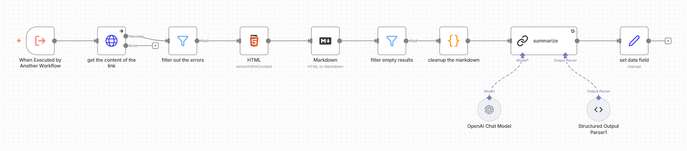
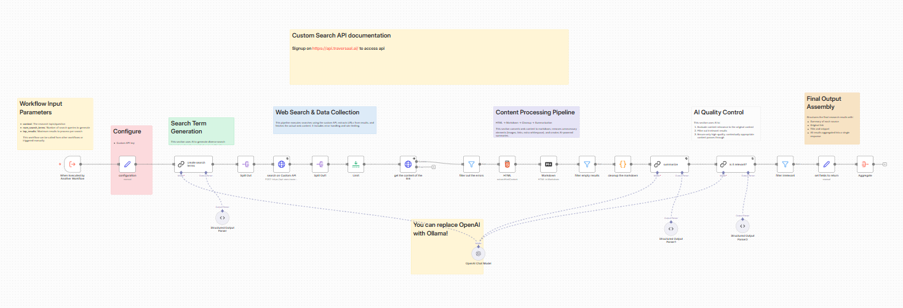

# ✍️ Apollo - Your Ultimate Blog Post Agent

This folder contains workflows and configurations for automated blog post generation using n8n and AI.

---

## ✨ Overview
The Blog Post Agent automates the process of generating high-quality blog posts. It leverages 🤖 AI to create content based on your prompts and can be extended with additional research and enrichment steps.

### 🚀 Key Features
- 📝 Automated blog post generation using AI
- 🗂️ Configurable prompts and topics
- 🔗 Can be integrated with other tools (Google Sheets, Notion, etc.)

---

## Architecture
The architecture of **Apollo** consists of a main *orchestrator* and two *sub-workflows* within the main workflow.

### Apollo - The Main Orchestrator

### Scraper

### Deep Researcher

---

## 🧩 Sub-Workflow Requirement
**To enable deep research and richer content, you should also add the `scraper` and `deep-researcher` workflows as sub-workflows.**
- 🛠️ The `scraper.json` file extracts and summarizes the content from a link. 
- 🧠 The `deep-researcher.json` file provides a research pipeline that can be called from the main blog post generator workflow.
- 📚 This allows the agent to gather and synthesize information before drafting the post.

---

## ⚙️ Setup
1. 📥 Import `apollo-blog-agent.json` into your n8n instance as the main workflow.
2. 🧠 Import `deep-researcher.json` as a sub-workflow.
3. 🛠️ Import `scraper.json` as a sub-workflow.
4. 🔑 Configure any required credentials (OpenAI, Google Sheets, Notion etc.) in n8n.
5. 🛠️ Adjust prompts and workflow logic as needed for your use case.

---

## 🚦 Usage
- ▶️ Trigger the main workflow with your desired topic or prompt.
- 🔄 The workflow will call the scraper and deep researcher sub-workflows, then generate a blog post draft.
- 📤 Output can be sent to your preferred platform (Google Docs, Notion, etc.).

---

## 📁 Files
- `apollo-blog-agent.json` — Main workflow for blog post generation
- `scraper.json` — Sub-workflow for content extraction
- `deep-researcher.json` — Sub-workflow for deep research

## 🎓 Ready to Level-Up?
Join our courses on Maven and never stop learning:
- 🤖 [Agentic AI System Design for PMs](https://maven.com/boring-bot/ml-system-design)
- 💻 [Agent Engineering Bootcamp: Developers Edition](https://maven.com/boring-bot/advanced-llm)

