# Agents in Action
## 🚀 **Build AI Agents Like a Pro!** [🌐Start Here](https://traversaal-ai.github.io/agents-in-action)

### 👋 Welcome to our course on AI Agents. 

This course is one of the top-rated courses on building AI Agents using no-code/low-code tools. So far, we’ve taught this course to over 1500 professionals, at MAVEN, Stanford Continuing Studies, UCLA and University of Minnesota, helping them gain a deep understanding of the levels of agentic architecture, enterprise-grade Retrieval Augmented Generation (RAG), and open source agentic products deployment.

Unlike most courses, this course teaches you how to think about solving real-world problems using agentic AI combined with no-code tools and enabling you to design, build, and deploy your own custom AI products and solutions.

---

## Course Mindmap

```mermaid
---
config:
  look: neo
  theme: forest
---
graph LR
    Root("<b>🚀 Agents in Action</b>") --> Obj["🎯 Objectives"] & Tech["🛠️ Tech Stack"] & Agents["🤖Agents"] & Info["🗓️Course Info"] & Aud["👨🏻‍💻Audience"]
    Obj --> O1["High ROI Use Cases"] & O2["Agent Architecture"] & O3["Enterprise RAG"] & O4["Evaluations"] & O5["Safety & Guardrails"]
    Tech --> T1["n8n & Webhooks"] & T2["Lovable"] & T3["Supabase"] & T4["OpenRouter LLMs"]
    Agents --> A1["📈 Sales & Marketing"] & A2["🔎 Content & Search"] & A3["🌐 Vertical Agents"]
    A1 --> A1a["Prospecting Agent"] & A1b["Social Automators"]
    A2 --> A2a["Perplexity Clone"] & A2b["Voice Assistant"]
    A3 --> A3a["Travel Agent"] & A3b["Finance Agent"]
    Info --> I1["6 Live Sessions"] & I2["Hands-On Exercises"] & I3["Office Hours Q/As"] & I4["Capstone Project"]
    Aud --> AU1["Product Managers"] & AU2["Business Leaders"] & AU3["Career Builders"]

    Obj@{ shape: rounded}
    Tech@{ shape: rounded}
    Agents@{ shape: rounded}
    Info@{ shape: rounded}
    Aud@{ shape: rounded}
    O1@{ shape: rounded}
    O2@{ shape: rounded}
    O3@{ shape: rounded}
    O4@{ shape: rounded}
    O5@{ shape: rounded}
    T1@{ shape: rounded}
    T2@{ shape: rounded}
    T3@{ shape: rounded}
    T4@{ shape: rounded}
    A1@{ shape: rounded}
    A2@{ shape: rounded}
    A3@{ shape: rounded}
    A1a@{ shape: rounded}
    A1b@{ shape: rounded}
    A2a@{ shape: rounded}
    A2b@{ shape: rounded}
    A3a@{ shape: rounded}
    A3b@{ shape: rounded}
    I1@{ shape: rounded}
    I2@{ shape: rounded}
    I3@{ shape: rounded}
    I4@{ shape: rounded}
    AU1@{ shape: rounded}
    AU2@{ shape: rounded}
    AU3@{ shape: rounded}
    classDef Peach stroke-width:1px, stroke-dasharray:none, stroke:#FBB35A, fill:#FFEFDB, color:#8F632D
    style Root fill:#FFE0B2,stroke:none,stroke-width:2px,color:#000000
    style Obj fill:#BBDEFB,stroke:none
    style Tech fill:#BBDEFB,stroke:none
    style Agents fill:#BBDEFB,stroke:none
    style Info fill:#BBDEFB,stroke:none
    style Aud fill:#BBDEFB,stroke:none
    style O1 stroke:none,fill:#C8E6C9
    style O2 fill:#C8E6C9,stroke:none
    style O3 fill:#C8E6C9,stroke:none
    style O4 fill:#C8E6C9,stroke:none
    style O5 fill:#C8E6C9,stroke:none
    style T1 fill:#C8E6C9,stroke:none
    style T2 fill:#C8E6C9,stroke:none
    style T3 fill:#C8E6C9,stroke:none
    style T4 fill:#C8E6C9,stroke:none
    style A1 fill:#C8E6C9,stroke:none
    style A2 fill:#C8E6C9,stroke:none
    style A3 stroke:none,fill:#C8E6C9
    style A1a fill:#E1BEE7,stroke:none
    style A1b stroke:#E1BEE7,fill:#E1BEE7
    style A2a stroke:none,fill:#E1BEE7
    style A2b stroke:none,fill:#E1BEE7
    style A3a stroke:none,fill:#E1BEE7
    style A3b stroke:none,fill:#E1BEE7
    style I1 stroke:none,fill:#C8E6C9
    style I2 stroke:none,fill:#C8E6C9
    style I3 stroke:none,fill:#C8E6C9
    style I4 stroke:none,fill:#C8E6C9
    style AU1 stroke:none,fill:#C8E6C9
    style AU2 stroke:none,fill:#C8E6C9
    style AU3 stroke:none,fill:#C8E6C9
```

---

## 📌 Learning Outcomes
By the end of this series, you will be able to:
1. **Understand the evolution of AI agents** — from Large Language Models (LLMs) to autonomous, tool-using systems capable of reasoning, memory, and planning.
2. **Master n8n as a no-code AI automation platform**, learning to build, connect, and orchestrate intelligent workflows visually.
3. **Use webhooks to connect frontends and backends**, enabling real-time, two-way communication between users and AI systems.
4. **Design and deploy full-stack AI agents for real-world applications** — including chatbots, sales assistants, research tools, and content automation systems.
5. **Implement Retrieval-Augmented Generation (RAG)** for document-aware chatbots and knowledge-driven agents.
6. **Add long-term memory and context retention to AI workflows** using databases like Supabase for personalization and persistence.
7. **Integrate voice, UI, and API tools** to create multimodal, interactive AI experiences that go beyond text-based interaction.
8. **Automate real-world processes** (e.g., lead generation, content publishing, research synthesis) with AI-human collaboration loops.
9. **Build and evaluate advanced agentic systems** that combine reasoning loops, internet search, and multi-tool orchestration.
10. **Create a meta-agent that builds other agents**, gaining the ability to auto-generate, configure, and deploy intelligent workflows from within n8n itself.

---

## 📢 Who is This Course For?
No prerequisites. Just curiosity.

Agents in Action is for anyone who wants to learn, build, and launch AI agents — without writing complex code.

You’ll discover how LLMs evolve into full AI agents, use Lovable to create frontends, use n8n to automate workflows, connect webhooks and APIs, and deploy real-world systems — from chatbots and sales agents to voice assistants and research tools.

`Build confidently, think agentically, and bring your own AI products to life.`

Whether you’re a developer, product manager, researcher, or simply an AI enthusiast — Agents in Action will take you from understanding the basics of LLMs to creating full-stack, production-ready AI workflows.

### 📌 What You’ll Learn:

✔ The evolution of **AI Agents** — from LLMs to autonomous, tool-using systems

✔ Core concepts of **agentic architecture** — memory, planning, and tool integration

✔ Real-world **GenAI applications** across sales, research, content, and automation

✔ Building intelligent workflows with **no-code tools** like n8n and Lovable

✔ Using **webhooks and APIs** to connect backends and frontends

✔ Designing **RAG-powered chatbots** and voice-enabled agents

✔ Implementing **memory, reasoning, and human-in-the-loop** systems

✔ Deploying and scaling your own **AI products and solutions**

✔ Ensuring **safety, security, and reliability** in agentic AI applications

---

## 📚 What’s Included?
✅ **16 hands-on chapters** — from AI fundamentals to full-stack agent deployment

✅ **Step-by-step projects covering real-world AI agents**:
Chatbots • Sales Agents • Voice Assistants • Research Tools • Workflow Builders

✅ **Ready-to-run n8n workflows** with complete documentation and GitHub repos

✅ **No-code + low-code tutorials** to help you connect APIs, webhooks, and frontends

---

## 📅 Course Syllabus

| Chapter# | Title | Description | n8n Workflow |
|---------|-------|-------------|------| 
| 0 | [Why we built this course?](https://traversaal-ai.github.io/agents-in-action/) | We built **Agents in Action** to demystify AI agents and show that anyone can build, understand, and deploy intelligent systems. |  |
| 1 | [From LLMs to AI Agents](https://traversaal-ai.github.io/agents-in-action/from-llms-to-ai-agents/) | Discover how Large Language Models evolve into fully functional AI agents. |  |
| 2 | [Agents are Here and They are Staying](https://traversaal-ai.github.io/agents-in-action/agents-are-here-and-they-are-staying/) | Explore how AI is evolving from generating answers to taking actions. |  |
| 3 | Build Your First End-to-End Agent |  |  |
|  | 3a. [Introducing Lovable](https://traversaal-ai.github.io/agents-in-action/meet-n8n/) | Meet Lovable, a lightweight and customizable frontend that brings your n8n agents to life — enabling real-time, conversational interfaces. | [All-In-One-Lovable](https://github.com/traversaal-ai/agents-in-action/tree/main/401-all-in-one-lovable) |
|  | 3b. [Introducing n8n & Building Your First Workflow](https://traversaal-ai.github.io/agents-in-action/meet-n8n/) | Get to know n8n, the open-source automation platform that powers your AI workflows. | [Hello n8n](https://github.com/traversaal-ai/agents-in-action/tree/main/101-hello-n8n) |
|  | 3c. [Connecting n8n & Lovable via Webhooks](https://traversaal-ai.github.io/agents-in-action/meet-n8n/) | Learn how to connect Lovable with n8n using webhooks. | [Basic Webhook](https://github.com/traversaal-ai/agents-in-action/tree/main/201-basic-webhook) | [301-lovable-webhook-n8n](https://github.com/traversaal-ai/agents-in-action/tree/main/301-lovable-webhook-n8n) |
| 4 | [Sales Agent to Find the Right Customer with AI](https://traversaal-ai.github.io/agents-in-action/sales-agent-to-find-the-right-customer/) | Build your first real-world AI Sales Agent using n8n — an automated system that researches, qualifies, and reaches out to high-potential leads. | [Sales Prospects Agent](https://github.com/traversaal-ai/agents-in-action/tree/main/sales-porspects-agent) |
| 5 | [Build a Chatbot that Knows Your Documents](https://traversaal-ai.github.io/agents-in-action/chatbot-that-knows-your-documents/) | Build a document-aware chatbot using n8n, OpenRouter, and RAG. | [Chatbot that Knows Your Docs](https://github.com/traversaal-ai/agents-in-action/tree/main/chatbot-that-knows-your-documents) |
| 6 | [Build Your Own Perplexity Clone](https://traversaal-ai.github.io/agents-in-action/build-your-own-perplexity-clone/) | Build your own Perplexity-style AI agent using n8n, combining RAG, Internet Search, and smart tool routing to answer AWS-related questions, searching the web for fresh info, and gracefully declining out-of-scope queries. | [Your Own Perplexity Clone](https://github.com/traversaal-ai/agents-in-action/tree/main/your-own-perplexity-clone) |
| 7 | [Teach your RAG Agent to Remember](https://traversaal-ai.github.io/agents-in-action/supabase-rag-with-memory/) | Teach your RAG Agent to think, remember, and respond like a pro — this workflow adds persistent memory to your Retrieval-Augmented Generation chatbot. | [RAG Agent with Memory](https://github.com/traversaal-ai/agents-in-action/tree/main/supabase-rag) |
| 8 | [Give Your Book a Voice - The AI Assistant Edition](https://traversaal-ai.github.io/agents-in-action/book-companion-voice-rag-agent/)| Give your book a voice with this AI-powered Voice RAG Agent — a full-stack, speech-to-speech assistant that lets readers talk to your book in real time. | [Your Book's Voice Companion](https://github.com/traversaal-ai/agents-in-action/tree/main/book-companion-voice-rag-agent) |
| 9 | [Automate Your Content - YouTube to LinkedIn with AI](https://traversaal-ai.github.io/agents-in-action/youtube-to-linkedin-agent/) | Automate your content workflow with a YouTube-to-LinkedIn AI Agent that transforms videos into engaging LinkedIn posts. | [YouTube to LinkedIn](https://github.com/traversaal-ai/agents-in-action/tree/main/youtube-to-linkedin) |
| 10 | [The Unofficial AirBnb AI Agent](https://traversaal-ai.github.io/agents-in-action/the-unofficial-airbnb-ai-agent/) | Build the Unofficial Airbnb AI Agent — a conversational, context-aware search system powered by MCP integration, memory, and intelligent recommendations. | [Airbnb Agent](https://github.com/traversaal-ai/agents-in-action/tree/main/airbnb-agent) | 
| 11 | [LinkedIn Human-in-the-Loop Agent](https://traversaal-ai.github.io/agents-in-action/linkedin-post-human-in-the-loop/) | Create a Human-in-the-Loop LinkedIn Post Agent that combines AI automation with human review, generating technically precise, style-matched LinkedIn posts from AI news feeds. | [LinkedIn Human in the Loop](https://github.com/traversaal-ai/agents-in-action/tree/main/linkedpost-human-in-the-loop) |
| 12 | [The Ultimate AI Blog Post Agent](https://traversaal-ai.github.io/agents-in-action/the-ultimate-ai-blog-post-agent/) | Build the Ultimate AI Blog Post Agent — a research-driven content creation system that automates deep research, article synthesis, and professional publishing. | [Blog Post Agent](https://github.com/traversaal-ai/agents-in-action/tree/main/blog_post_agent) |
| 13 | [Fully Functional Agent Loop - The Travel Agent](https://traversaal-ai.github.io/agents-in-action/travel-agent/) | Build a ReAct-based AI Travel Agent using n8n and MCP integration that plans complete trips from natural language input — handling flights, hotels, itineraries, calendar events, and email delivery. | [Travel Agent](https://github.com/traversaal-ai/agents-in-action/tree/main/travel-agent) |
| 14 | [Intelligent Research - Build The Ultimate AI Research Assistant](https://traversaal-ai.github.io/agents-in-action/the-ultimate-ai-research-assistant/) | Build the Ultimate AI Research Assistant — an intelligent dual-search agent that seamlessly combines real-time internet search with private document RAG retrieval. | [Research Assistant](https://github.com/traversaal-ai/agents-in-action/tree/main/simplest-rag-internet-search) |
| 15 | [Investment Intelligence - Build The Ultimate AI Finance Agent](https://traversaal-ai.github.io/agents-in-action/the-ultimate-ai-finance-agent/) | Build the Ultimate AI Finance Agent — your intelligent financial analyst that combines real-time market research, economic trend analysis, and investment strategy. | [Finance Agent](https://github.com/traversaal-ai/agents-in-action/tree/main/finance-agent) |
| 16 | [An Agent that Creates Other Agents](https://traversaal-ai.github.io/agents-in-action/workflow-creator/) | Build the Workflow Creator Agent — an intelligent automation designer that helps you visually create, configure, and manage complex n8n workflows with modular templates, reusable components, and seamless integrations. | [Workflow Creator](https://github.com/traversaal-ai/agents-in-action/tree/main/workflow_creator) |

---

## On Demand Sessions by **[Hamza Farooq](https://www.linkedin.com/in/hamzafarooq/)**
|  |  |
|--------|--------|
|  |  |
|  |  |

---

## 🔥 Why Take This Course?
Unlike most AI courses, this course teaches you how to solve a real-world problem using AI agents with no-code/low-code approach and launch your own startup.

By the end, you’ll be able to:

✅ Build highly effective Agentic AI applications

✅ Deploy cost-efficient and scalable AI solutions

## ⭐ What Students Are Saying
*"Hamza was incredibly available and supportive throughout the course. His guidance on the capstone kept me focused and his framework for thinking about agentic AI use cases is something I’ve already started applying in my day-to-day work. Highly recommend."*

**Valisha**, *Head of Product Strategy*

*"This course really stands out from all the agentic courses out there. Most courses focus on learning theories, or building prototypes, but with this course I can build agentic systems serving my daily life and 10X my productivity."*

**Chilann**, *Product Manager*

*"Having taken several of Hamza's courses (including his LLM Agentic RAG Developer's Edition), I came to this No-Code/Low-Code course eager to expand my toolkit — and it absolutely delivered! This course was simply eye-opening for someone accustomed to traditional build processes. The game-changer: Learning to achieve "Visual Confirmation" with stakeholders in hours, not weeks."*

**Kurt**, *Co-Founder*

---

## 🙌 Testimonials

---

## 📢 Attribution & Credits
If you use our course material, content, or research in your work, please credit me and the respective contributors.

🔹 Proper citation format:

Farooq, H. (2025). *Agentic AI System Design for PMs*

📌 Tagging & mentions are always appreciated! 😊

---

## 🧑‍💻 Contributors
- [Hamza Farooq](https://github.com/hamzafarooq)
- [Gabriela de Queiroz](https://github.com/gdequeiroz) 
- [Jaya Rajwani](https://github.com/JayaRajwani)
- [Bhavna Jain](https://substack.com/@bhavnajain)
- [Taha Hussain](https://github.com/Taha-Traversaal)
- [Yousuf Alvi](https://github.com/yousuf-alvi)
- [Amina Javaid](https://github.com/aminajavaid30)
  
---

## 🧠 Contribute

We welcome community builds! If you've worked on an interesting agent, automation, or frontend workflow:
- Fork this repo
- Submit a pull request with a new project folder
- Add clear README + `n8n` file + code/demo

Let’s build the agentic internet — together.

---

## 📬 Stay in the Loop

Follow [@hamzafarooq](https://www.linkedin.com/in/hamzafarooq/) and [@gabrieladequeiroz](https://www.linkedin.com/in/gabrieladequeiroz/) on LinkedIn

📬 Subscribe to the **Generative AI for Everyone** newsletter → [Join here](https://boringbot.substack.com)

---

## License

APACHE 2.0 License — use, remix, and deploy freely (with attribution)

## 🎓 Ready to Level-Up?
Join our courses on Maven and never stop learning:
- 🤖 [Agentic AI System Design for PMs — _For Leaders, Managers & Career Builders_](https://maven.com/boring-bot/ml-system-design?promoCode=201OFF)
- 💻 [Agent Engineering Bootcamp: Developers Edition — _For Developers, Engineers & Researchers_](https://maven.com/boring-bot/advanced-llm?promoCode=200OFF)

Watch our Agent Bootcamp Playlist on YouTube:
- ▶️ [Agent Bootcamp 2025](https://www.youtube.com/playlist?list=PLrfvDRVRE-H4ZoJ5LDzArOC4n9FCVJN-g)

