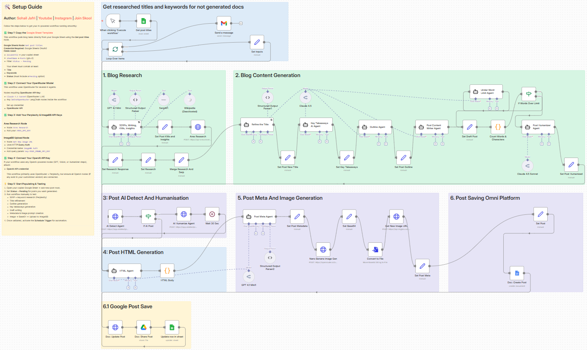
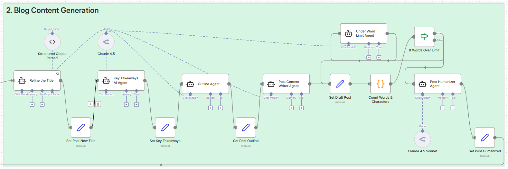
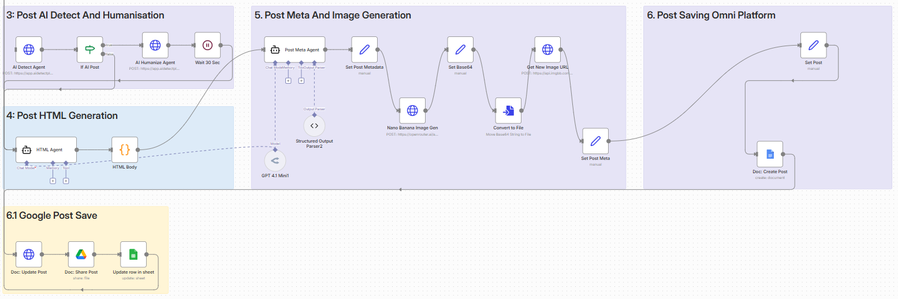

# ✍️ SEO Blog Writer Agent

This folder contains workflows and configurations for **automated, SEO-optimized blog generation** using **n8n** and **AI agents**.

The SEO Blog Writer Agent is designed to take blog ideas from a structured source, perform research, write long-form content, optimize it for search engines, and publish it automatically.

---

## ✨ Overview

The **SEO Blog Writer Agent** automates the entire blog creation lifecycle — from **SERP research** to **HTML-ready content and publishing**.

It uses a **multi-agent architecture** where each agent focuses on a specific task such as research, outlining, writing, humanizing, SEO metadata generation, and image creation.

---

## 🚀 Key Features

- 🔍 Automated SERP & deep research
- 🧠 Multi-agent content generation
- ✍️ SEO-optimized long-form writing
- 🤖 AI detection & humanization flow
- 📏 Word-limit enforcement
- 🖼️ AI image generation & hosting
- 🌐 HTML-ready blog output
- 📘 Google Docs publishing
- 📄 Google Sheets–driven task management
- 📬 Email notification on completion

---

## 🏛️ Architecture

The **SEO Blog Writer Agent** consists of a main *orchestrator workflow* and multiple *internal agent pipelines*.

### SEO Blog Writer — Main Orchestrator

### Research Pipeline

### Writing Pipeline

### Optimization & Upload Pipeline

---

## 🧩 Agent Pipelines

This workflow relies on **internal agent chains and tool nodes** rather than external sub-workflows.

However, it integrates multiple research and enrichment steps internally:

- 🔍 **SERP & keyword insights**
- 📊 **Ares deep research**
- 🧠 **Title, outline & content agents**
- 🤖 **AI detection & humanizer**
- 🏷️ **SEO metadata generator**
- 🖼️ **Image generation & upload**

> No additional sub-workflow imports are required — everything runs inside the main workflow.

---

## ⚙️ Setup

1. 📥 Import `seo_blog_writer.json` into your n8n instance.
2. 📄 Copy the Google Sheet template and update its ID in the workflow.
3. 🔑 Configure required credentials in n8n:
   - OpenRouter (Claude / GPT models)
   - Google Sheets & Docs
   - Ares Research API
   - AIDetectPlus API
   - ImageBB API
   - Gmail (optional)
4. 🛠️ Adjust prompts, word limits, or agents as needed.

---

## 🚦 Usage

- ▶️ Add blog ideas to the Google Sheet.
- 🟡 Set **Status = Pending** for posts to be generated.
- ▶️ Execute the workflow manually (for testing) or via schedule.
- 🔄 The agent will:
  - Perform research
  - Write and optimize the blog post
  - Generate images & metadata
  - Publish to Google Docs
  - Update the Sheet and notify via email

---

## 📁 Files

- `seo_blog_writer.json` — Main SEO blog writing workflow
- `images/` — Architecture and workflow screenshots

---

## 🎓 Ready to Level-Up?

Join our courses on Maven and never stop learning:

- 🤖 [Agentic AI System Design for PMs — _For Leaders, Managers & Career Builders_](https://maven.com/boring-bot/ml-system-design?promoCode=201OFF)
- 💻 [Agent Engineering Bootcamp: Developers Edition — _For Developers, Engineers & Researchers_](https://maven.com/boring-bot/advanced-llm?promoCode=200OFF)

---

🚀 **This agent demonstrates how production-grade SEO content can be generated using agentic AI workflows in n8n.**
