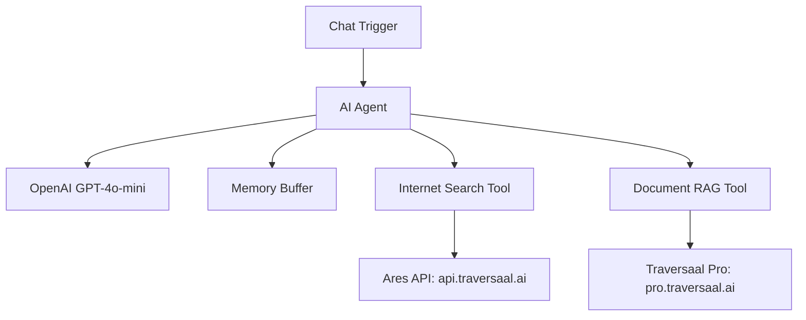

# 🤖 AI Research Assistant with Ares Internet Search & Traversaal Pro RAG

A comprehensive **n8n** workflow that provides AI-powered research assistance using two specialized **Traversaal APIs** for both real-time internet search and document-specific retrieval.

---

## 🌟 Features

* 🌐 **Real-time Internet Search** via Ares API (`api.traversaal.ai`)
* 📚 **Document-based RAG Search** via Traversaal Pro (`pro.traversaal.ai`)
* 🤖 **Intelligent Tool Selection** – Agent decides whether to use internet or document search
* 💬 **Conversational Interface** with memory for context retention
* 📧 **HTML Email Generation** for research summaries
* 🔄 **Multi-Angle Research** capability for deeper, broader answers

---

## 🏗️ Architecture



---

## 🛠️ Setup Instructions

### Prerequisites

* n8n instance (cloud or self-hosted)
* OpenAI API account and key
* Traversaal API access

### 1. Traversaal API Setup

**For Ares Internet Search:**

* Sign up at [Traversaal](https://api.traversaal.ai)
* Navigate to API section and generate an API key
* Copy the API key for configuration

**For Traversaal Pro RAG:**

* Access [Traversaal Pro](https://pro.traversaal.ai)
* Upload your document collection
* Generate a Bearer token for your project
* Note your project IDs

### 2. n8n Workflow Configuration

#### Import the Workflow

```bash
# Copy the JSON from the workflow file and import into n8n
```

#### Configure OpenAI Credentials

* Add your OpenAI API key in n8n Credentials
* Set in the "OpenAI Chat Model" node

#### Set Up Internet Search API

In the **"Internet Search"** node:

```json
{
  "name": "x-api-key",
  "value": "your_traversaal_api_key_here"
}
```

#### Configure Document RAG (Optional)

In the **"AWS Document Search"** node:

```json
{
  "name": "Authorization",
  "value": "Bearer your_traversaal_pro_token_here"
}
```

#### Activate the Workflow

* Click "Activate" to enable the webhook
* Copy the webhook URL for your interface

---

## 📝 Usage

### Starting a Research Session

Example message:

```
Research the latest developments in quantum computing in 2025
```

### Common Query Types

* 🔍 Current Events: “Latest AI industry trends this month?”
* 🛍️ Product Research: “Top project management tools”
* 🧑‍💻 Technical Docs: “Setup AWS Lambda functions” (uses RAG)
* 📈 Market Trends: “Crypto predictions for 2025”

### Agent Behavior

* Analyzes input
* Chooses best tool (internet/documents)
* Synthesizes answers
* Optionally generates HTML email summaries

---

## 🔧 Customization

### Add New Documents

* Upload new PDFs to Traversaal Pro
* Add a new HTTP node in n8n
* Use your Bearer token for auth

### Modify Agent Behavior

* Update the AI system prompt
* Change search result depth or format
* Adjust temperature or model

### Email Format

* Auto-generated subject
* HTML-rich formatting
* Sources and references embedded

---

## 🌐 API Endpoints

| Tool                 | Endpoint                                                    | Auth Type      | Purpose                |
| -------------------- | ----------------------------------------------------------- | -------------- | ---------------------- |
| Ares Internet Search | `https://api-ares.traversaal.ai/live/predict`               | `x-api-key`    | Real-time web search   |
| Traversaal Pro RAG   | `https://pro-documents.traversaal-api.com/documents/search` | `Bearer token` | Doc-based semantic RAG |

---

## 📊 Workflow Components

| Component       | Purpose                      | Notes                   |
| --------------- | ---------------------------- | ----------------------- |
| Chat Trigger    | Initiates chat flow          | Webhook-based trigger   |
| AI Agent        | Core reasoning and selection | Orchestrates logic      |
| OpenAI Model    | Text generation              | GPT-4o-mini recommended |
| Memory Buffer   | Context preservation         | Adjustable window       |
| Internet Tool   | Real-time info               | Uses Ares API           |
| Doc Search Tool | RAG from private docs        | Uses Traversaal Pro     |

---

## 🔍 Troubleshooting

* **API Key Errors:** Check if keys are valid and correctly entered
* **No Results:** Validate endpoint, request format, and keys
* **Memory Glitches:** Clear chat history and resize buffer
* **Document Issues:** Confirm document upload + Bearer token

Enable `debug mode` in n8n for detailed logs and decision flow.

---

## 📈 Performance Tips

* Use **specific keywords**
* Break down complex questions
* Combine **Ares + RAG** for best results
* Rotate API keys regularly

---

## 🤝 Contributing

* Fork this repo
* Add new tools or agents
* Submit PRs with clean commits

---

## 📄 License

MIT License. Use responsibly and respect API limits.

---

## 🙋‍♂️ Support

* [n8n Docs](https://docs.n8n.io)
* [Traversaal Support](https://traversaal.ai)
* Open GitHub issues for this workflow

---

## 🎓 Learn More
Want to build and customize more AI agents like this?\
🤖 [AI Bootcamp: Generative AI Beyond the Hype](https://maven.com/boring-bot/ml-system-design)\
💻 [Agent Engineering Bootcamp: Developers Edition](https://maven.com/boring-bot/advanced-llm)\
📂 [GitHub: Agents in Action](https://github.com/traversaal-ai/agents-in-action)
