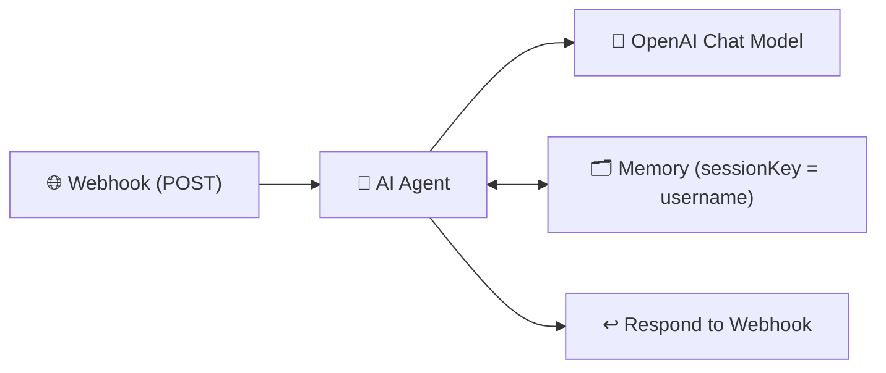

# 🪝 201 — Basic Webhook → OpenAI

This folder contains the **Basic Webhook workflow** for n8n.
It shows the simplest “**HTTP in → AI out**” pattern using a **Webhook**, **AI Agent**, **OpenAI**, and **Memory**.

---

## ✨ Overview

Send a POST request to an n8n **Webhook**, pass a prompt, and get a short AI answer back.
Test with `curl`, Postman, or the provided **Colab notebook**.

---

## 🚀 Key Features

- 🌐 **Webhook Trigger** — receive a JSON payload over HTTP (POST).
- 🧠 **AI Agent** — enforces simple, consistent response rules.
- 🤖 **OpenAI Chat Model** — generates replies (e.g. `gpt-4o-mini`).
- 🗂️ **Memory** — per-user conversation via `username` (session key).

---

## 🔄 How It Works



1. Client sends `POST` JSON → **Webhook**.
2. **AI Agent** reads the prompt and rules.
3. **OpenAI** generates a short reply.
4. **Memory** uses `username` to keep per-user context.
5. The workflow **responds** to the HTTP request.

---

## 🛂 Inputs (JSON Body)

- `query` _(string, required)_ → the user’s prompt/message.
- `username` _(string, recommended)_ → stable identifier for memory.

**Example**

```json
{
  "query": "Tell me two fun facts about Sydney.",
  "username": "demo-user-1"
}
```

> The Webhook node exposes your payload under `body`. The workflow reads `body.query` and `body.username`.

---

## 📤 Output

- HTTP 200 with the AI’s reply (plain text or a small JSON wrapper, depending on n8n config).

---

## ⚙️ Setup

1. **Import** `201-basic.json` into your n8n Cloud workspace.
2. **Credentials** → configure **OpenAI** (API key).
3. Open the **Webhook** node and **Activate** the workflow (top-right).
4. Copy the **Production Webhook URL** (not the Test URL).

> ⚠️ **Use the Production Webhook URL**
> The Test URL is temporary. For Colab/Postman/cURL, **activate** the workflow and use the **Production** URL.

---

## 🧪 Try It

### Option A — cURL

```bash
WEBHOOK_URL="https://<your-n8n>/webhook/<id>"   # Paste the Production URL
curl -X POST "$WEBHOOK_URL" \
  -H "Content-Type: application/json" \
  -d '{"query":"Tell me two fun facts about Sydney.","username":"demo-user-1"}'
```

### Option B — Postman

1. New → **POST** request to your **Production Webhook URL**.
2. Body → **raw** → **JSON**:

   ```json
   {
     "query": "In two bullets, why is Bondi Beach popular?",
     "username": "demo-user-1"
   }
   ```

3. Send → See the reply.

### Option C — **Google Colab (Python)**

- Open the instructor’s Colab:
  **[201 Basic — Webhook Client (Colab)](https://colab.research.google.com/drive/1o66IjJDEQZ404gs5MNiItm2WqxcU2bzx?usp=sharing)**
- **Make it editable:**

  - Click **Copy to Drive** (or **File → Save a copy in Drive**) to create your own editable copy.

- **Update the webhook URL variable:**

  - In your copy, locate the variable that holds the webhook URL (commonly named `url` or `WEBHOOK_URL`) and **paste your Production Webhook URL** from n8n.

- **Run the notebook:**

  - Click **Runtime → Run all** (or run cells sequentially).
  - You should see the HTTP status and the AI’s reply printed.

> If the notebook uses a variable named `url`, replace that value with your Production Webhook URL. If it uses `WEBHOOK_URL`, replace that instead.

---

## 🧰 Troubleshooting

- **404 / 405** → Workflow not **Active**, wrong method (must be **POST**), or wrong URL.
- **401 / 403** → Check n8n auth/network; verify your Production URL.
- **Empty/odd response** → Ensure JSON body has `query` and `username`, and header is `Content-Type: application/json`.
- **Memory not sticking** → Use a stable `username` (same value across requests).

---

## 🧠 What to Notice (Teaching Points)

- The exact wording of `query` changes the answer — try general vs. specific prompts.
- `username` enables per-user conversational continuity.
- This pattern is the foundation for app integrations (next) and RAG.

---

## 📚 References

- 📖 [n8n Webhook Docs](https://docs.n8n.io/integrations/builtin/core-nodes/n8n-nodes-base.webhook/)
- 📖 [Respond to Webhook](https://docs.n8n.io/integrations/builtin/core-nodes/n8n-nodes-base.respondtowebhook/)
- 📖 [AI / OpenAI Nodes](https://docs.n8n.io/advanced-ai/intro-tutorial/#what-you-will-need/)
