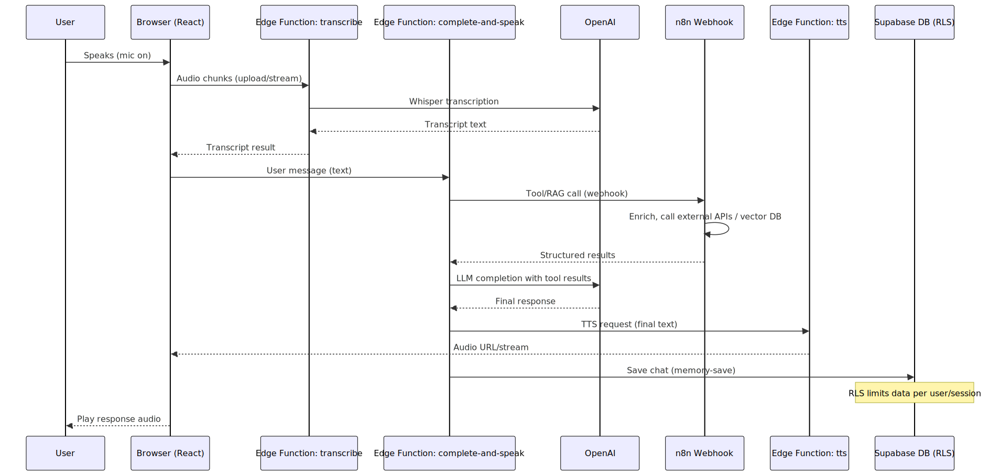

# 🎙️🤖🔎 Book Companion Voice RAG Agent

## Building an LLM Application (from Scratch)

A complete voice-enabled book companion system with **n8n** as the core RAG engine, integrated into a full-stack application with React frontend, Supabase backend, and real-time voice interaction capabilities.

**URL:** https://building-llm-apps-from-scratch-companion.lovable.app/

---

## 🌟 Features

- 🎙️ **Full Voice Interface**: Complete speech-to-speech interaction using React frontend
- 🔍 **Intelligent RAG Search**: n8n workflow provides semantic document retrieval
- 🗃️ **Full-Stack Architecture**: React + Supabase + Edge Functions + n8n integration
- 💾 **Session Management**: User authentication and chat memory persistence
- ⚡ **Real-time Experience**: Live transcription and instant voice responses
- 📚 **Book-Focused**: Specialized for "Building LLM from Scratch" content

---

## 🏗️ System Architecture

This system combines multiple components for a complete voice AI experience:

### Frontend (React)

Browser-based voice interface with real-time audio processing

### Backend (Supabase)

- **Authentication**: User sessions and security
- **Edge Functions**: Transcription, completion, TTS, and memory management
- **Database**: Chat history with Row Level Security (RLS)
- **Realtime**: Live subscriptions and updates

### RAG Engine (n8n)

- **Vector Search**: Semantic document retrieval
- **External Integration**: Connects to vector databases and APIs
- **Webhook Interface**: RESTful integration with Supabase functions

### Voice Processing Flow

The complete voice interaction follows this sequence:

1. User speaks → Browser captures audio
2. Audio transcribed via Whisper → Text displayed
3. RAG search via n8n webhook → Document chunks retrieved
4. LLM processes with context → Response generated
5. Text-to-speech → Audio played back

---

## 🚀 Quick Start

### ✅ Prerequisites

- An `n8n` instance (cloud or self-hosted)
- OpenAI API Key with embeddings access
- Supabase account (for vector storage)
- Pre-processed "Building LLM from Scratch" document vectors

---

### 🔑 Required Credentials in n8n

| Service  | Purpose                        |
| -------- | ------------------------------ |
| OpenAI   | Embeddings for semantic search |
| Supabase | Hosts vector embeddings        |

---

## 📋 Setup Instructions

### Step 1: Import and Configure

1. Import the workflow JSON into your n8n instance
2. Add OpenAI and Supabase credentials
3. Ensure your Supabase "documents" table contains vectorized book content
4. Activate the webhook trigger

### Step 2: API Integration

1. Copy the webhook URL from the Webhook node
2. Integrate with your frontend application or service
3. Send POST requests with questions in the request body
4. Receive instant document chunks as JSON responses

---

## 🔧 Configuration

### Search Settings

- Embedding Model: `text-embedding-3-large`
- Vector Store Table: `documents` (Supabase)
- Top Results: 2 most relevant chunks
- Metadata: Excluded for clean responses

### API Settings

- HTTP Method: POST
- CORS: Enabled for web integration
- Response Format: JSON with document chunks
- Input: `question` field in request body

---

## 🛠️ Customization

### Adjust Search Parameters

- Modify `topK` value for more/fewer results
- Include metadata for citations if needed
- Tune similarity thresholds

### Extend Functionality

- Add authentication middleware
- Implement caching for frequent queries
- Connect multiple document collections
- Add request logging and analytics

---

## 📊 Example Use Cases

**API Client:** "What are transformers in LLMs?"
**Response:** Returns relevant book chunks about transformer architecture

**Frontend App:** "Explain attention mechanisms"
**Response:** Provides document sections on attention from the book

**Chatbot Integration:** "How do you train an LLM?"
**Response:** Delivers training methodology chunks for processing

---

## 🧪 Troubleshooting

### 🛑 No Search Results?

- Ensure vectors are stored in Supabase
- Verify embedding model consistency
- Check question format is plain text

### ❌ API Connection Issues?

- Confirm webhook URL accessibility
- Test with curl or Postman
- Verify CORS settings for browser requests

### ⚠️ Empty Responses?

- Check Code node data extraction logic
- Verify Supabase table structure
- Ensure embeddings are properly indexed

---

## 📈 Optimization

### 💸 Cost

- No LLM costs, only embedding API calls
- Minimal processing overhead
- Pay-per-search model

### ⚡ Speed

- Direct vector search without AI reasoning
- Lightweight JSON responses
- Stateless design for fast scaling

---

## 🔐 Security

- Store credentials securely in n8n
- Consider API authentication for production
- Implement rate limiting to prevent abuse
- Use HTTPS for webhook communications

---

## 📚 Resources

- 📖 [n8n Docs](https://docs.n8n.io/)
- 🧠 [LangChain Node Integration](https://docs.n8n.io/integrations/langchain/)
- 🔍 [Supabase Vector Guide](https://supabase.com/docs/guides/ai)
- 🤖 [OpenAI Embeddings API](https://platform.openai.com/docs/guides/embeddings)

---

## 🤝 Contributing

We welcome:

- Bug reports & PRs
- Performance improvements
- API enhancements & tooling

---

## 🎓 Learn More
Want to build and customize more AI agents like this?\
🤖 [AI Bootcamp: Generative AI Beyond the Hype](https://maven.com/boring-bot/ml-system-design)\
💻 [Agent Engineering Bootcamp: Developers Edition](https://maven.com/boring-bot/advanced-llm)\
📂 [GitHub: Agents in Action](https://github.com/traversaal-ai/agents-in-action)

---

## 📄 License

Provided for educational & practical use. Please comply with TOS of APIs used.
