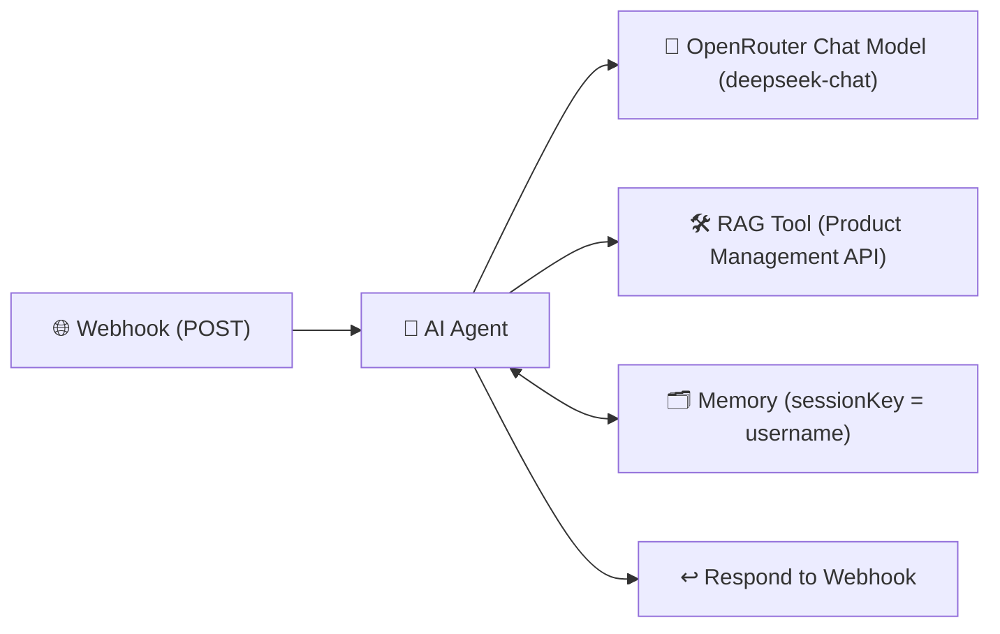
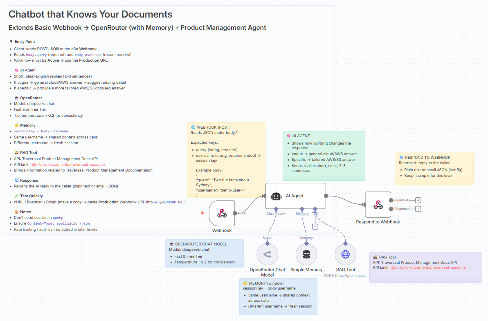

# 💬 Chatbot that Knows Your Documents (OpenRouter + Product Management Agent)

This folder contains the **Webhook + Retrieval-Augmented Generation (RAG)** workflow for **n8n**, powered by **OpenRouter**’s _deepseek-chat_ model.
It demonstrates how prompt wording and topic specificity change the AI’s response — while adding a **RAG tool for Product Management insights**.

---

## ✨ Overview

This workflow expands the **201-basic-webhook** pattern by introducing **memory**, **OpenRouter free-tier LLM**, and a **RAG API tool** for contextual answers.
It creates a **Product Management AI Agent** that:

- 🧠 Uses **RAG** for **Product Management questions**
- 💬 Uses the **LLM (deepseek-chat)** for **general or AWS-related questions**
- 🙅 Politely declines **out-of-scope or non-relevant questions**
- 🧍 Keeps short, simple replies (2–3 sentences), emphasizing clarity and prompt impact

---

## 🔄 How It Works



1. **Webhook** receives JSON (`query`, `username`).
2. **AI Agent** decides how to respond:

   - If the topic involves **Product Management** → call the **RAG Tool**.
   - Otherwise → use the **deepseek-chat** model directly.
   - For vague questions → respond generally and guide users to be more specific.

3. **Memory Buffer (Window)** stores short-term conversation context by username.
4. **Response Node** returns the generated reply to the client.

---

## 🏛️ Architecture



---

## 🛂 Inputs (JSON Body)

| Field      | Type   | Required       | Description                           |
| ---------- | ------ | -------------- | ------------------------------------- |
| `query`    | string | ✅             | User’s input message                  |
| `username` | string | 🟢 Recommended | Session key for conversational memory |

**Example**

```json
{
  "query": "What are best practices for Product Managers when prioritizing features?",
  "username": "demo-user-1"
}
```

---

## 📤 Output

- **HTTP 200 OK** with a short AI reply.
- Reply style examples:

  - “(Answer from Product Management knowledge base)” — via RAG Tool
  - “(General or AWS-based answer)” — via model
  - “(Out-of-scope polite refusal)” — for unrelated queries

---

## ⚙️ Setup

1. **Import** `chat-with-docs.json` into your **n8n Cloud** workspace.
2. **Credentials → Configure:**

   - 🔑 **OpenRouter API** (create a free account at [openrouter.ai](https://openrouter.ai))
   - 🔑 Optional: API key for the **Traversaal Product Docs API** (used by the RAG Tool)

3. **In the “RAG Tool” node**, replace:

   ```bash
   Authorization: your_traversaal_api_auth_brearer_token_here
   ```

   with your actual bearer token.

4. **Activate** the workflow and copy the **Production Webhook URL** (from the Webhook node).
5. Optionally adjust the `systemMessage` inside the AI Agent node to modify tone or domain focus.

---

## 🧪 Try It

### Option A — Google Colab (Recommended)

1. Open the instructor’s Colab notebook:
   **[Chatbot that Knows Your Documents — Client (Colab)](https://colab.research.google.com/drive/1o66IjJDEQZ404gs5MNiItm2WqxcU2bzx?usp=sharing)**
2. Click **File → Save a copy in Drive**.
3. Replace `WEBHOOK_URL` with your **Production Webhook URL** from n8n.
4. Run all cells and test:

   - 🧠 “What are best practices for Product Managers?”
   - ☁️ “Tell me about AWS S3 buckets.”
   - 🏙️ “What is the capital of France?”

> 💡 Use the same `username` to maintain context; new names start fresh sessions.

---

### Option B — cURL

```bash
WEBHOOK_URL="https://<your-n8n>/webhook/<id>"   # Use Production URL
curl -X POST "$WEBHOOK_URL" \
  -H "Content-Type: application/json" \
  -d '{"query":"List key principles of Product Management","username":"demo-user-1"}'
```

### Option C — Postman

1. Create a **POST** request → `Production Webhook URL`
2. Body → Raw → JSON:

   ```json
   {
     "query": "How can I improve sprint planning as a Product Manager?",
     "username": "demo-user-1"
   }
   ```

3. Click **Send** → view AI reply.

---

## 🧠 What to Notice (Teaching Points)

- Demonstrates **how prompt wording changes the model’s specificity**.
- Shows **AI tool routing** (LLM vs RAG) within a single workflow.
- Highlights the benefit of **contextual memory** via `sessionKey`.
- Provides a **budget-friendly OpenRouter setup** (deepseek-chat is free tier).
- Encourages experimentation with tone and system instructions.

---

## 📚 References

- 📖 [Traversaal Product Management Docs API](https://pro-documents.traversaal-api.com/)
- 📖 [OpenRouter — deepseek-chat model](https://openrouter.ai/models/deepseek/deepseek-chat)
- 📖 [n8n — AI Agent node](https://docs.n8n.io/integrations/builtin/cluster-nodes/root-nodes/n8n-nodes-langchain.agent/)
- 📖 [n8n — HTTP Request Tool](https://docs.n8n.io/integrations/builtin/core-nodes/n8n-nodes-base.httprequest/)
- 📖 [n8n — Memory Buffer Window](https://docs.n8n.io/integrations/builtin/cluster-nodes/sub-nodes/n8n-nodes-langchain.memorybufferwindow/)

---

> 🪄 Learn how to chain OpenRouter, RAG, and custom APIs in your own workflows — the same pattern used here.

## 🎓 Ready to Level-Up?
Join our courses on Maven and never stop learning:
- 🤖 [Agentic AI System Design for PMs — _For Leaders, Managers & Career Builders_](https://maven.com/boring-bot/ml-system-design?promoCode=201OFF)
- 💻 [Agent Engineering Bootcamp: Developers Edition — _For Developers, Engineers & Researchers_](https://maven.com/boring-bot/advanced-llm?promoCode=200OFF)
