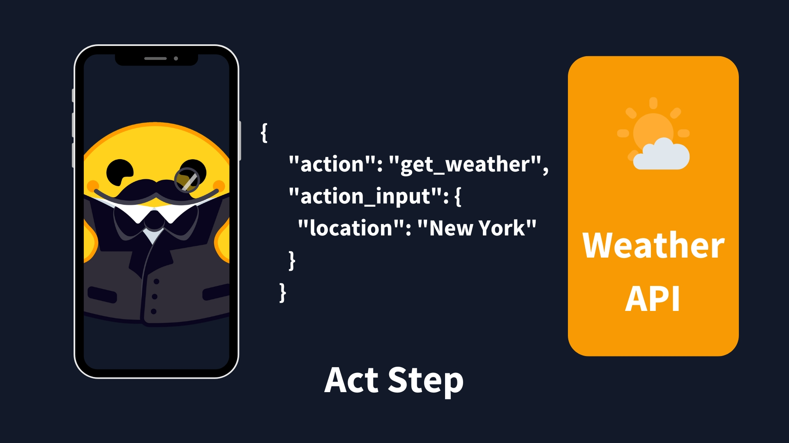
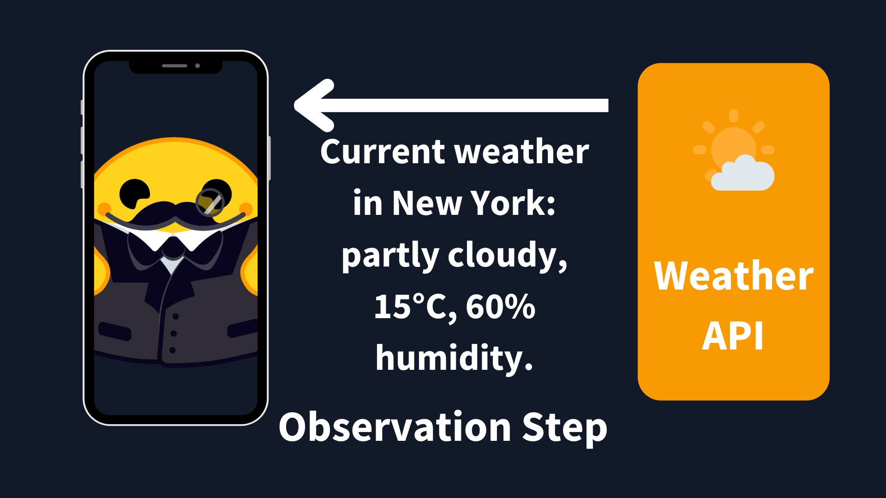
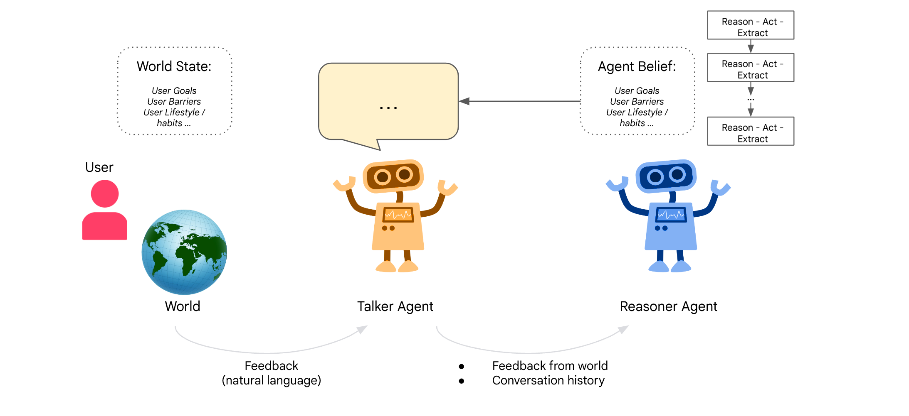
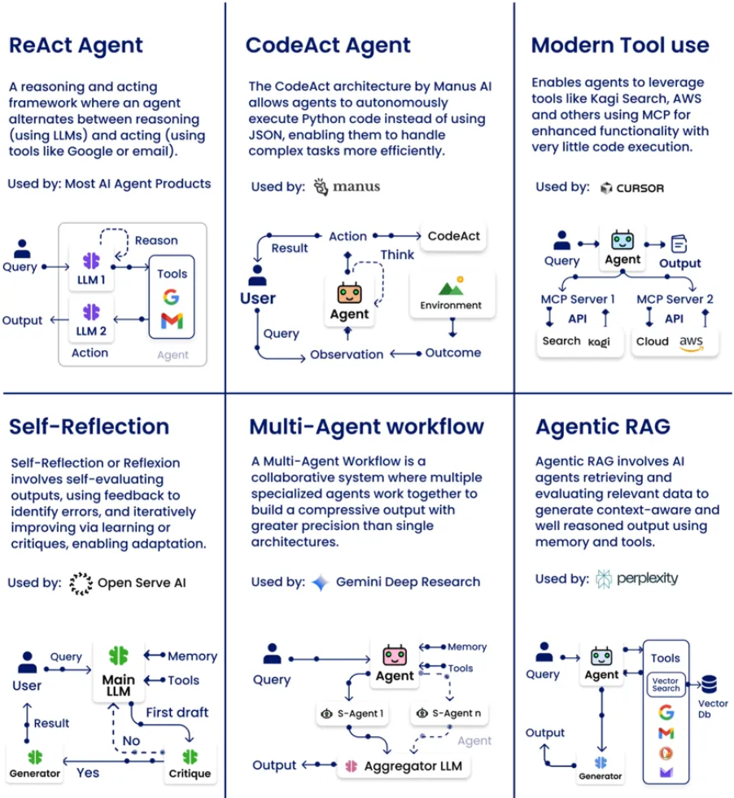

# Day 2: How Agents Think
### Types, Behaviors & Design Patterns

[**Hamza Farooq**](https://github.com/hamzafarooq) and [**Jaya Rajwani**](https://github.com/JayaRajwani)

## Welcome to Day 2 of the 7-Day Agents in Action Series.

Hi!

My name is [Hamza](https://www.linkedin.com/in/hamzafarooq/), and I am so excited to welcome you to our new course. Joining me is [Jaya](https://www.linkedin.com/in/jayarajwani/) who is a ninja in Agents!

In these 7 sessions we will uncover all we can about Agents, what they are, how they work and the what’s really behind all this hype?

In Day 1 of the course **Agents are here and they are staying**, we explored what makes agents different from GenAI chatbots. We saw how vertical agents are domain-specific, tool-using, and memory-augmented digital workers. One critical layer to add to this recipe of vertical agents is: **how do agents actually think?**

Not from a philosophic standpoint but from an architectural standpoint.

When you give an agent a task, for example: "write a report," "search for a policy," "check this document for compliance", how does it decide what to do first? Does it jump in? Does it stop and plan? Does it revise if something goes wrong?

`***"Most agents don’t fail because they lack intelligence. They fail because they don’t know how to think.”***`

  <em><a href="https://aiablog.medium.com/new-thinking-method-for-agents-better-than-reasoning-models-fbd71ae77464">New Thinking Method for Agents | Better than reasoning models</a></em>

That, right there, is where most GenAI builders hit their ceiling. Because you can bolt memory and tools onto an LLM, but if the agent doesn’t have a thinking loop, it breaks down after step one. This is where Agent Thinking Styles come into play.

## **How Agents Think: A Practical Viewpoint**
Let’s start simple. Imagine asking your agent:

`"Summarize this PDF."`

A reactive agent would instantly extract the text, summarize it, and return an answer. No memory. No context. No second thoughts. Done.

Now imagine you ask:

`"Scan these ten compliance policies and alert me to any mismatches with our internal rules."`

That’s not a one-shot task. Now the agent has to:
- Break the request into steps
- Retrieve internal guidelines
- Compare across multiple documents
- Identify inconsistencies
- Possibly ask clarifying questions

This is no longer about reacting. This is thought, action, and observation cycle. And that’s the key takeaway here: agents don’t just differ in what they do - they differ in how they think. This is also sometimes called the agent loop. These components of the loop work as:
1. **Thought**: The LLM part of the Agent decides what the next step should be.
2. **Action**: The agent takes an action, by calling the tools with the associated arguments.
3. **Observation**: The model reflects on the response from the tool.

|  |  |
|-----------------------------|-----------------------------|
|  |  |

  <em><a href="https://huggingface.co/learn/agents-course/en/unit1/agent-steps-and-structure">Understanding AI Agents through the Thought-Action-Observation Cycle</a></em>

There are several combinations for this thought-action-observation loop. These combinations determin how we implement intelligent behavior in real systems. Let’s connect these styles to actual design patterns used in today’s GenAI agents.

## **From Theory to Practice: Patterns for Agentic Thinking**

Before the rise of LLMs and agent frameworks like LangChain or AutoGen, the foundations of agent design were already well-established in classical AI literature. These ideas came from robotics, planning systems, and decision theory, and they remain relevant even in the era of language-based agents.
- **Reactive agents**: First formalized in Rodney Brooks’ behavior-based robotics and detailed in Russell & Norvig’s Artificial Intelligence: A Modern Approach, reactive agents respond instantly to stimuli without building internal models of the world. They’re designed for speed and simplicity, often using a condition-action mapping. Think of a thermostat or a chatbot that immediately replies to inputs. ([Russell & Norvig, AIMA, Brooks, 1986](https://aima.cs.berkeley.edu/))
- **Deliberative (Planning) agents**: First modeled through systems like STRIPS (Fikes & Nilsson, 1971) and formalized by Georgeff & Lansky in 1987, these agents reason about the world, create internal representations, and plan sequences of actions. In today's GenAI landscape, they map naturally to plan-act-reflect agents ([Georgeff & Lansky, 1987](https://dl.acm.org/doi/10.5555/1856740.1856792))
- **Hybrid agents**: Introduced by Michael Wooldridge and Nicholas Jennings, hybrid agents blend reactive and deliberative thinking. A lower-level reactive layer handles real-time decisions, while a higher-level planner works on strategic goals. Modern multi-agent systems often mimic this design. ([Wooldridge & Jennings, 1995](link))
- **Reflective/meta agents**: While the idea of meta-reasoning dates back to early expert systems, it gained new relevance in the era of LLMs. Shinn et al.’s Reflexion framework (2023) offers a modern interpretation: agents that monitor and critique their own outputs, learning from previous mistakes to improve future performance. This is the seed of what may become long-term, self-improving AI systems. ([Shinn et al., 2023 – Reflexion](https://arxiv.org/abs/2303.11366))

These styles aren’t just historical curiosities, they’re directly informing how we design GenAI agents today. ReAct builds on reactive behavior. Plan-Act-Reflect agents are rooted in deliberative logic. And modern memory-augmented, self-improving agents reflect the beginnings of true reflective cognition.

## **Case Study: How Thinking Style Impacts Agent Performance**

A recent study, [Agents Thinking Fast and Slow: A Talker-Reasoner Architecture](https://arxiv.org/abs/2410.08328), introduces a dual-agent architecture based on Daniel Kahneman’s Thinking Fast and Slow model. Their system consists of:

- A Talker (System 1): Fast, intuitive, conversational - akin to reactive behavior.
- A Reasoner (System 2): Slow, strategic, deliberative - responsible for planning, tool use, and memory updates.

This architecture was demonstrated in a sleep coaching agent that converses with users while planning interventions behind the scenes. The paper concluded that:

`“Architectural design decisions, especially around planning and memory, play a greater role than model size alone.”`

This reinforces the idea that how your agent thinks matters more than how big your LLM is. Architecting a strong planning and reflection loop is key to solving complex, multi-step tasks — especially in vertical use cases like finance, legal ops, or engineering.

Let’s connect these styles to actual design patterns used in today’s GenAI agents.

## **Design Patterns for Agents**

Here’s the real deal: these thinking modes don’t just live in academic papers or theoretical frameworks, they directly shape how agents behave in production. Every agent architecture, from simple assistants to full-blown autonomous systems, must decide how to think. That thinking isn’t random - it follows design patterns.

Design patterns are recurring, proven strategies that define how an agent processes information, uses tools, and makes decisions. They’re the mental blueprints behind agent cognition, and just like software design patterns, they help developers avoid reinventing the wheel.

  <em><a href="https://medium.com/%40bijit211987/agentic-design-patterns-cbd0aae2962f">Agentic Design Patterns</a></em>  

Let’s explore how we implement these styles using design patterns - and when to use each.

## **1. ReAct (Reason + Act)**
Originally proposed by Yao et al. in 2022, ReAct is like giving your agent an inner monologue. It thinks, acts, observes the result, and keeps going.

**How it works:**

1. **Thought**: “Hmm, I should probably search for battery startups.”
2. **Action**: Calls a web search tool.
3. **Observation**: Reads the results.
4. Repeats with updated thoughts.

**Why it matters**: This cycle enables agents to operate with feedback. Rather than relying on a single giant prompt, ReAct breaks thinking into chunks. This not only grounds the agent in reality but also makes its reasoning interpretable, auditable, and easier to debug.

*Example:*

`An agent investigating “Who are the top battery tech startups in Silicon Valley right now?” It thinks, searches, reflects, and refines just like a junior analyst.`

Used in: LangChain, AutoGen, CrewAI

## **2. CodeAct (Code-generation agents)**

If ReAct is about language and logic, CodeAct is where agents become engineers. These agents take natural language instructions and turn them into real, executable programs, then run those programs and act on the results.

**How it works:**

- Takes a prompt like “build a graph of monthly sales.”
- Plans how to approach it.
- Writes Python using libraries like pandas or matplotlib.
- Runs the code.
- Adapts if errors occur.

**Why it matters**: CodeAct-style agents are capable of automation, transformation, and analysis at machine speed. They’re ideal for workflows like report generation, ETL pipelines, data visualization, or even bug fixing.

*Example*:

`A product manager asks: “Give me a dashboard of conversion rates by campaign over the last 3 months.” The agent queries data, generates charts, and emails the results and no human data analyst needed.`

Popular in: Replit Ghostwriter, Devin by Cognition

## **3. Tool Use**
Modern agents don’t live in a vacuum, they interact with APIs, databases, and external environments. This pattern is about orchestrating that interaction effectively.

**How it works:**
- Uses a protocol like MCP (Model-Context Protocol) to define available tools
- Selects the right tool based on the current context and task
- Passes structured arguments and receives outputs
- Can chain tools together or retry with fallback tools if needed

**Why it matters**: Tool use is what makes agents useful. Whether it’s calling a calendar API, sending an email, or scraping a web page, this pattern turns passive LLMs into powerful actors.

*Example:*

`A virtual assistant checks your calendar, books a slot with your colleague, and sends a follow-up message - all through API calls.`

Used in: LangGraph, Cursor, Autogen

## **4. Self-Reflection**

Self-Reflection borrows directly from how humans improve: by learning from their own mistakes. This pattern introduces a secondary LLM whose sole job is to critique the output of the primary agent enabling self-correction and iterative learning.

**How it works:**

- The primary agent completes a task or responds to a prompt
- A second LLM (the critic) reviews the result
- If the answer is flawed, incomplete, or poorly reasoned, the critic suggests improvements
- The agent then reattempts the task with updated context

**Why it matters**: This reflective loop helps agents move from brittle one-shot responses to more resilient, self-improving behavior. Especially useful in complex or high-stakes domains where accuracy improves over iterations.

*Example:*

`An agent fails to generate a valid SQL query. Instead of giving up, a second LLM analyzes the query, pinpoints the issue, and suggests a fix allowing the agent to retry and succeed.`

Used in: AutoGen (via feedback mode) and LangChain Experimental Agents

## **5. Multi-Agent Systems**

Sometimes a single agent isn’t enough. In complex tasks, we need planners, executors, verifiers - each with their own role, working together in coordination. Multi-agent systems are inspired by how real teams operate: different roles, communication, and collaboration.

**How it works:**

- A high-level Planner assigns subtasks
- Specialized agents (e.g., Coders, Writers, Validators) execute in parallel
- Agents share memory and context or report to a central Orchestrator

**Why it matters**: This pattern unlocks true scalability. One agent can only do so much, but multiple agents can handle parallelism, specialization, and redundancy.

*Example:*

`A research team agent delegates background research to one agent, summary writing to another, and citation checking to a third. Then compiles everything into a polished report.`

Used by: AutoGen, CrewAI, and open-ended research platforms.

## **6. Agentic RAG (Retrieval-Augmented Generation)**

Agentic RAG builds on the classic Retrieval-Augmented Generation pattern — but adds planning, memory, and sometimes even tool use to the mix. Rather than just grabbing documents and summarizing them, these agents actively reason over what they retrieve and incorporate it into a broader goal-oriented workflow.

**How it works:**

- Performs semantic or hybrid search (e.g., vector DB + keyword lookup)
- Retrieves relevant documents or context snippets
- Uses the LLM to reason over that information in real-time
- Optionally uses tools or APIs to validate or supplement
- Generates a final output through a response synthesis phase

**Why it matters**: RAG was already useful for grounding answers in knowledge. Agentic RAG supercharges that by weaving in logic, decision trees, and memory. It bridges the gap between passive search and active understanding.

*Example:*

`A policy audit agent retrieves applicable laws, compares them with current internal documentation, identifies gaps, and generates action items — with citations.`

Used by: **Perplexity**, internal agents in search, compliance, legal ops

  <em><a href="https://www.linkedin.com/feed/update/urn:li:activity:7321515242390249472/">Agentic Design Patterns by Rakesh Gohel</a></em>

**Next: Agent Memory and Retrieval** In the next module, we’ll explore how agents remember, recall, and use long-term memory. You’ll learn how vector stores, semantic embeddings, and caching can drastically change your agent’s behavior.

