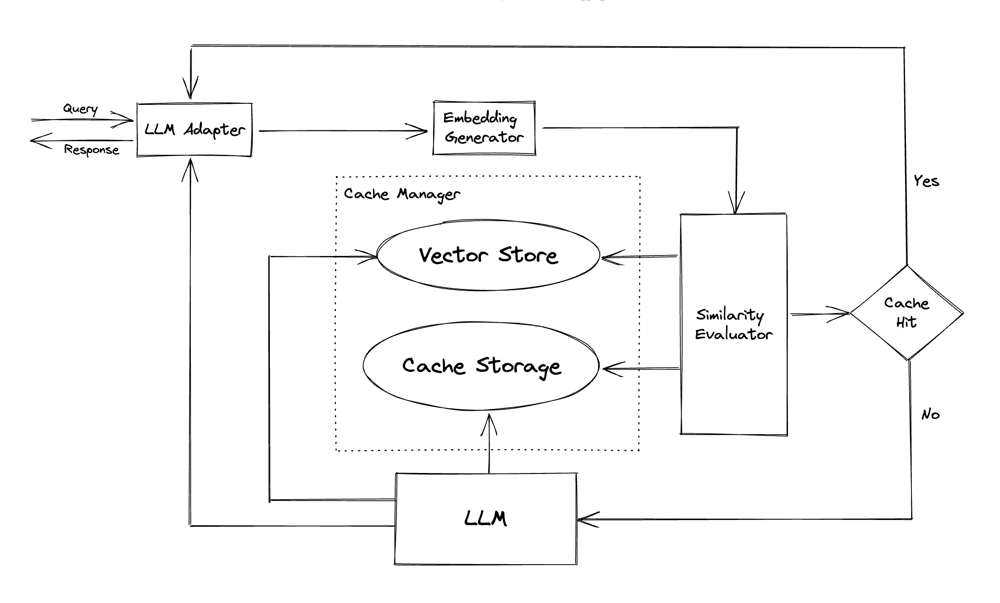

# Memory — The Agent's Brain
### We got our agents to think and remember

[**Hamza Farooq**](https://github.com/hamzafarooq) and [**Jaya Rajwani**](https://github.com/JayaRajwani)

Hi!

My name is [Hamza](https://www.linkedin.com/in/hamzafarooq/), and I am so excited to welcome you our new course. Joining me is [Jaya](https://www.linkedin.com/in/jayarajwani/), who is a ninja in Agents!

In these 7 sessions we will uncover all we can about Agents, what they are, how they work and the what’s really behind all this hype?

Read: [Day 1](link)

Read: [Day 2](link)

Before we dive in — **We’ve got a bonus live session** coming up to help you apply what you’re learning in this series. If you're curious about building real-world agents that go beyond the hype, this is for you.

Sign up here: [Design Vertical AI Agents that Deliver Results, Beyond Hype](https://maven.com/p/075022/design-vertical-ai-agents-that-deliver-results?utm_source=instructor&utm_medium=ll_share_link&ajs_uid=18166)

**Back to Day 3 of the course….**

In Day 2 of the course **How Agents Think - Types, Behaviors & Design Patterns**, we explored how agents think - from reactive responders to planning strategists and reflective troubleshooters. But there's one critical ingredient those agents need to truly evolve: memory.

An agent that forgets everything it did five seconds ago can’t grow. It can’t personalize. It can’t even hold a conversation properly.

That’s where memory comes in. Just like humans, agents need memory to stay coherent, consistent, and context-aware across time. Memory transforms a stateless LLM into a stateful system, one that adapts to you, learns from you, and builds knowledge over time.

`"Intelligence without memory is just noise. Real reasoning starts when past context is remembered."`

  <em><a href="https://www.newsletter.swirlai.com/p/simple-way-to-explain-memory-in-ai">Simple explanation of memory in Agentic Systems</a><em>

In this module, we’ll explore the layers of memory, lightweight strategies like caching, and introduce the foundations of retrieval.

## **Why Memory Matters in Agents**

Imagine a support agent that forgets your issue every time you write a message. Or a data analyst agent that re-asks what your database schema looks like after every query. Without memory, even the smartest LLM becomes... dumb.

Memory is what makes agent behavior adaptive. It allows the system to:

- Remember past interactions and preferences
- Track goals and sub-goals across time
- Build knowledge that compounds

Think of memory as the key to making AI truly intelligent, because it helps them learn context, adapt, and provide personalized responses through short-term (working) memory and the three forms of long-term memory - procedural, semantic, and episodic.

In short: memory is what lets agents act like intelligent beings, not just parrots.

## **What Kinds of Memory Do Agents Use?**

Modern agents use multiple layers of memory, each suited for different functions. Here’s how they break down — with simple analogies and real-world use cases:

### 1. **Working Memory**:
- Temporary, high-speed memory for the current task or prompt cycle
- Holds recent context, tool results, or short chains of reasoning
- Cleared at the end of an interaction or session

*Analogy*: Like what you hold in your mind while doing mental math

*Use case*: Storing tool results during a multi-turn plan in a ReAct agent

### 2. **Procedural Memory**:
- Encodes how to do things like how to use a specific API, run a tool, or follow a multi-step process
- Helps agents perform tasks they've been trained or fine-tuned to execute

*Analogy*: Like muscle memory or following a recipe from habit

*Use case*: Remembering the steps to install packages or write SQL queries in a coding agent

### 3. **Episodic Memory**:
- Like a journal of the agent’s interactions
- Tracks sequences of actions, user inputs, and system responses over time
- Often used for debugging or improving task continuity

*Analogy*: Like your browser history or diary

*Use case*: Recalling past user sessions to personalize future responses

### 4. **Semantic Memory**:
- Stores general knowledge, facts, and conceptual understanding
- Uses meaning-based representation to support flexible recall
- Enables agents to retrieve and relate ideas even if phrased differently

*Analogy*: Like understanding the concept of gravity — you don’t remember when you learned it, but you know it

*Use case*: Recalling the definition of “net revenue” even if a user asks about “monthly earnings”

  <em><a href="https://medium.com/@honeyricky1m3/giving-your-ai-a-mind-exploring-memory-frameworks-for-agentic-language-models-c92af355df06">Giving Your AI a Mind: Exploring Memory Frameworks for Agentic Language Models</a></em>

## **Caching: A Practical Subtype of Memory**

Caching is often considered a practical subtype of memory — more lightweight and task-specific than deep memory structures. Sometimes agents just need to remember something for a few minutes or avoid repeating a call.

That’s where **caching** comes in. Think of it as the agent’s sticky note:

- Stores outputs from recent tool calls
- Remembers verified results
- Reuses recent answers to avoid recomputation

It doesn’t require embeddings or deep reasoning — but it makes agents feel faster, snappier, and more responsive.

  <em><a href="https://github.com/zilliztech/GPTCache">GPTCache GitHub Repository</a></em>

**When to use caching:**

- When you need to reduce redundant tool/API calls
- When agent response time needs to be improved
- When storing complex memory is overkill for a task

It doesn’t require embeddings or deep reasoning but it makes agents feel faster, snappier, and more responsive, especially in repetitive or low-stakes tasks.

## **Agent Memory in Practice: How Mem0 Powers Recall**
We have discussed how agents need different types of memory - from working memory to episodic and semantic layers. But how does that actually look in a real system? Let’s discuss an example using mem0.

[**mem0**](https://mem0.ai/) is an open-source memory backend purpose-built for AI agents. Unlike traditional vector stores or databases, mem0 is designed to act like a brain — organizing and retrieving contextual memory such as user preferences, tool outputs, and reasoning traces across sessions.

It supports multiple types of memory (working, episodic, semantic) and plugs directly into LLM workflows, giving agents continuity, adaptability, and personalization — without needing to build a memory system from scratch.

This diagram shows how memory fits into the broader agent workflow, with a specific focus on mem0 as the memory layer.

