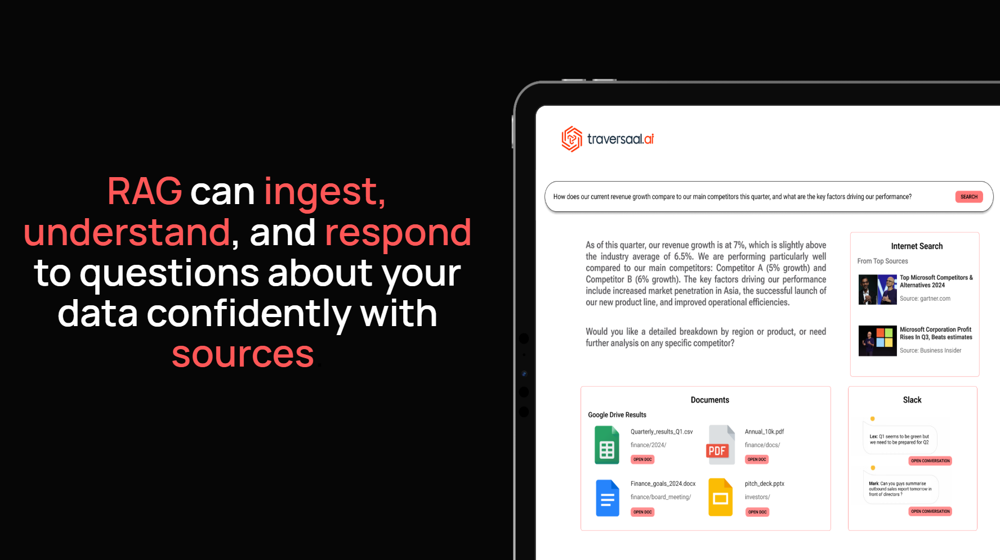
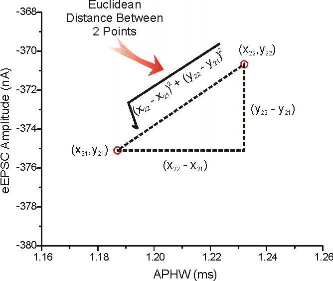

# Day 4: Agentic RAG Ecosystem
### Powering Agents with Real-World Knowledge

[**Hamza Farooq**](https://github.com/hamzafarooq) and [**Jaya Rajwani**](https://github.com/JayaRajwani)

## Welcome to Day 4 of the 7-Day Agents in Action Series.

Hi!

My name is [Hamza](https://www.linkedin.com/in/hamzafarooq/), and I am so excited to welcome you our new course. Joining me is [Jaya](https://www.linkedin.com/in/jayarajwani/), who is a ninja in Agents!

In these 7 sessions we will uncover all we can about Agents, what they are, how they work and the what’s really behind all this hype?

In the first three days, we moved from big picture to architecture.

**Day 1** clarified what sets agents apart from GenAI,

**Day 2** dug into how agents think and

**Day 3** explored memory and how agents remember.

Together, these layers lay the foundation for what comes next: **retrieval-augmented generation**, or RAG - the key to making agents both smart and informed.

Large Language Models (LLMs) are powerful, but they come with a major limitation: their knowledge is frozen in time. Once trained, they can’t access new information unless retrained. That’s where Retrieval-Augmented Generation (RAG) comes in.

RAG allows LLMs to access external sources of truth in real-time. Instead of guessing or hallucinating answers, RAG-powered agents can "look things up" before responding. This makes them ideal for high-stakes applications like healthcare, finance, legal, and customer support.

``***"Knowledge isn’t static an so shouldn’t be your AI”***

  <em>Source: <a href="https://neo4j.com/blog/developer/knowledge-graph-llm-multi-hop-reasoning/">Knowledge Graphs & LLMs: Multi-Hop Question Answering</a></em>

# **BUT!!!! WHAT IS RAG??**

Retrieval-Augmented Generation is an AI architecture that combines retrieval systems with generative models. The retrieval system fetches relevant documents or facts from a knowledge base, and the language model uses that context to generate an informed response.

This architecture stands in contrast to the so-called "closed-book" LLMs that rely only on what they were trained on. With RAG, we get "open-book" models that can dynamically access knowledge.

  <em>Source: <a href="https://towardsdatascience.com/beyond-naive-rag-advanced-techniques-for-building-smarter-and-reliable-ai-systems-c4fbcf8718b8/">Beyond Naive RAG: Advanced Techniques for Building Smarter and Reliable AI Systems</a></em>

**Example**: Instead of asking a model to summarize GDPR from memory, a RAG system retrieves the actual GDPR document and generates the summary from it.

To understand RAG in depth, let’s cover the core components of RAG.

## **Core Components of a RAG System**

### **1. Retriever:**

The retriever component is responsible for identifying and returning relevant context from a large corpus of documents. It typically consists of:

- **Embedding Model**: Converts queries and documents into dense vector representations using pretrained models like **BERT** [[Devlin et al., 2018](https://arxiv.org/abs/1810.04805)], **MiniLM** [[Wang et al., 2020](https://arxiv.org/abs/2002.10957)], or domain-specific models like **SciBERT** [[Beltagy et al., 2019](https://arxiv.org/abs/1903.10676)].
- **Vector Index**: These vectors are stored in a specialized vector index such as **FAISS** (Facebook AI Similarity Search) [[Johnson et al., 2017](https://arxiv.org/abs/1702.08734)] for efficient retrieval.
- **Similarity Search**: Matches query embeddings against stored vectors using distance metrics like cosine similarity or L2 (Euclidean) distance. Approximate Nearest Neighbor (ANN) algorithms like **HNSW** [[Malkov & Yashunin, 2018](https://arxiv.org/abs/1603.09320)] are used to retrieve millions of documents.

  <em>Source: <a href="https://medium.com/@pankaj_pandey/faiss-efficient-similarity-search-and-clustering-of-dense-vectors-dace1df1e235">FAISS: Efficient Similarity Search and Clustering of Dense Vectors</a></em>

### **2. Generator**

The generator is typically an autoregressive language model (e.g., GPT, T5, Claude) that receives both the original query and the retrieved context and generates a natural language response. The quality of generation depends on:

- **Prompt Engineering**: Ensuring the retrieved documents are properly formatted and injected into the prompt.
- **Context Length**: The model's ability to handle long contexts (e.g., 4k vs. 32k tokens) impacts how many documents can be used.
- **Relevance Weighting**: Some architectures (e.g., Fusion-in-Decoder [[Izacard & Grave, 2020](https://arxiv.org/abs/2007.01282)]) weigh multiple retrieved documents during generation to enhance relevance.

### **3. Chunking**
Chunking is the process of breaking large documents into smaller, manageable pieces. Because LLMs cannot process entire datasets at once, chunking enables targeted, efficient retrieval of relevant information. It plays a critical role in improving the accuracy, scalability, and usefulness of responses generated by RAG systems. These are some types of chunking:

- **Fixed-Size Chunking** - Specified number of characters, regardless of their content or structure
- **Recursive Chunking** - Divides the input text into smaller chunks in a hierarchical and iterative manner using a set of separators (Operates recursively until desired size or structure is achieved)
- **Document Based Chunking** - Split a document based on its inherent structure
- **Semantic Chunking** - Divides the text into meaningful, semantically complete chunks
- **Agentic Chunking** - LLM to determine how much and what text to include in a chunk based on context

Read my detailed article on chunking: [Chunking - the feature engineering of unstructured data](https://traversaal-ai.notion.site/Chunking-the-feature-engineering-of-unstructured-data-1e59a2e5c4a6804ba246d3e6f9b9b3ad)

### **4. Similarity Metrics**
Similarity metrics are what allow RAG systems to identify which chunks of data are most relevant to a user query. These metrics determine how "close" a query vector is to document vectors in the embedding space, not in terms of literal keywords, but in meaning. There are two main types of similarity metrics used in vector search systems:

- **Cosine Similarity**: Measures angle between vectors; scale-invariant. It is calculated by taking the dot product of the two vectors and then dividing by the product of their magnitudes.

- **Euclidean Distance**: Measures straight-line distance between all given points between our query vector, and the vectors loaded into the index. It’s simple, very accurate, but not too fast.

Once we know the components that make up a RAG, it is also important to understand how to integrate these components t develop scalable, enterprise level RAG architectures.

## **Types of RAG Systems**
Not all RAG systems are built the same. Depending on the complexity of the task, the nature of the data, and the design goals of the agent, RAG can take on different architectural forms. Some systems rely on simple, one-shot retrieval to generate answers quickly. Others chain multiple retrievals, use external tools, or route queries between specialized agents. These different types exist because the needs of a customer support assistant, a compliance checker, and a multimodal tutor vary wildly. Choosing the right type is about balancing cost, latency, relevance, and reasoning depth. Some popular RAG architecture are as as follows:

### **1. Naive RAG**
- The simplest form: retrieve documents once and pass them directly to the generator.
- No reranking or query refinement.
- Best suited for simple, high-precision tasks like FAQs.

### **2. Retrieve-and-Rerank**
- First retrieves a large set of documents, then uses a reranker model (e.g., a cross-encoder like BERT) to score and reorder them.
- Ensures the most relevant content is passed to the generator.
- Improves performance in dense, noisy corpora.

### **3. Multimodal RAG**
- Incorporates image, video, or audio embeddings alongside text.
- Requires multimodal retrievers and generators (e.g., BLIP, Flamingo).
- Useful in domains like medical diagnostics, surveillance, or edtech.

### **4. Graph RAG**
- Organizes document relationships in the form of a knowledge graph.
- Uses structured nodes and edges for multi-hop reasoning.
- Particularly useful for structured decision support systems and compliance tools.

### **5. Hybrid RAG**
- Combines multiple retrievers or retrieval strategies (e.g., keyword + vector).
- May retrieve from structured databases, APIs, and unstructured corpora.
- Can be used for tasks requiring both logic and language understanding.

### **6. Agentic RAG (Router)**
- Uses an agent to route the query to the best retriever or model.
- Enables intelligent dispatching based on domain, task type, or input format.
- Can reduce latency and improve specialization.

### **7. Agentic RAG (Multi-Agent)**
- Employs multiple cooperating agents, each responsible for a specific tool or knowledge base (e.g., Vector DB A, web search, Slack, Gmail).
- Supports dynamic tool use and reasoning chains.
- Powerful in enterprise settings or when dealing with fragmented data sources.

## **Real-World Applications of RAG by Domain**
Isn’t RAG quite cool? Want to know something more cool? It’s use cases. These architectures are being adopted by companies to solve real problems which serve real customers. I compiled a list of such examples for you across multiple indusctires.

**Healthcare** - [Mayo Clinic](https://www.mayoclinicplatform.org/)'s internal clinical decision support tools combine LLMs with structured and unstructured knowledge sources to augment physician decision-making. Their platform, Mayo Clinic Platform_Connect, facilitates retrieval of patient-specific content and up-to-date clinical trial information.

**Legal** - [Casetext](https://legal.thomsonreuters.com/en/products/cocounsel-legal), acquired by Thomson Reuters, developed "CoCounsel" - a legal assistant using GPT-4 with retrieval over legal databases, briefs, and case law. It enables tasks like deposition prep and document review with citations.

**Enterprise Knowledge Management** - Atlassian launched "[Atlassian Intelligence](https://www.atlassian.com/trust/atlassian-intelligence)," which uses OpenAI models with embedded document retrieval to answer team queries from Jira, Confluence, and other workspace tools.

**Customer Support** - Intercom's [Fin AI](https://fin.ai/?utm_source=google&utm_medium=sem&utm_campaign=22485552221&utm_term=intercom%20fin%20ai&utm_ad_collection=182654069671&utm_ad=753184554147&utm_geo=9077141&gad_source=1&gad_campaignid=22485552221&gbraid=0AAAAAoKeDyJlZHWG7s0dl1Ry9YZzi5KMy&gclid=Cj0KCQjwuvrBBhDcARIsAKRrkjeskoVCHfXquqoYtsNTNrMdCgOOIQaH39-5BaeGeeZO3lVAKHAvoIoaArRrEALw_wcB) agent uses vector search over past tickets, help docs, and support articles to deliver immediate, accurate answers to users. It’s a live production deployment of RAG for customer service.

RAG transforms language models from static encyclopedias into dynamic knowledge workers. It is more than just a plug-in to fix hallucinations - it's a paradigm shift. It redefines how LLMs interact with knowledge: not by remembering everything, but by knowing where to look.

Next up, we take this further in **Day 5: Multimodal Agents – Going Beyond Text** — where agents go from understanding only language to also interpreting tables, images, documents, and more. You’ll learn how to design high-level multimodal architectures, why vision + language agents are shaping the future, and how structured data fits into agent workflows.

# **WANT TO DIVE DEEPER?**
Check out my AI Agents for Enterprise course on [Maven](https://maven.com/boring-bot/ml-system-design) if you are interested to be a part of something bigger.

