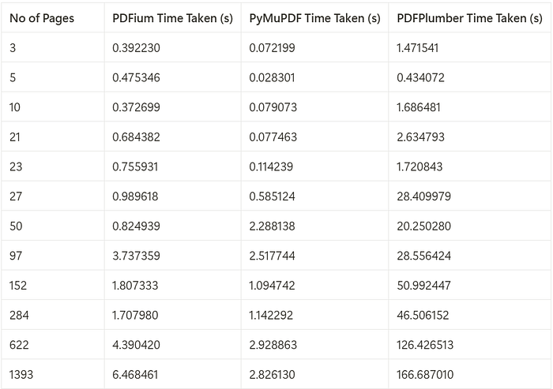

# Day 5: Multimodal Agents
### Going Beyond Text

[**Hamza Farooq**](https://github.com/hamzafarooq) and [**Jaya Rajwani**](https://github.com/JayaRajwani)

## Welcome to Day 5 of the 7-Day Agents in Action Series.

My name is [Hamza](https://www.linkedin.com/in/hamzafarooq/) and I’m excited to welcome you back to *Agents in Action*. As always, I’m joined by [Jaya](https://www.linkedin.com/in/jayarajwani/), who’s been breaking down how vertical agents actually work. For today’s edition, we are joined by [Areej Mehboob](https://www.linkedin.com/in/areej-mehboob-396b7a207/), a brilliant AI engineer and researcher helping us unpack the world of multimodal agents.

In these 7 sessions we will uncover all we can about Agents, what they are, how they work and the what’s really behind all this hype?

In **Day 4 RAG – Powering Agents with Real-World Knowledge**, we discussed how retrieval lets agents access external knowledge from databases, APIs, or document stores, making them more grounded and flexible. Retrieval-Augmented Generation (RAG) systems and multimodal large language models (LLMs) are evolving rapidly, finding applications in everything from enhancing search experiences to generating complex content. These methods are constantly being refined to expand the boundaries of what AI can achieve.

But what happens when that knowledge isn’t in plain text?

  <em>Photo by <a href="https://unsplash.com/@wesleyphotography?utm_source=medium&utm_medium=referral">Wesley Tingey</a> on <a href="https://unsplash.com/?utm_source=medium&utm_medium=referral">Unsplash</a></em>

What if you could combine their strengths to build a RAG system that not only handles text but also processes images, tables or other visual information seamlessly?

Now imagine taking it a step further by creating this system without relying on pre-built frameworks such as LangChain or LlamaIndex?

This post explores how to architect a multimodal RAG system from scratch — built to ingest, embed, and retrieve both text and images. No wrappers, no dependencies, just full control.

  <em>Process Flow for Multi-Modal RAG Pipeline</em>

# **What is a Multimodal RAG System?**
A Multimodal RAG system combines traditional retrieval-augmented generation with the ability to handle visual data alongside text. Instead of relying solely on documents and APIs, it can process PDFs, extract tables, interpret diagrams, and reason across formats.

## **Why This Matters**:
Text is just one part of most real-world documents. From technical drawings to scanned reports, image data plays a critical role. A multimodal agent expands the usefulness of your LLM by allowing it to make sense of diverse formats.

## **Example Use Cases**:
- Disaster reports with maps and stats
- Legal or medical records with annotated images
- Environmental data with satellite imagery

This evolution transforms RAG into something far more useful and realistic.

# **Part 1: Data Ingestion for Multimodal RAG Systems**

The foundation of any RAG system is reliable data. For a system to retrieve and generate accurate results, the content it processes needs to be clean, complete, and well-structured. When dealing with PDFs, this means extracting not just text but also images and tables, ensuring no valuable information is lost.

Choosing the right tools for PDF processing is critical. With so many libraries available, it can be overwhelming to decide which one suits your needs. Some prioritize speed, others focus on accuracy, and a few offer a balance between the two. To help you make an informed decision, we’ve evaluated three popular libraries: PyMuPDF, PDFium, and PDFPlumber.

The table below compares the time taken to process PDFs of varying page counts using three libraries: PDFium, PyMuPDF, and PDFPlumber.

  <em>Performance of each Python package across different number of pages</em>

Based on the performance analysis, PyMuPDF consistently outperforms PDFium and PDFPlumber, being up to **2.3x faster than PDFium** and **59x faster than PDFPlumber** for processing PDFs with a page count exceeding 1,000.

## **Key Takeaways**
- **PyMuPDF** is the fastest, making it ideal for large-scale or time-sensitive tasks.
- **PDFium** offers a balance between speed and accuracy but lacks image extraction capabilities.
- **PDFPlumber** is slower but excels in extracting detailed tables from complex PDFs.

  <em>Text Extraction Accuracy vs. Speed</em>

Clean extraction is non-negotiable — poor inputs lead to poor outputs. Choosing the right tool here impacts the performance of everything downstream.

To learn more about PDF benchmarking, check this repository out: https://github.com/py-pdf/benchmarks?tab=readme-ov-file

# **Part 2: Embedding Text and Images**
Once data is extracted, the next step is transforming both text and images into vector embeddings - mathematical representations that allow similarity-based retrieval. This is a crucial differentiator from traditional RAG systems which embed only text.

## **Processing and Embedding Text and Images**
- **Text Embeddings**:
  - First, the text is split into manageable chunks
  - Each chunk is tagged with metadata like a unique identifier (UUID) and the source file path for traceability.
  - Lastly, we use models like Nomic Text Embed or Sentence Transformers to encode the textual content.
- **Image Embeddings**:
  - Each extracted image is embedded using the mean of the model’s final hidden state.
  - Metadata includes the file name and path for reloading and referencing during retrieval.
  - **Nomic Vision Embed** or a similar vision encoder is used to embed images.

# **Key Notes:**
  - **Flexibility in Tools**: While Nomic models are used here, alternatives like Sentence Transformers or custom models can be substituted to meet specific requirements.
  - **Metadata Importance**: Adding relevant metadata like unique identifiers ensures traceability and enhances retrieval accuracy.

# **Part 3: Creating Retriever**
Finally, bring everything together by setting up a multimodal retriever, enabling us to retrieve both text chunks and images that match a user query. The retriever is configured to return the top 3 results from each collection, text and images, based on similarity scores.

**Why Separate Collections?**

Text and image embeddings operate in different feature spaces, and their similarity scores are not directly comparable. By separating the collections and running independent queries, we ensure that both text and image results are retrieved with proper weight and relevance. This approach avoids situations where one modality (e.g., text) dominates the results due to higher similarity scores, which could overshadow relevant results from the other modality.

The use of independent collections ensures that:

- Text chunks are retrieved based on their semantic similarity to the query.
- Images are retrieved based on their visual similarity, independent of text scores.

This separation is critical for multimodal systems where both modalities are equally important for satisfying user intent.

**Why This Step Matters**:

A multimodal agent doesn’t just retrieve paragraphs, it can also surface diagrams, screenshots, or charts that visually answer the query.

# **Part 4: Multimodal RAG with LLM Integration**
To build a **MultiModal RAG** system pipeline, you can integrate any multimodal LLM to handle both text and images. Here’s how it works:

1. **Prepare the Data**: Separate the text chunks (a context list) and images into a list of their file paths.
2. **Process Images**: Convert the image file paths into encoded image data. These encoded images will then be passed to the model as URLs or encoded objects, depending on the model’s requirements.
3. **Input to the Model**: Combine the text chunks and the encoded images into a single input format. The multimodal LLM will use the text chunks as context and the images as visual data to generate answers.

This approach allows the model to seamlessly process both textual and visual information, providing a comprehensive and accurate response.

Our Multi Modal RAG function accepts image paths as input, opens and encodes the images, then passes them to the Multimodal LLM for answering user queries. These image paths are stored in the payload, as discussed in the image embedding collection step. When the retriever fetches image embeddings, we use their payload to get the image paths for our multimodal LLM.

# **Part 5: Making Multimodal Data Work for You.**
Building a multimodal RAG system is about turning complex, diverse data into something truly useful. From extracting content with tools like PyMuPDF, to embedding text and images with models like Nomic Vision and Text, and organizing it all in Qdrant, each step builds toward a system that works seamlessly. Adding a multimodal LLM at the end brings everything together, enabling the system to deliver answers that are not just accurate but also contextually rich and comprehensive.

The outlined process demonstrates how to:
- Extract multimodal data.
- Embed and store it in Qdrant.
- Retrieve it for multimodal LLM-based processing.

This process shows how AI can bridge the gap between different types of data, text and visuals, to solve real-world problems. With the right approach, a RAG system becomes more than just a tool; it becomes a way to gain meaningful insights and make smarter decisions.

# **Full Code Companion**
The complete code for this tutorial is available in the following Colab notebook (formatting tends to be off for the code in the article): [Colab Notebook: Multimodal RAG Implementation](https://colab.research.google.com/drive/1JPqGFM2mfFhRWeXue6NNJqwDDeCx1d4z?usp=sharing)

**Next Up: Build Your Own Agent From Scratch**: In Day 6, we roll up our sleeves and build a complete agent loop — the thinking engine behind any autonomous system. You’ll learn how to initialize your agent’s “brain,” generate and run code dynamically, manage dependencies, and orchestrate everything from a central control layer.

**ARE WE VIBING!!?**

If you like this series, you should check out my AI Agents for Enterprise course on [Maven](https://maven.com/boring-bot/ml-system-design) and be a part of something bigger and join hundreds of builders to develop enterprise level agents.

