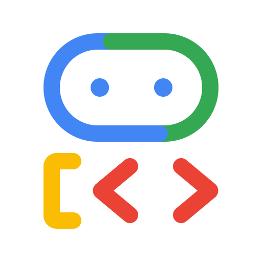
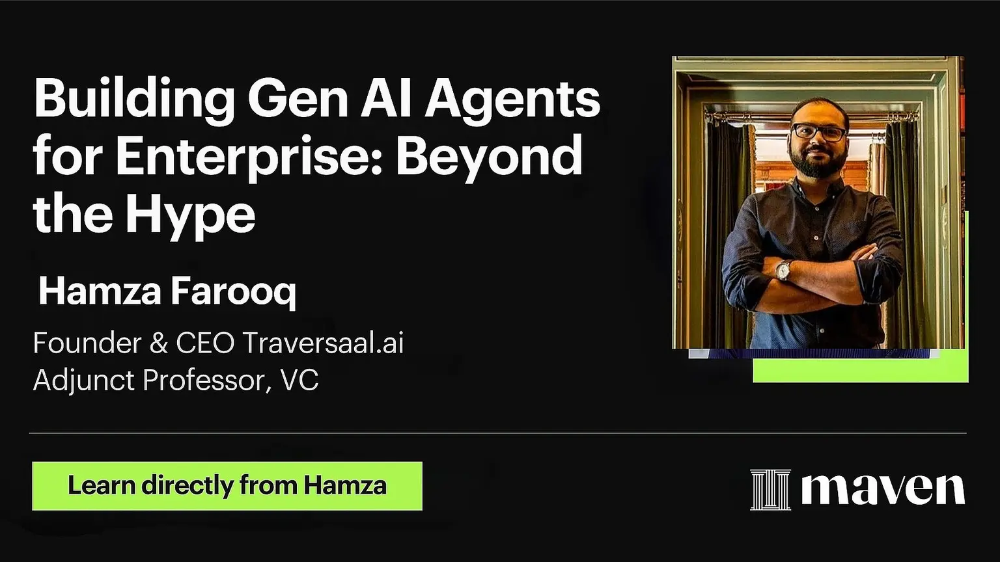

# Day 6: Scaling Agents: Architectures with Google ADK, A2A, and MCP
### Do you think you know MCP?

[**Hamza Farooq**](https://github.com/hamzafarooq) and [**Jaya Rajwani**](https://github.com/JayaRajwani)

## Welcome to Day 6 of the 7-Day Agents in Action Series.

Hi again!

I’m [Hamza](https://www.linkedin.com/in/hamzafarooq/), joined once again by [Jaya](https://www.linkedin.com/in/jayarajwani/) — and today, we’re stepping into the build phase.

If you like this series, we’d love you to have you in our course for AI Agents for Enterprise course on [Maven](https://maven.com/boring-bot/ml-system-design) and be a part of something bigger and join hundreds of builders to develop enterprise level agents.

Now back to the course:

Over the last five days, we’ve set the foundation. We explored how agents evolved from GenAI **Day 1**, how they think and reason **Day 2**, how they remember through different types of memory **Day 3**, how they access real-time knowledge via retrieval **Day 4**, and how they extend their intelligence beyond text through multimodality **Day 5**.

But agents don’t live in isolation. In the real world, they need to talk to other agents, access external tools, and operate safely at scale.

  <em>Source: <a href="https://medium.com/fundamentals-of-artificial-intellegence/agent-to-agent-a2a-protocol-e001d480b41c">Agent Communication example</a></em>

In this article, we will explore how Google is shaping this with its Agent Development Kit (ADK), the Agent-to-Agent (A2A) protocol, and the Model Communication Protocol (MCP). These are not just tools - they represent a shift in how agents are designed, orchestrated, and deployed in real-world systems.

We will also unpack how these components work together to build scalable, modular, and secure agentic infrastructure.

# **Building Agents with Google Agent development kit (ADK)**

  <em>Source: <a href="https://google.github.io/adk-docs/">Google Agent Development Kit</a></em>

Let’s start with the question behind every serious AI project:

How do we go from a clever demo to a reliable, reusable agent?

Because here’s the truth: most GenAI agents today are just dressed-up prompts. They might look smart in a single interaction, but they break down quickly when you need structure, memory, collaboration, or consistency.

That’s where Google’s Agent Development Kit (ADK) comes in, a production-grade framework built to help you move beyond hacks and experiments. ADK gives you the building blocks to create agents that can plan, act, and scale — not just respond.

At its core is the BaseAgent class - a flexible template you can extend to define how your agent reasons, remembers, and decides what to do next. But ADK goes much further: it supports tool use, multi-agent coordination, streaming, memory modules, and evaluation, all with a developer experience that’s actually pleasant.

  <em>Source: <a href="https://google.github.io/adk-docs/agents/">https://google.github.io/adk-docs/agents/</a></em>

Think of ADK as your workbench for real-world agent systems.

Not just one chatbot. Not just one clever workflow. A foundation for building intelligent systems that can collaborate, adapt, and operate with guardrails in place.

# **Core Pillars of ADK**
ADK provides capabilities across the entire agent development lifecycle:

- **Multi-Agent by Design** – Modular, hierarchical agent composition
- **Model Flexibility** – Works with Gemini, Vertex AI, LiteLLM, and more
- **Tool Ecosystem** – Supports MCP tools, LangChain, LlamaIndex, etc.
- **Built-in Streaming** – Audio/video streaming for multimodal interaction
- **Flexible Orchestration** – Sequential, parallel, loop, or dynamic flows
- **Dev Experience** – Local CLI + visual UI for testing and debugging
- **Built-in Evaluation** – Assess final outputs and intermediate steps
- **Easy Deployment** – Container-ready for any environment

For more information and docs on ADK, reference the github: [https://google.github.io/adk-docs/](https://google.github.io/adk-docs/)

# **Acting in the World: Model Context Protocol (MCP)**
Now that you’ve built an agent with ADK, how do you let it interact with the real world?

Imagine your agent needs to call a Stripe API, run a SQL query, or access your file system. These are straightforward for a human developer. But for a language model, even a capable one, public APIs are inaccessible without help.

This is where the Model Communication Protocol (MCP) comes in. MCP acts as a standardized bridge between agents and tools. It wraps APIs, databases, and local services in a format that agents can understand and safely call. Think of it like an adapter — instead of teaching an agent the details of every single API, MCP lets you plug in pre-wrapped tools that just work.

In a nutshell, what MCP does is:

- Standardizes agent-tool communication
- Secure external access
- Plug-and-play tool integration

## **Core Components of MCP**
Following are the core components of MCP:

- **MCP Hosts**: Programs like Claude Desktop, IDEs, or AI tools that want to access data through MCP
- **MCP Clients**: Protocol clients that maintain 1:1 connections with servers
- **MCP Servers**: Lightweight programs that each expose specific capabilities through the standardized Model Context Protocol
- **Local Data Sources**: Your computer’s files, databases, and services that MCP servers can securely acces
- **Remote Services**: External systems available over the internet (e.g., through APIs) that MCP servers can connect to

  <em>Source: <a href="https://modelcontextprotocol.io/docs/getting-started/intro">https://modelcontextprotocol.io/docs/getting-started/intro</a></em>

## **How is MCP Different from Standard API?**
The main difference between MCPs and APIs lies in who they’re meant for:

- APIs are built for developers. They expose data or services, but they assume the person using them knows how to write code, format requests, handle errors, etc.
- For an AI agent (like an LLM) to use a public API, it needs a wrapper built by a developer first, which explains:
  - how to call the API
  - what the input/output should look like
  - and how to handle the response.

MCPs are designed for LLMs to call APIs without extra setup, whereas APIs require a developer to build that tool manually. MCPs act as wrappers around APIs, helping LLMs understand how to call them.

## **MCP Limitations**
While MCP is a standard to call tools for an LLM instead of formatting data for an API, it also has it’s own limitations:

- **Limited responses**: If an API only returns 100 results per call (e.g., Stripe transactions or customers), an MCP won’t know to paginate, so it will most likely miss key data.
- **High costs for historical data**: MCPs make on-the-fly API requests, so pulling 12 months of data (if it can figure out how to) eats up context window + cost fast.
- You can only use one MCP at a time, meaning LLMs struggle to combine multiple data sources.

Despite the limitations, MCP is a powerful step toward turning agents into *doers*, not just *talkers*.

## **Working in teams: Agent2Agent (A2A) Protocol**
What happens when you have not just one agent, but many?

Let’s say one agent specializes in retrieving data, another in summarizing it, and a third in masking sensitive content. You now have a team. But how do they talk to each other? That’s the problem A2A (Agent-to-Agent Protocol) solves.

A2A is a communication protocol that allows agents to collaborate securely, predictably, and efficiently — all without sharing memory or internal reasoning. It’s like giving each agent a walkie-talkie and shared task language, so they can coordinate without stepping on each other’s toes.

Built on familiar web standards like HTTP and JSON-RPC 2.0, A2A allows agents to:

- Send tasks and receive results in structured formats
- Handle long-running operations
- Work across modalities like text, video, or even form inputs
- Securely authenticate with each other in enterprise environments

Instead of coding logic that chains agents together manually, A2A lets each agent operate independently but still collaborate like members of a team.

## **A2A Design Principles**
A2A is an open protocol that provides a standard way for agents to collaborate with each other, regardless of the underlying framework or vendor. While designing the protocol with our partners, we adhered to five key principles:

- **Agent-first** – Enables true collaboration between agents, even without shared memory or tools
- **Standards-based** – Built on HTTP, SSE, and JSON-RPC for easy integration
- **Secure by Default** – Supports enterprise-grade auth aligned with OpenAPI standards
- **Long Task Support** – Handles everything from fast actions to multi-hour human-in-the-loop workflows
- **Modality Agnostic** – Designed for text, audio, video, and more — not just chat

# **Putting It All Together: A Real-World Flow**
Let’s walk through a real system that combines ADK, MCP, and A2A. Imagine a user sends a request:

**“Find our top customers from last quarter and make sure no PII is exposed.”**

Here’s how it plays out:

- A client sends a request to your A2A server
- A2A routes the task to a security pipeline before executing it:
  - Input Validation Layer (outside LLM)
  - Model Armor checks for: Prompt injection, Malicious sources, DDoS, web attacks
  - Agent Judge (ADK agent with tool access): Uses 270+ regex rules to detect anomalies and if found conversation is terminated
- A2A then calls call_sql_agent()
- This invokes the SQL Agent (ADK agent using MCP tools): Infers database schema, Constructs SQL query, Returns result
- Output is sent to the Mask Agent:
- Uses Google Cloud DLP API to redact/mask sensitive data (e.g., names, IDs)
- Final masked result is returned: MCP → ADK → A2A → Client

# **Next Up: Your First Full Agent System - Begins 8th October**
You have seen the pieces — planning, memory, retrieval, tools, collaboration. Now it’s time to bring it all together.

In the final day of this series, we will build a complete agent from scratch - one that thinks, remembers, retrieves, and takes action. You will learn how to wire up the control loop, plug in external tools, and coordinate across agents like a real system architect.

**Ready to ship something real?**

If you like this series, you should check out my AI Agents for Enterprise course on [Maven](https://maven.com/boring-bot/ml-system-design) and be a part of something bigger and join hundreds of builders to develop enterprise level agents.

