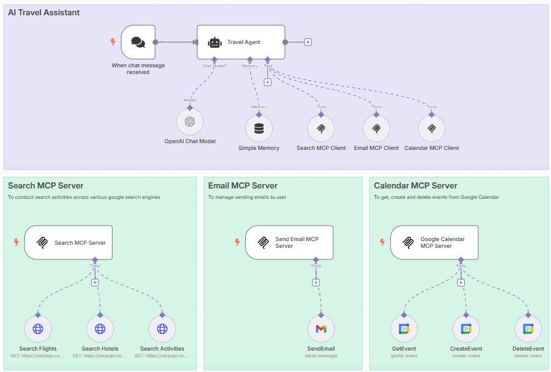
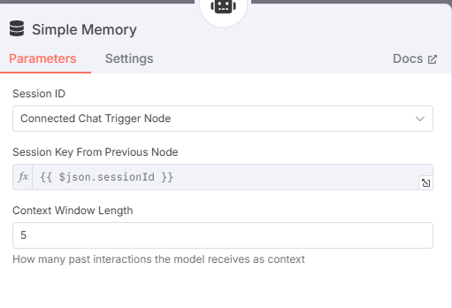
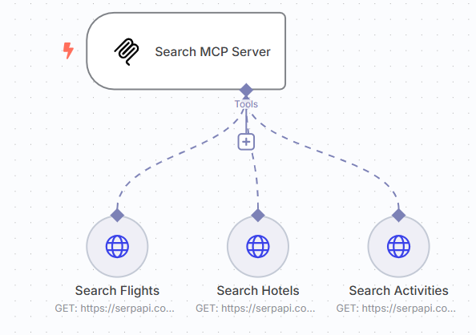

# Day 7: MCP Travel Agent
### Build a Fully Functional ReAct Travel Agent using n8n

[**Hamza Farooq**](https://github.com/hamzafarooq) and [**Jaya Rajwani**](https://github.com/JayaRajwani)

## Welcome to Day 7 of the 7-Day Agents in Action Series.

Hi again!

It’s [Hamza](https://www.linkedin.com/in/hamzafarooq/) and [Jaya](https://www.linkedin.com/in/jayarajwani/), and you’ve officially made it to the final day of our 7-part journey into the world of intelligent agents.

If you’ve followed along since **Day 1**, you now understand how agents think, plan, retrieve, and interact. Here’s a quick recap of what we've covered:

**Day 1: Agents are here and they are staying**

We explored the rise of agents from basic GenAI capabilities to autonomous systems. Why just prompt a model when you can give it goals?

**Day 2: How agents think**

We dug into planning and reasoning: how agents break tasks into subtasks, choose actions, and reason step-by-step.

**Day 3: Memory - the agent's brain**

We covered short-term and long-term memory, vector stores, and how agents remember and reflect across tasks.

**Day 4: Agentic RAG Ecosystem**

We explored Retrieval-Augmented Generation (RAG) for agents to access real-time knowledge through document and database search.

**Day 5: Multimodal agents**

We saw how agents can go beyond text — interpreting images, audio, PDFs, and more.

**Day 6: Scaling agents with ADK, A2A, and MCP**

We explored how Google’s ADK, A2A protocol, and MCP create scalable agentic infrastructure. From single-agent demos to real-world deployable systems.

For this finale, we’re going from theory to reality: building a working travel agent using only the concepts and tools we covered over the past week.

This workflow was built using [n8n](https://n8n.io/), a no-code/low-code automation tool that allows you to visually connect agents, tools, and APIs.

Here’s how it works:

- The agent receives a natural language input from the user (e.g., planning a trip)
- It uses reasoning steps to identify missing information or clarify ambiguous ones
- Then, it plans which tools to use and in what sequence (e.g., flight search → hotel search → itinerary planning)
- It accesses those tools using structured queries (inspired by MCP principles)
- Finally, it assembles a summary and sends it to the user via email and adds the trip to their calendar

# **Step-by-Step: Travel Agent Workflow**
We’ll break down the entire workflow node-by-node.

## **Step 1: User Input Trigger**
The flow begins with a user request (triggered via webhook or form).

- Text input example: “Plan a 5-day trip to Paris next month”
- The message is passed into the system via n8n's chat trigger

  <em>User Input Node</em>

## **Step 2: Setup the Agent to parse user data**
This is where we set up our ****AI agent inside n8n.

The user input is passed into an LLM node powered by the OpenAI API (you can use models like gpt-3.5-turbo or gpt-4). We also attach a simple memory block to help the agent retain short-term context across the workflow.

The system prompt includes structured instructions that guide the agent to:

- Extract structured fields like destination, travel dates, and duration
- Reformat the data into a format suitable for downstream tools

This step is focused purely on interpretation and memory retention — not yet tool interaction. It's a clean example of how to go from messy natural input to structured, actionable intent using LLMs and memory.

  <em>Agent node connected to user input</em>

  <em>To setup OpenAI chat node, ensure the credentials are added and the right model is selected</em>

  <em>For the simple memory, it is essential to pass the sessionId and also provide the required context window</em>

## **Step 3: Search MCP Server & Client setup**
This is where the agent begins executing search tasks using the Search MCP, which includes three tools:

- Search Flights
- Search Hotels
- Search Activities

These tools use SerpAPI under the hood to access Google search results and return structured data based on parameters passed from the agent.

The flow:

1. Agent sends search request to the MCP Server
2. Server routes to the correct tool (flights, hotels, or activities)
3. Results are returned to the agent via the MCP Client

This design decouples tool logic from the agent, allowing flexible, standardized integration.

  <em>Search MCP server and its tools</em>

  <em>Search MCP Client to connect to Search MCP Server</em>

In order to connect an MCP Server to an MCP Client, use the SSE endpoint in Server and add it to the MCP Client node.

## **Step 4: Email MCP Server & Client setup**
Next, we use the Email MCP, which includes a single tool:

- SendEmail

The user’s email address is collected in the earlier interaction. This tool takes the finalized travel plan and sends it directly to the user’s inbox as a neatly formatted message.

The MCP server accepts structured trip data, formats it, and handles the outbound email through a provider (like SendGrid or Gmail API).

  <em>Email MCP Server</em>

  <em>Email MCP Client, added to the agent</em>

## **Step 5: Calendar MCP Server & Client setup**
The Calendar MCP allows the agent to manage user calendar events with three tools:

- GetEvent
- CreateEvent
- DeleteEvent

Here’s what it does:

- **Checks for conflicts** during the travel dates
- **Adds trip events** (flights, check-ins, tours) once finalized
- **Deletes/replaces events** if the user changes travel plans

This makes the agent not just an advisor but an active participant in the user’s schedule.

  <em>Calendar MCP Server</em>

## **Step 6: Final Output**

Now comes the moment where everything comes together.

I told the agent I wanted to take a trip from Karachi to Paris. I provided it the dates and some activities I would prefer to do while in Paris.

The agent collects the flight options, hotel recommendations, and planned itinerary. It not only stitches the information into a cohesive summary but also packages it in a way that feels polished and ready to use.

The travel plan is sent via email to the me — giving a clean, organized view of their trip including flights, hotels, and activities. It can also be routed to chat platforms or webhooks for further integration.

## **Why This Matters**
This travel agent isn't a toy — it's a **deployable, modular, and extensible system**. You can:

Swap in real APIs

Add more search tools (visa requirements, currency conversion, weather)

Extend output formats (PDFs, rich chat cards)

It’s a perfect example of **tool-augmented agentic reasoning** that doesn’t require full-stack development.

## **🎉 That’s a Wrap!**
Over the past seven days, we’ve gone from foundational theory to a fully functioning system, not just imagining what agents could do, but actually building one that reasons, retrieves, and takes action. Along the way, you’ve seen the building blocks of modern intelligence: memory, planning, tools, collaboration, and real-world execution. But this isn’t just about travel agents or workflows — it’s about unlocking a new way of thinking.

What happens when intelligence becomes modular?

When reasoning becomes a service?

The future of AI isn’t just smarter models — it’s systems that work together, adapt, and solve. You now know how to build them.

## **Want to build your next big idea?**
Check out my AI Agents for Enterprise course on Maven and be a part of something bigger and join hundreds of builders to develop enterprise level agents.

