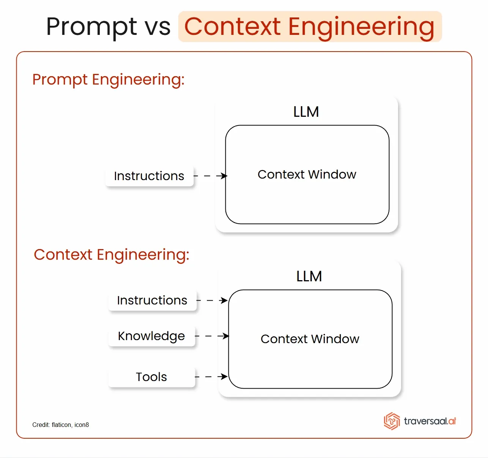
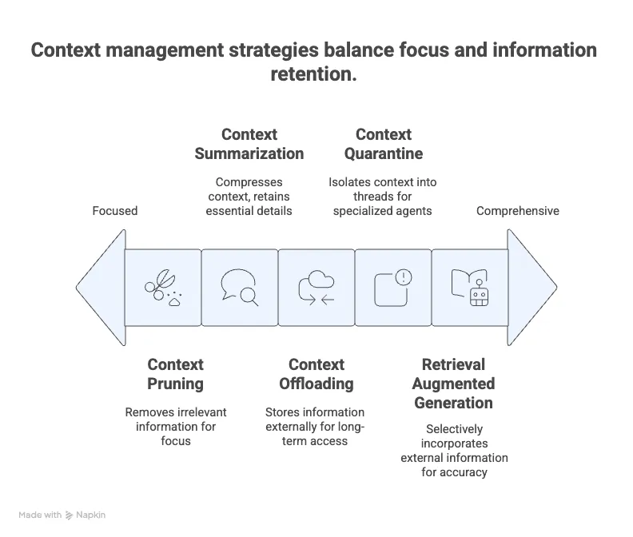

# Understanding Context Engineering: Enhancing AI with Dynamic Context Management
### Let's explore the essentials of context engineering in AI, its challenges, and practical solutions to optimize large language model performance for dynamic, real-world applications.

## Introduction to Context Engineering in AI
In Generative AI, terminology often shifts and adapts as new techniques and challenges emerge. One such term gaining traction recently is context engineering. While it may sound like a novel concept, context engineering builds upon long-established practices in AI and large language model (LLM) development, evolving from the foundational idea of prompt engineering.

### What is context engineering?
Context engineering refers to the art and science of providing the right information, in the right format, at the right time, to an LLM so that it can effectively and plausibly accomplish a given task. This involves dynamically managing the context window of the model — the portion of input data the model considers when generating responses. Context engineering moves beyond static prompts, emphasizing dynamic systems capable of adapting context based on the task, available tools, and user inputs.

Toby, CEO of Shopify, popularized the term by highlighting its importance over traditional prompt engineering. According to him, it involves "providing all the context for the task to be plausibly solvable by the LLM." Others in the AI community, like Andrej Karpathy, echo this sentiment, calling it a "delicate art" of filling the context window with precisely the right information.

## From Prompt Engineering to Context Engineering
Prompt engineering traditionally focuses on crafting ideal instructions or prompts for chatbots or language models to maximize task success. However, context engineering expands this notion by:

- Dynamically populating prompts with relevant and up-to-date data.

- Integrating tool descriptions and environmental knowledge.

- Managing large, evolving context windows efficiently.

The LangChain team frames prompt engineering as a subset of context engineering, where prompt engineering handles formatting instructions while context engineering oversees assembling and managing dynamic data inputs.

### Challenges in Context Management for LLMs

Despite the promise of context engineering, effectively managing context is far from trivial. LLMs have inherent limitations and failure modes when dealing with large or poorly curated context windows. Understanding these failure cases is crucial for building robust AI systems.

**1. Context Poisoning**

Context poisoning occurs when hallucinated or erroneous information becomes part of the model's context and is repeatedly referenced, leading the model to reinforce false or misleading knowledge. This phenomenon was notably studied by DeepMind in their Gemini 2.5 agent, where hallucinations during multi-turn interactions caused the agent to fixate on incorrect goals, degrading its performance over time.

**2. Context Distraction**

When context windows grow excessively large, the model may overly focus on repeated or irrelevant information, neglecting its foundational training knowledge. This results in reduced creativity and problem-solving ability. For example, in multi-agent systems or prolonged interactions, agents might favor repeated actions from historical context rather than generating novel solutions.

Technical reports highlight that this distraction effect intensifies beyond certain token thresholds (e.g., 100,000 tokens for Gemini Pro), and smaller models exhibit this issue even earlier (around 32,000 tokens for LLaMA 3 405B). This reveals a practical "distraction ceiling" that limits context length.

**3. Context Confusion**

Context confusion arises when superfluous or irrelevant data in the context leads to low-quality outputs. This is especially problematic when agents are given many tool descriptions, some of which may not be relevant to the current query. Studies show that when multiple tools are provided, models—particularly smaller ones—may randomly invoke irrelevant tools rather than correctly addressing the user prompt.

Limiting the number of active tools in context (suggested to be 10–15) helps mitigate this issue. For instance, a quantized LLaMA 3 model failed when presented with 46 tools but showed better performance with only 19 tools.

**4. Context Clash**

This occurs when conflicting information or instructions coexist in the context, causing the model to produce inconsistent or erroneous outputs. Context clash is a more severe form of confusion, where contradictions directly undermine the model’s reasoning.

Experiments from Microsoft and Salesforce highlight that sharding instructions across multiple turns (progressively adding context) is less effective than providing a concise, unified prompt. Multi-turn context expansion resulted in a significant performance drop (up to 39%), with some models like GPT-3 showing a decrease from 98% accuracy to 64%.

## Solutions and Best Practices in Context Engineering

To overcome these challenges, researchers and practitioners have developed several strategies for managing context effectively.

### 1. Retrieval Augmented Generation (RAG)

RAG selectively incorporates relevant external information into the model’s context to improve response accuracy. Instead of overwhelming the model with all available data or tool descriptions, RAG ranks and filters inputs based on their relevance to the user query, feeding only the most pertinent information.

For multi-tool agents, RAG can dynamically narrow down the toolset visible to the model, enhancing focus and reducing confusion.

### 2. Context Quarantine and Multi-Agent Systems

Dividing context into isolated threads or segments assigned to specialized agents can prevent interference and reduce context clash. Instead of a monolithic shared context, each agent operates with a dedicated, relevant context, enabling smoother handoffs and clearer task division.

OpenAI has proposed such multi-agent architectures to improve modularity and scalability in agentic AI systems.

### 3. Context Pruning

Pruning involves removing irrelevant or outdated information from the context window to keep it concise and focused. RAG systems often implement multi-stage ranking to retrieve a broad set of documents initially and then prune down to the most relevant subset before passing it to the model.

The "Provenance" model, introduced in early 2025, exemplifies this by filtering out error-prone context based on the current query, thus improving response quality.

### 4. Context Summarization

When nearing token limits, summarization compresses previously accumulated context into condensed representations that retain essential details while freeing up space. This technique preserves continuity in long conversations or multi-turn interactions without overwhelming the model.

However, summarization must be carefully controlled to avoid losing critical information or introducing distortions that lead to confusion or distraction.

### 5. Context Offloading and Memory Systems

Storing information outside the immediate context window—via specialized tools or memory modules—allows models to access long-term or short-term memories without burdening their limited token capacity. This offloading supports persistent knowledge retention and retrieval across sessions.

By combining offloading with RAG and pruning, AI systems can maintain a balance between context richness and manageable input size.

## Practical Implications and Future Directions
Context engineering is rapidly becoming a foundational skill for developers working with LLMs, especially in Agentic AI and complex workflows. While it builds on prompt engineering, it emphasizes system-level design, dynamic context adaptation, and sophisticated information management.

### Key Takeaways for AI Practitioners

- Dynamic Context Assembly: Continuously tailor the context based on the task and user inputs rather than relying on static prompts.

- Relevance Filtering: Use RAG or ranking methods to include only necessary information and tools.

- Avoid Overloading: Monitor token limits and prevent context poisoning, distraction, or clash by pruning and quarantining context.

- Use Summarization Wisely: Summarize older interactions to maintain continuity without exceeding context windows.

- Design Multi-Agent Systems: Leverage specialized agents with isolated contexts to improve modularity and reduce interference.

## Future Research and Development
Advancements in model architectures with larger context windows (e.g., million-token inputs) show promise but also reveal new challenges like distraction ceilings. Further innovation is needed in:

- Automated context cleaning and summarization algorithms.

- Efficient multi-agent coordination with seamless context handoffs.

- Better understanding of hallucination propagation and mitigation in dynamic contexts.

- Memory-augmented LLMs that balance on-the-fly reasoning with persistent knowledge.

## Conclusion

While context engineering may sound like a buzzword, it encapsulates essential principles for optimizing AI systems powered by large language models. It extends prompt engineering by focusing on dynamic, system-level management of context to ensure AI agents receive the right information at the right time in the right format.

By understanding common context-related failure modes—such as poisoning, distraction, confusion, and clash—and applying practical solutions like RAG, pruning, summarization, and context quarantine, developers can significantly enhance model reliability and task performance.

---
