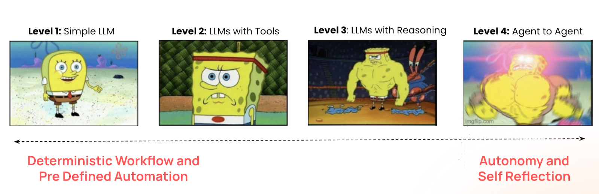
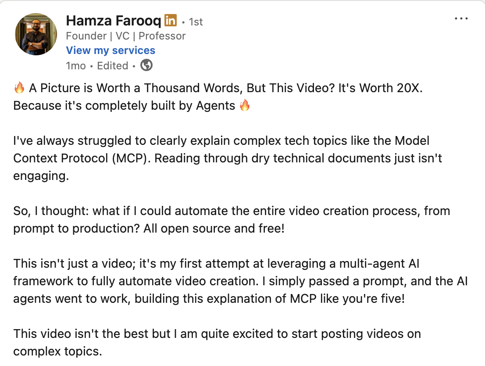

# Day 1: 🚀 Agents in Action: From LLMs to AI Agents
### The rise of Agents from mere LLMs!

[Hamza Farooq](https://github.com/hamzafarooq) and Bhavna Jain

Hi there!

My name is [Hamza](https://www.linkedin.com/in/hamzafarooq/), and I am so excited to welcome you to our transformative 10-day course on AI agents! Joining me throughout this journey is my cohort [Bhavna](https://www.linkedin.com/in/bhavna-s-jain/), our resident AI expert at [Traversaal.ai](https://traversaal.ai/)

In these 10 sessions, we'll uncover everything about AI agents—what they truly are, how they actually work, and what's really behind all this hype. We'll move beyond the buzzwords and build practical, enterprise-ready AI agents that can work alongside humans as genuine digital colleagues.

## 🎯 **What You'll Master Today**
By the end of today's lesson, you'll have a comprehensive understanding of:

- ✨ **LLM Fundamentals**: How large language models work and their limitations as standalone systems
- 🧠 **Agent Architecture**: The three core components that transform LLMs into agents
- 📈 **Maturity Levels**: The four stages of agent evolution and when to use each
- 🛠️ **Practical Applications**: Real-world examples of agents driving business value
- 🔄 **Planning Loops**: How agents think, act, and learn from their experiences
- 💡 **Strategic Thinking**: How to identify agent opportunities in your own work or organization

---

Over the past year, tools like ChatGPT have revolutionized how we interact with AI. They can generate text, answer complex questions, write code, and even engage in sophisticated conversations. But here's the thing, they're fundamentally reactive. They wait for us to prompt them, respond brilliantly, and then... wait again.

They're like having an incredibly knowledgeable consultant who only speaks when spoken to and forgets everything the moment the conversation ends.

**That's where AI agents change everything.**

## **🤖 What Exactly Is an AI Agent?**

At its core, an **AI agent is an LLM with access to tools**, but that simple definition understates a profound shift in capability. Think of it this way: if an LLM is like a brilliant scholar locked in a library with no phone, no internet, and no way to affect the outside world, then an AI agent is that same scholar given a smartphone, a credit card, access to APIs, and the ability to take actions in the real world.

But it's not just about tools. AI agents represent a fundamental evolution in how we think about AI systems. They transform passive responders into proactive digital workers that can:
- **Remember** conversations and context across time
- **Use tools** to interact with real-world systems, APIs, and databases
- **Plan and execute** multi-step workflows
- **Learn and adapt** from their actions and mistakes
- **Collaborate** with other agents and humans

The magic happens when we combine these capabilities. An LLM might tell you how to book a flight; an AI agent actually books it, adds it to your calendar, sends confirmations to relevant parties, and sets up reminders, all while remembering your preferences for future trips.

## 🧠 **The Three Pillars That Transform LLMs into Agents**

### **1. 🧠 Memory: The Foundation of Continuity**
Traditional LLMs reside in the eternal present; each conversation begins anew. AI agents, however, maintain different types of memory:

- **Conversational Memory**: Remembering what you discussed yesterday or last week
- **Procedural Memory**: Learning your preferences and workflows over time
- **Knowledge Memory**: Building and updating their understanding of your domain
- **Episodic Memory**: Recalling specific events and outcomes from past actions

This memory isn't just storage; it's the foundation of relationship-building between humans and AI.

### **2. 🛠️ Tools: The Bridge to Reality**
Tools are what transform an AI from a conversationalist into a digital worker. These can include:

- **API Integrations**: Connecting to Slack, Salesforce, Google Workspace, or proprietary systems
- **Code Execution**: Running Python scripts, SQL queries, or data analysis
- **File Operations**: Reading, writing, and manipulating documents and databases
- **Web Interactions**: Browsing, scraping, and gathering real-time information
- **Communication Tools**: Sending emails, messages, or notifications

The key insight is that tools aren't just add-ons, they're the agent's hands and eyes in the digital world.

### **3. 🔄 Planning Loops: The Engine of Intelligence**
This is where the real magic happens. Instead of generating a single response, agents operate in continuous **Think → Act → Observe → Reflect** cycles:

- **Think**: Analyze the current situation and plan the next step
- **Act**: Execute an action using available tools
- **Observe**: Process the results and feedback
- **Reflect**: Learn from outcomes and adjust future actions

This loop enables agents to tackle complex, multi-step tasks that would overwhelm traditional LLMs.

---

## **📊 The Four Levels of AI Agent Evolution**
Understanding these levels will help you choose the right approach for your specific use cases:

### **Level 1: Simple LLMs**
*The Foundation*

These are your standard chatbots, sophisticated text generators that excel at conversation but can't take actions. They're perfect for:

- Customer service queries
- Content generation
- Educational tutoring
- Creative writing assistance

**When to use**: When you need intelligent conversation without external actions.

---

### **Level 2: LLMs with Tools**
*The Specialists*

LLMs connected to specific, predefined tools and APIs. They can fetch weather data, send calendar invites, query databases, or integrate with specific software platforms.

**Example workflow**:

User: "Schedule a meeting with the marketing team for next Tuesday"

Agent: → Checks calendar API → Finds available slots → Sends invites → Confirms booking

**When to use**: For specific, well-defined tasks within known systems.

---

### **Level 3: ReAct Agents (Reasoning + Acting)**
*The Thinkers*

These agents implement the "Think, Act, Observe, Reflect" loop, allowing them to tackle complex, multi-step problems dynamically. They can plan, execute, learn from mistakes, and adapt their approach in real-time.

**Example workflow**:

User: "Research our top 3 competitors and create a comparison report"

Agent thinks: "I need to identify competitors, research each one, and compile findings"

→ Searches web for competitor information

→ Observes: Found basic info but need financial data

→ Thinks: "Let me check financial databases"

→ Queries financial APIs

→ Observes: Got financial data but missing recent news

→ Searches recent news articles

→ Compiles comprehensive comparison report

**When to use**: For complex, undefined problems requiring planning and adaptation.

---

### **Level 4: Multi-Agent Systems**
*The Teams*

Multiple specialized agents working together, each with distinct roles, collaborating through shared memory or orchestration systems to solve complex, end-to-end workflows.

**Example team structure**:

- **Research Agent**: Gathers information from multiple sources
- **Analysis Agent**: Processes data and identifies patterns
- **Writer Agent**: Creates polished reports and presentations
- **Validator Agent**: Checks accuracy and completeness
- **Coordinator Agent**: Manages workflow and deadlines

**When to use**: For enterprise-scale problems requiring multiple specialized skills.

---

### 🌐 **See our Agent in action - [Sales Research Agent](https://preview--spark-lead-ignition.lovable.app/)**

---

## **🎯 Real-World Agents in Action**
Let me share three agents I personally use daily to give you concrete examples:
### **ICP (Ideal Customer Profile) Agent**
This Level 2 agent revolutionized our sales process:

- **Thinks**: "What characteristics define our best customers?"
- **Acts**: Scrapes LinkedIn, Crunchbase, and industry databases
- **Observes**: Analyzes patterns in successful customer profiles
- **Reflects**: Refines search criteria based on conversion rates
- **Result**: Automatically surfaces 10-15 high-quality prospects daily, saving 4+ hours of manual research

### **Bottleneck Summarizer**
A specialized Level 2 agent that keeps our team focused:

- Continuously monitors support tickets, Slack threads, and GitHub issues
- Uses NLP to identify recurring pain points and frustrated language
- Generates daily summaries with severity rankings
- Automatically escalates critical issues to relevant team members
- Impact: Reduced response time to critical issues by 60%

### **Content Creator Agent**
A Level 2 agent that maintains our thought leadership:

- **Plans**: Analyzes trending topics in our industry
- **Creates**: Drafts LinkedIn posts, newsletter content, and course outlines
- **Optimizes**: A/B tests different content styles and topics
- **Distributes**: Schedules posts across platforms via APIs
- **Learns**: Adjusts content strategy based on engagement metrics

See the LinkedIn Post [here](https://www.linkedin.com/posts/hamzafarooq_a-picture-is-worth-a-thousand-words-but-activity-7334460279763677184-xOSm/?utm_source=share&utm_medium=member_desktop&rcm=ACoAAADtgS0BfFimbryOOYpG3yuWcOW3sFJUYmE)

## **🔮 Why This Matters Now**
We're at an inflection point. The companies and professionals who master AI agents in 2025 will have an insurmountable advantage over those still thinking of AI as just "a better search engine" or "writing assistant."

But, and this is crucial, most organizations are still building simple chatbots and calling them "AI agents." They're missing the transformative potential that comes from memory, tools, and planning loops working together.

---

## **🚀 Next Session’s Deep Dive**
On **Day 2**, we'll get hands-on with **n8n**, the workflow automation platform that will serve as our foundation for building Level 2 agents. You'll learn to:

- Set up automated workflows that connect multiple systems
- Create your first tool-enabled agent that can interact with real APIs
- Understand the architecture patterns that make agents reliable and scalable
- **Build and deploy your first working Level 2 agent**

We'll move from theory to practice, giving you a working agent you can immediately use and expand upon.

---

## **💪 Your Agent Journey Starts Here**
Remember, the goal isn't just to understand AI agents, it's to build systems that can genuinely augment human intelligence and productivity. Over the next 9 days, we'll progressively build more sophisticated agents, culminating in a multi-agent system that can handle complex, real-world workflows.

This is your opportunity to get ahead of the curve, to become one of the practitioners who truly understands how to harness this technology effectively. The future belongs to those who can collaborate with AI agents as seamlessly as they do with human colleagues.

Welcome to that future. Let's build it together.

---
