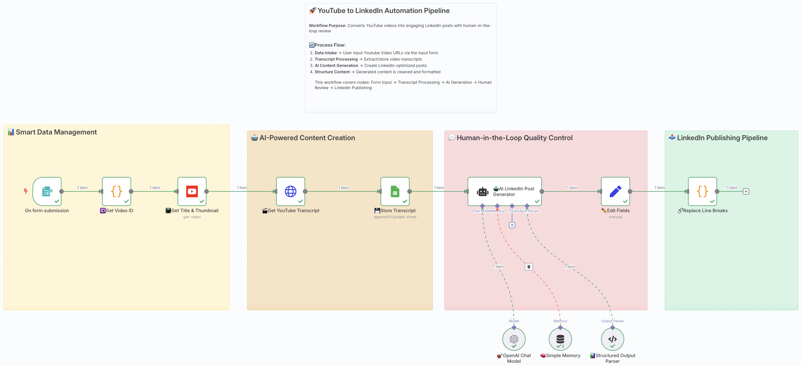

# Day 3: LinkedIn to YouTube Agent
### Automated Content Generation

[Hamza Farooq](https://github.com/hamzafarooq) and Bhavna Jain

Welcome back to Day 3 of our AI Agents in Action!

I'm [Hamza](https://www.linkedin.com/in/hamzafarooq/), and joining me is [Bhavna](https://www.linkedin.com/in/bhavna-s-jain/). Today, we're taking your agent-building skills to the next level! In the previous session, you built your first AI sales prospecting agent that automatically finds and qualifies leads.

Today, we're exploring content automation, one of the most powerful applications of AI agents in marketing and personal branding.

See the tool in action, [here](https://linkyou.traversaal.ai/)

In today's session, we'll build a sophisticated **YouTube to LinkedIn Content Agent** that transforms video content into engaging LinkedIn posts, complete with human review workflows and automated publishing. This is the exact system I use to maintain consistent thought leadership across platforms while focusing on creating quality video content.

This agent has helped me 10x my LinkedIn engagement while spending 80% less time on content repurposing!

# **🎯 What You'll Master Today**
By the end of today's lesson, you'll have hands-on experience with:

- 📹 **Content Extraction**: Automatically pulling transcripts from YouTube videos using APIs
- 🤖 **AI Content Generation**: Transforming video content into platform-optimized posts
- 👀 **Human-in-the-Loop Workflows**: Building review and approval processes into your agents
- 🔗 **Social Media Automation**: Publishing approved content directly to LinkedIn
- 📊 **Content Performance Tracking**: Monitoring and analyzing your content pipeline
- ⏰ **Scheduling & Orchestration**: Creating time-based triggers and content calendars
---

# **🎬 Why YouTube to LinkedIn Content Automation?**

Content repurposing is one of the biggest pain points for creators and marketers. Here's why this workflow is perfect for learning advanced agent patterns:

## **Multi-Stage Processing**
Unlike simple automation, this workflow involves multiple transformation steps: video → transcript → analysis → generation → review → publishing → tracking.

## **Human-AI Collaboration**
This isn't full automation—it's intelligent augmentation. The AI handles the heavy lifting while humans make strategic decisions about tone, timing, and brand alignment.

## **Cross-Platform Intelligence**
The agent understands platform differences (YouTube's long-form vs LinkedIn's professional tone) and adapts content accordingly.

## **Real Business Impact**
Content consistency drives engagement, builds authority, and generates leads. This agent directly impacts your marketing ROI.
---

# **🏗️ The Architecture of Our YouTube to LinkedIn Agent**

Here's the GitHub [link](https://github.com/traversaal-ai/agents-in-action/tree/main/youtube-to-linkedin)

Let's break down what our intelligent content agent will accomplish:

## **Before we dive into building, let's understand what our agent will do based on this real-world implementation:**
## **Step 1: Smart Form-Based Input**

- **n8n Form Integration**: User-friendly form that accepts YouTube URLs and audience targeting information
- **Audience Customization**: Text input field for specifying target audience (entrepreneurs, developers, marketers, etc.)
- **Instant Processing**: Form submission immediately triggers the content transformation pipeline

## **Step 2: Video Data Extraction & Processing**

- **Code Node Video ID Extraction**: JavaScript-based parsing of various YouTube URL formats to extract clean video IDs
- **YouTube Metadata Collection**: Automated retrieval of video titles, thumbnails, and essential metadata
- **Data Standardization**: Ensures consistent format for downstream AI processing

## **Step 3: Transcript Generation with Supadata**

- **Supadata API Integration**: Leverages transcript extraction service for video-to-text conversion
- **Automated Transcript Retrieval**: GET request to Supadata playground for accurate transcription
- **Quality Assurance**: Basic transcript validation and formatting

***Important Note**: We don't specifically endorse Supadata as a transcription service. We've integrated it for convenience and demonstration purposes due to its accessible API. For production environments, consider enterprise-grade alternatives.*

## **Step 4: Data Storage & Organization**

- **Google Sheets Integration**: Automatic storage of transcripts, metadata, and processing status
- **Structured Data Management**: Organized content repository for easy access and analysis
- **Version Control**: Maintains history of processed videos and generated content

## **Step 5: AI-Powered LinkedIn Content Generation**

- **OpenAI Integration**: Advanced language model processing for content transformation
- **Memory-Enhanced Processing**: Contextual understanding of audience preferences and brand voice
- **Structured Output Generation**: Formatted LinkedIn posts optimized for engagement and platform algorithms

## **Step 6: Human-in-the-Loop Quality Control**

- **Manual Review Gate**: Strategic pause for human oversight and brand alignment verification
- **Content Refinement**: Opportunity for editing and customization before publishing
- **Quality Assurance**: Ensures content meets brand standards and audience expectations
---

# **🔧 Building Your YouTube to LinkedIn Agent: Technical Implementation**
## **The Workflow Breakdown**
### **1. n8n Form Node**
- **Input Fields**:
  - YouTube URL (required)
  - Target Audience (text input for customization)
- **Purpose**: Receives content requests and initiates the transformation workflow
- **User Experience**: Simple, intuitive interface for non-technical users

### **2. Video ID Extraction**
Here various YouTube URL formats are processed:
- `https://www.youtube.com/watch?v=VIDEO_ID`
- `https://youtu.be/VIDEO_ID`
- `https://www.youtube.com/embed/VIDEO_ID`
- `https://m.youtube.com/watch?v=VIDEO_ID`

- JavaScript extraction ensures clean video IDs for API calls and eliminates URL format inconsistencies.

### **3. YouTube Data Collection**

- **Title Extraction**: Pulls video titles for context and potential headline generation
- **Thumbnail Retrieval**: Downloads thumbnails for potential LinkedIn media attachments
- **Metadata Collection**: Gathers duration, upload date, and basic video information

### **4. Supadata Transcript Integration**

- **API Endpoint**: GET request to [https://supadata.ai/playground](https://supadata.ai/playground)
- **Transcript Processing**: Converts video audio to structured text format
- **Error Handling**: Manages API limitations and response formatting

### **5. Google Sheets Storage Node**

- **Data Structure**:
  - Column A: YouTube URL
  - Column B: Status
  - Column C: Video Title
  - Column D: Video Thumbnail
  - Column E: Video Id
  - Column F: Video Transcript
  - Column G: Post Made Status
  - Column H: Post
- **Purpose**: Centralized content repository and processing tracking

### **6. AI Agent - LinkedIn Content Generation**

- **OpenAI Integration**: GPT-4.1 mini powered content transformation
- **Memory Integration**: Contextual understanding of previous successful posts
- **Structured Output**: Formatted LinkedIn posts with:
  - Engaging hooks optimized for LinkedIn algorithm
  - Bullet points and emojis for readability
  - Relevant hashtags for discoverability
  - Clear calls-to-action
  - Professional tone adapted from video content
 
### **7. Human Quality Control Gate**

- **Manual Review Process**: Strategic pause for content evaluation
- **Brand Alignment Check**: Ensures content matches voice and messaging standards
- **Final Approval**: Human decision point before publishing

# **📊 Real-World Example: Tech Creator Content Pipeline**

Let me share how this exact workflow performs for a technology consultant:

**The Challenge**: Creating consistent LinkedIn content while focusing on producing quality YouTube tutorials and client work. Manual repurposing was taking 2-3 hours per video.

**The Content Strategy**: Transform technical YouTube tutorials into LinkedIn thought leadership posts that position expertise while driving video views.

**The Implementation**:

1. **Content Input**: YouTube videos about AI, automation, and business efficiency (2-3 per week)
2. **AI Processing**: Extract key concepts and translate technical content into business value propositions
3. **Human Review**: Subject matter expert reviews for accuracy and brand alignment (15 minutes vs. 2+ hours manual creation)
4. **Strategic Publishing**: Posts scheduled for maximum professional audience engagement

**Results from 90-day implementation**:

- **47 YouTube videos** processed into LinkedIn content
- **340% increase** in LinkedIn post frequency (2/week → 8/week)
- **89% time reduction** in content repurposing (2.5 hours → 15 minutes per video)
- **156% growth** in LinkedIn followers due to consistent, quality content
- **23 qualified leads** generated directly from LinkedIn content driving YouTube views
- **$43K in consulting revenue** attributed to improved thought leadership positioning

**Sample Content Transformation**:

*Original YouTube Video*: "Building Automated Data Pipelines with Python and Apache Airflow" (45-minute technical tutorial)

*Generated LinkedIn Post*:

🚀 Just spent 3 hours debugging a data pipeline that should have taken 30 minutes to fix.

Sound familiar?

Here's what I learned about building resilient automated systems:

📊 Monitor early, monitor often

- Set up alerts BEFORE problems occur
- Track data quality metrics, not just uptime
- Failed fast is better than failed late

🔧 Design for failure from day one

- Assume every API will timeout
- Build retry logic into every step
- Always have a manual override option

⚡ Automate the boring stuff, not the thinking

- Let humans handle edge cases
- Automate data collection, not data interpretation
- Build workflows that enhance human decision-making

The goal isn't to replace human judgment—it's to free up time for the strategic thinking that actually moves your business forward.

What's your biggest data pipeline headache? Drop a comment—I might just make a video about it 👇

#DataEngineering #Automation #BusinessIntelligence`

*Results*: 2,847 views, 94 likes, 23 comments, 12 shares, 4 video clicks, 1 consulting inquiry
---

# **⚠️ Common Pitfalls and How to Avoid Them**
## **Over-Automation Without Human Oversight**
Don't publish directly without human review. Even the best AI can miss brand nuances, current events context, or potential PR issues. Always include human checkpoints for public-facing content.

## **Ignoring Platform-Specific Optimization**
YouTube and LinkedIn have different audiences, algorithms, and engagement patterns. Don't just copy-paste—ensure your agent adapts content for each platform's unique characteristics.

## **Transcript Quality Issues**
Poor transcripts lead to poor content. Invest in quality transcription APIs (AssemblyAI, [Rev.ai](https://www.rev.ai/)) rather than free alternatives. Bad input = bad output, especially for content generation.

## **Neglecting Performance Feedback Loops**
Track which types of content perform best and feed this data back into your generation prompts. Your agent should get smarter over time based on actual engagement results.

## **Inconsistent Brand Voice**
Spend time training your AI on your specific brand voice with examples of successful posts. Generic business content won't build the personal brand authority you need.
---

# **💡 Pro Tips for Content Agent Success**
## **Create Voice & Tone Guidelines**

- Document your brand voice with specific examples:
- Formal vs. conversational language preferences
- Industry jargon vs. accessible explanations
- Emoji usage and formatting preferences
- Controversial topic boundaries

## **Build Content Calendars**
Don't just post when videos are ready. Create strategic content calendars that consider:

- Industry events and conferences
- Product launches or announcements
- Seasonal trends and holidays
- Competitive landscape timing

## **A/B Test Generation Prompts**
Try different AI prompts for content generation and compare engagement results:

- Question-based vs. statement-based hooks
- Technical vs. business-focused angles
- Short vs. long-form LinkedIn posts
- Different call-to-action approaches

## **Leverage Video Timestamps**
Include specific video timestamps in LinkedIn posts to drive targeted traffic: "The breakthrough moment happens at 12 →"

## **Cross-Promote Strategically**
Don't just say "watch my video"—give specific value propositions: "If you're struggling with [specific problem], the solution I share at 8 will save you hours"
---

# **🚀 Advanced Workflow Enhancements**
## **Multi-Platform Publishing**
Extend your agent to also create:

- Twitter thread versions
- Instagram carousel posts
- Blog post outlines
- Email newsletter content

## **Competitive Intelligence Integration**
Monitor competitor content and ensure your posts add unique perspectives to trending industry topics.

## **SEO Optimization**
Incorporate keyword research into your content generation to improve discoverability on LinkedIn and Google.

## **Personalized Engagement**
Add workflows to automatically engage with comments on your posts, maintaining the conversation momentum.

## **Content Series Creation**
Identify opportunities to create multi-part LinkedIn series from comprehensive YouTube videos.
---

# **💪 Your Content Marketing Revolution Starts Now**
Today, you've built something that goes far beyond simple automation. Your YouTube to LinkedIn agent represents a new paradigm in content marketing—one where AI handles the repetitive work while humans focus on strategy, relationship building, and high-level creative direction.

This agent doesn't just save time—it enables consistency at scale, which is the foundation of building authority and trust in your industry. The compound effect of consistent, quality content will transform your professional presence over the coming months.

But we're just getting started. The principles you've learned today—multi-stage processing, human-AI collaboration, and performance feedback loops—will apply to every sophisticated agent you build going forward.

---
