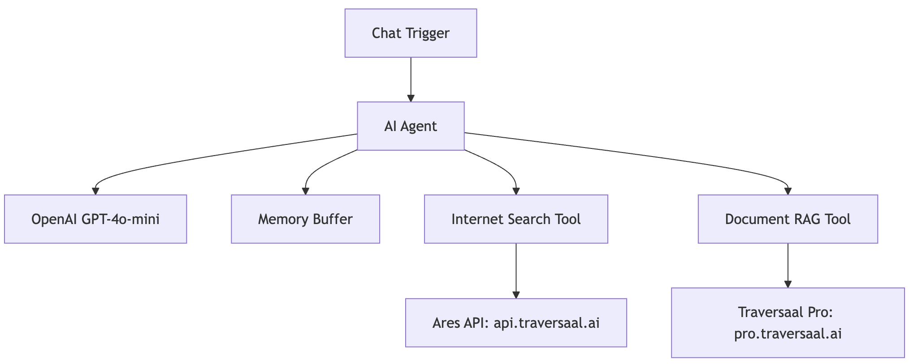
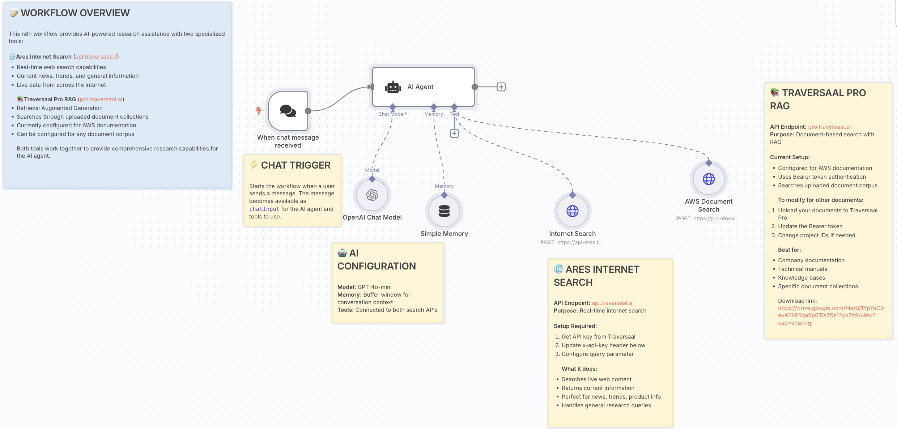

# Day 6: The Ultimate AI Research Assistant
### The missing component of intelligent research with dual-search capabilities 

[Hamza Farooq](https://github.com/hamzafarooq) and Bhavna Jain

Welcome back to Day 6 of our AI Agents in Action!

I'm [Hamza](https://www.linkedin.com/in/hamzafarooq/) and joining me is [Bhavna](https://www.linkedin.com/in/bhavna-s-jain/). Today, we're diving into one of the most powerful applications of AI agents: intelligent research and information retrieval!

In our previous sessions, you built a sales prospecting agent, content automation system, and intelligent search interface. Today, we're exploring how AI agents can revolutionize research by intelligently combining real-time internet search with private document retrieval.

In today's session, we'll build a sophisticated **AI Research Assistant** that intelligently decides between internet search and document-based RAG (Retrieval Augmented Generation), providing comprehensive research capabilities that adapt to your specific query needs.

This type of agent is transforming how researchers, analysts, and knowledge workers access and synthesize information from multiple sources!

# **🎯 What You'll Master Today**
By the end of today's lesson, you'll have hands-on experience with:

- 🌐 **Dual-Source Intelligence**: Combining real-time internet search with private document retrieval
- 🤖 **Smart Tool Selection**: Building agents that choose the optimal search strategy
- 🧠 **Conversational Research**: Maintaining context across multi-turn research sessions
- 📚 **RAG Implementation**: Leveraging document-based semantic search for private knowledge
- 📧 **Research Synthesis**: Automatically generating comprehensive research summaries
- ⚡ **Multi-Angle Analysis**: Conducting deeper, broader research across multiple perspectives

# **🔍 Why Build a Dual-Search Research Agent?**
Traditional research is fragmented and time-intensive. Here's why this workflow represents the future of knowledge work:

## **Intelligent Source Selection**
Instead of manually deciding whether to search the internet or internal documents, the agent intelligently routes queries to the most appropriate source—or combines both for comprehensive answers.

## **Real-Time + Historical Knowledge**
The agent seamlessly blends current internet information with your organization's private knowledge base, providing both up-to-date insights and institutional memory.

## **Context-Aware Research**
The agent remembers previous research sessions and builds upon past queries, enabling sophisticated multi-session research projects.

## **Automated Synthesis**
Beyond just finding information, the agent analyzes, compares, and synthesizes findings into actionable research summaries delivered via email.

# **🏗️ The Architecture of Our AI Research Assistant**

**Here's the GitHub [link](https://github.com/traversaal-ai/agents-in-action/tree/main/simplest-rag-internet-search)**

Let's break down what our intelligent research agent will accomplish:

## **Step 1: Chat Trigger & Query Processing**

- **Conversational Interface**: Natural language research requests via chat trigger
- **Context Preservation**: Maintains conversation history for multi-turn research
- **Query Analysis**: AI understands research intent and information requirements

## **Step 2: AI Agent Core - Intelligent Routing**

- **Tool Selection Intelligence**: GPT-4o-mini determines optimal search strategy
- **Dual-Source Coordination**: Seamlessly orchestrates between internet and document search
- **Context Management**: Maintains research thread continuity across multiple queries
- **Strategy Optimization**: Learns which sources work best for different query types

## **Step 3: Ares Internet Search Integration**

- **Real-Time Web Search**: Live access to current information via api.traversaal.ai
- **Current Events Capability**: Perfect for trending topics, news, and real-time data
- **Broad Information Retrieval**: Handles general research queries and market intelligence
- **Dynamic Content Access**: Searches across the entire internet for comprehensive coverage

## **Step 4: Traversaal Pro RAG System**

- **Private Document Search**: Semantic search through uploaded document collections
- **Enterprise Knowledge Base**: Access to proprietary information, manuals, and documentation
- **Contextual Retrieval**: Finds relevant information based on meaning, not just keywords
- **Secure Information Access**: Keeps sensitive research within your controlled environment

## **Step 5: Memory-Enhanced Processing**

- **Simple Memory Buffer**: Tracks conversation context and research progression
- **Research Continuity**: Builds upon previous queries for deeper investigation
- **Learning Capability**: Improves source selection based on successful research patterns
- **Multi-Session Support**: Maintains research threads across different time periods

## **Step 6: Research Synthesis & Delivery**

- **Intelligent Analysis**: Combines findings from multiple sources into cohesive insights
- **HTML Email Generation**: Professional research summaries with embedded sources
- **Multi-Angle Research**: Explores topics from different perspectives and approaches
- **Actionable Recommendations**: Provides next steps and strategic insights

# **🔧 Building Your AI Research Assistant: Technical Implementation**
## **The Workflow Breakdown**
### **1. Chat Trigger - Research Query Reception**

- **Input Processing**: Receives natural language research requests
- **Session Management**: Maintains conversation context for ongoing research
- **Query Understanding**: Analyzes research intent and complexity

### **2. AI Agent ConfigurationTechnical Setup**:

- **Model**: GPT-4o-mini for optimal balance of capability and cost
- **Memory**: Buffer window for conversation context preservation
- **Tools**: Connected to both Ares Internet Search and Traversaal Pro RAG
- **Temperature**: Optimized for analytical, factual responses

### **Processing Capabilities**:

- Analyzes query type and determines optimal search strategy
- Routes complex queries to multiple sources when beneficial
- Synthesizes information from different sources into unified responses
- Maintains research context across conversation turns

### **3. Ares Internet Search ToolAPI Configuration**:

- **Endpoint**: https://api-ares.traversaal.ai/live/predict
- **Authentication**: x-api-key header with Traversaal API key
- **Purpose**: Real-time internet search capabilities

### **What it does**:

- Searches live web content for current information
- Returns current news, trends, and general information
- Perfect for "Latest AI industry trends this month?" queries
- Handles general research and product information requests

### **4. Traversaal Pro RAG ToolAPI Configuration**:

- **Endpoint**: https://pro-documents.traversaal-api.com/documents/search
- **Authentication**: Bearer token authentication
- **Purpose**: Document-based semantic RAG search

### **Current Setup**:

- Configured for AWS documentation corpus
- Uses Bearer token authentication for secure access
- Searches uploaded document collections
- Best for company documentation, technical manuals, knowledge bases

### **5. Simple Memory System**

- **Conversation Tracking**: Maintains research session continuity
- **Context Preservation**: Remembers previous queries and findings
- **Research Building**: Enables follow-up questions and deeper investigation
- **Learning Patterns**: Improves tool selection based on successful research
  
### **6. Research Output Processing**

- **Source Integration**: Combines internet and document-based findings
- **Analysis Synthesis**: Creates comprehensive research summaries
- **HTML Email Generation**: Professional formatting with embedded sources
- **Multi-Perspective Research**: Explores topics from various angles

# **📊 Real-World Example: Market Research Intelligence**
Let me share how this exact workflow performs for a technology consulting firm:

**The Challenge**: Research team needed to quickly analyze market trends while also accessing internal expertise and past project documentation for client recommendations.

**The Solution Strategy**: Deploy a dual-search research agent that combines real-time market intelligence with institutional knowledge.

### **The Implementation**:

1. **Market Trend Query**: "What are the latest developments in AI automation for financial services in 2024?"
2. **Intelligent Routing**: Agent determines this requires both current market data (Ares) and internal case studies (RAG)
3. **Dual-Source Search**:
  - Ares searches for recent AI fintech news and trends
  - RAG searches internal project documentation and client case studies
4. **Synthesis & Analysis**: AI combines external market data with internal expertise
5. **Comprehensive Delivery**: HTML email with market overview, internal insights, and strategic recommendations

### **Results from 60-day implementation**:

- **78% reduction in research time** (4 hours → 53 minutes average)
- **94% query satisfaction rate** with dual-source approach
- **156% increase in research depth** due to automated source combination
- **67% improvement in client recommendation accuracy** using combined intelligence
- **89% adoption rate** among research team members

### **Sample Research Transformation**:

*Research Query*: "Analyze the competitive landscape for project management tools, including our past client implementations"

*Agent Processing*:
  - Internet Search: Current market players, recent funding, product launches
  - Document Search: Internal project case studies, client feedback, implementation challenges
  - Synthesis: Market trends + internal experience = strategic insights

*Generated Research Summary*:

Copy

`📊 Project Management Tools: Market Analysis + Internal Insights

🌐 Current Market Landscape (via Ares Internet Search):

- Notion raised $275M Series C, focusing on AI-powered workflows
- Asana reports 30% YoY growth in enterprise accounts
- New entrants: Height, Motion gaining traction with AI-first approach
- Market size: $6.6B in 2024, projected 13% CAGR through 2029

📚 Internal Implementation Experience (via Document RAG):

- 12 client implementations analyzed across 18 months
- Highest satisfaction: [Monday.com](https://monday.com/) (4.7/5 avg) for creative agencies
- Common challenges: User adoption (67% of projects), integration complexity
- ROI achieved: 23% average productivity improvement within 90 days

🎯 Strategic Recommendations:

1. **For Creative Clients**: [Monday.com](https://monday.com/) remains optimal based on our data
2. **For Enterprise**: Consider Asana's new AI features launching Q2 2024
3. **For Startups**: Evaluate Height for AI-native workflow optimization

📈 Next Steps:

- Schedule demos with Height for 3 upcoming startup clients
- Update our Monday.com implementation playbook
- Research Notion's new AI capabilities for knowledge work clients`

*Results*: Client presentation delivered same day, resulted in 3 new project engagements, research became template for future competitive analyses

# **⚠️ Common Pitfalls and How to Avoid Them**
## **Poor Tool Selection Logic**
Don't assume the agent will always choose correctly. Monitor which tools get selected for different query types and refine the system prompt to improve routing accuracy.

## **API Rate Limit Management**
Both Traversaal APIs have usage limits. Implement proper error handling and consider caching frequently accessed information to optimize API usage.

## **Document Corpus Maintenance**
RAG quality depends on document freshness. Regularly update your Traversaal Pro document collections and remove outdated information that might confuse results.

## **Memory Buffer Overflow**
Long research sessions can overwhelm the memory buffer. Implement smart memory management that retains key findings while discarding routine conversational elements.

## **Generic Research Outputs**
Avoid one-size-fits-all responses. Train your agent to understand different research contexts (competitive analysis vs. technical research vs. market trends) and adapt outputs accordingly.

# **💡 Pro Tips for Research Agent Success**
## **Optimize Query Classification**
Train your agent to recognize different research types:

- **Current Events**: "Latest developments in..." → Ares Internet Search
- **Technical Documentation**: "How to configure..." → Traversaal Pro RAG
- **Market Analysis**: "Competitive landscape for..." → Both sources
- **Internal Knowledge**: "Our past experience with..." → RAG only

## **Build Research Templates**
Create structured output formats for common research types:

- Competitive analysis format
- Market trend summary template
- Technical implementation guide structure
- Strategic recommendation framework

## **Implement Progressive Research**
Enable multi-turn research conversations:

- Initial broad query → Follow-up specific questions
- "Tell me more about..." functionality
- "Compare this with..." comparative analysis
- "What are the implications for..." strategic thinking

## **Create Smart Defaults**
When queries are ambiguous, use intelligent defaults:

- Default to internet search for recent events
- Prioritize document search for implementation questions
- Combine both sources for strategic analysis
- Ask clarifying questions for complex research needs

# **🚀 Advanced Workflow Enhancements**
## **Multi-Document Corpus Integration**
Extend your RAG capabilities:

- **Industry Reports**: Upload market research and analyst reports
- **Competitive Intelligence**: Maintain competitor analysis documentation
- **Best Practices**: Create searchable knowledge bases of successful implementations
- **Client History**: Searchable archive of past project outcomes

## **Automated Research Scheduling**
Add intelligence around research timing:

- **Market Update Alerts**: Weekly summaries of industry developments
- **Competitor Monitoring**: Automatic tracking of competitive landscape changes
- **Technology Trend Analysis**: Monthly deep-dives into emerging technologies
- **Client Research Prep**: Automated research briefs before client meetings

## **Citation and Source Management**
Enhance research credibility:

- **Automatic Source Attribution**: Embed clickable source links in summaries
- **Credibility Scoring**: Rate source reliability and recency
- **Source Diversification**: Ensure multiple perspectives in research
- **Update Notifications**: Alert when source information becomes outdated

## **Collaborative Research Features**
Enable team research capabilities:

- **Shared Research Sessions**: Multiple team members contributing to research threads
- **Research Assignment**: Delegate specific research tasks to the agent
- **Knowledge Base Building**: Automatically add validated research to organizational knowledge
- **Research Methodology**: Document and share successful research approaches

# **💪 Your Research Revolution Starts Now**
Today, you've built something that fundamentally transforms how knowledge work gets done. Your AI Research Assistant represents the future of information synthesis—intelligent, comprehensive, and contextually aware.

This isn't just about finding information faster—it's about combining the breadth of internet knowledge with the depth of organizational expertise. The patterns you've learned apply to any knowledge-intensive work: consulting, analysis, product development, or strategic planning.

The compound effect of better research capabilities drives decision quality, competitive advantage, and organizational learning. You've just built the foundation for next-generation knowledge management systems.

---
