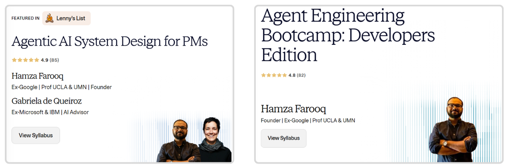

# 🤖 Agents in Action
## 💡 Why We Built This Course

Artificial Intelligence is changing faster than ever but most people still experience it passively, through chatbots and demos. We built **Agents in Action** to change that.

This course was born out of a simple belief:

`You shouldn’t need a technical background and years of coding experience to build something intelligent and useful with AI.`

Today, **Large Language Models (LLMs)** have evolved into **AI agents** — systems that can think, plan, and take real-world actions. Yet, most existing resources stop at the “chat” level. They explain prompts and APIs but rarely show how to connect models with tools, data, and automation to create something that actually works.

That’s where **Agents in Action** comes in.

We wanted to **bridge the gap between AI theory and real-world application** — giving you not just the concepts, but also the workflows, integrations, and hands-on projects to bring intelligent systems to life.

This course takes you step-by-step through the evolution of AI agents — from understanding how LLMs reason, to building full-fledged agents that can

- perform deep research,
  
- generate useful content,
  
- find prospecting customers, and
  
- build other agents.

Every chapter is designed with **accessibility and actionability** in mind:

- You’ll use **n8n**, a powerful no-code automation platform, to visualize agent logic.
- You'll learn how to develop interactive frontend for your agents using **Lovable**.
- You’ll connect **webhooks, APIs, and tools** to make your agents truly interactive.
- You’ll learn to build **chatbots, RAG systems, research assistants, and more** — all without heavy coding.

We built this course because we believe the next wave of AI innovation will come not from tech giants, but from **makers, creators, and problem-solvers** like you — people who can think creatively and use simple tools to build meaningful, intelligent solutions.

So whether you’re a student, a startup founder, a researcher, or just curious about where AI is headed — this is your invitation to dive in, build your first agent, and become part of the **agentic future**.

**Build, connect, and deploy your own AI agents — one workflow at a time.**

## 📚 Learn While You Build

All projects here are part of the following courses on Maven:

- 🤖 [Agentic AI System Design for PMs — _For Leaders, Managers & Career Builders_](https://maven.com/boring-bot/ml-system-design?promoCode=201OFF)
- 💻 [Agent Engineering Bootcamp: Developers Edition — _For Developers, Engineers & Researchers_](https://maven.com/boring-bot/advanced-llm?promoCode=200OFF)

These are hands-on, code-first/no-code programs where 10,000+ learners have already joined us to build autonomous, multi-agent systems using n8n and Lovable.

---

[🏠 **Home** - Agents in Action](https://traversaal-ai.github.io/agents-in-action)

[➡️ **Next** - From LLMs to AI Agents](https://traversaal-ai.github.io/agents-in-action/from-llms-to-ai-agents/)

