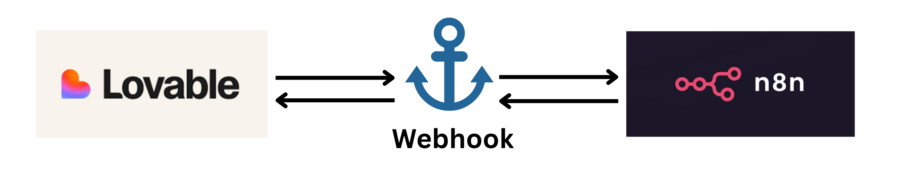

# Connect n8n to Lovable using Webhooks

## Why connect Lovable → n8n

**Lovable** gives you a front-end app builder (forms, UI, etc) and you can trigger backend logic via webhooks. 

**n8n** gives you the automation/orchestration engine with triggers, nodes, AI, and integrations. 

Together you can:
- Capture user input in Lovable → send it to n8n for processing (AI model, data lookup, etc)
- n8n does logic, maybe calls an LLM, maybe writes to database, then returns result to Lovable
- You end up with a connected stack: UI (Lovable) + logic/automation (n8n) with no full backend required

## Pre-requisites

Before you begin, you MUST have:
- A Lovable project you can edit (form or UI element that can call a webhook)
- n8n instance (cloud or self-hosted) accessible publicly (so Lovable can hit it)
- Basic familiarity with n8n: you know how to create a workflow, add a Webhook node, and activate it

## Step 1: Create the workflow in n8n

1. In n8n, create a **new workflow**.
2. Add a **Webhook** node (Trigger) → this will be the endpoint Lovable hits.
  - In the Webhook node: choose HTTP Method (usually POST) and define the **Path** (e.g., /lovable-webhook).
  - Note the Webhook URL shown (test and production URLs). 
3. Add further nodes after the Webhook: e.g., a **Code** node or **AI Model** node to process the incoming payload.
4. (Optional) Add a **Respond to Webhook** node so you can send a response back to Lovable (e.g., result JSON).
5. Activate the workflow so the production webhook URL is registered.

## Step 2: Configure Lovable to send data to the n8n webhook

1. In your Lovable project, create (or edit) a UI element / form that collects whatever user input you need (e.g., user message, lead info, etc).
2. In Lovable's integrations or in the UI logic, set the **Webhook destination** to the n8n webhook URL you obtained in Step 1.
  - Configure it to send a POST request, with JSON payload containing the form data.
3. On the Lovable side you might need to map form fields to JSON keys expected by n8n.
4. Save/deploy your Lovable page so when a user submits the form, it triggers the webhook call.

## Step 3: Handle the data in n8n

Once Lovable hits the webhook, n8n receives the payload. Inside your workflow you can:
  - Inspect incoming data ($json["fieldName"])
  - Use an AI node, e.g., send the input to a ChatGPT model
  - Store results in Google Sheets, Supabase, Airtable, etc (via integration nodes)
  - Send back a response to Lovable with summary or next step
If you added a **Respond to Webhook** node, make sure it’s placed after the processing node(s) so Lovable gets the processed result.

## Step 4: Test & debug

- Fill out the form in Lovable → check that the workflow in n8n triggers (check Executions tab).
- In the Webhook node in n8n you can view the “Test URL” mode to listen for the event.
- If something fails: check the payload structure, HTTP method, and response status.
- Common issue: Lovable UI expects a prompt response within a timeout. If your n8n workflow takes too long, Lovable may throw an error.
- Also ensure your webhook URL is correct and accessible.

## Working Sample: Mini-Workflow (n8n + Lovable) 

Here’s a simple workflow you might build:

- **Trigger**: Lovable form → fields: userName, question
- **Webhook** (n8n) receives { "userName": "...", "question": "..." }
- **AI node**: Use OpenAI Chat to answer question, maybe referencing userName
- **Google Sheets node**: Log the submission and answer
- **Respond to Webhook**: Return { "answer": "<AI response here>" }
- **On the Lovable side**: when the webhook returns, display answer on screen

## Tips & Tricks
- Use Test URL first in n8n while developing, then switch to Production URL when activating. 
- Ensure Lovable’s frontend expects the response from n8n within its timeout window. Long workflows may fail on the UI.
- Use Respond to Webhook if you need to return data back to Lovable; otherwise Lovable may continue waiting.
- Map JSON keys clearly on both sides: Lovable → payload; n8n → $json["key"] extraction.

## Takeaways
Connecting Lovable and n8n via webhooks gives you a powerful, no-code stack: Lovable for UI/frontend, n8n for backend logic & automation. With just a form in Lovable and a webhook trigger in n8n you can build real-time AI workflows, logging, integrations, and return results to users. Once you’ve done it once, you’ll be amazed how many product flows you can build this way.

---

Don’t forget to check out my **Agentic AI System Design for PMs** course on Maven if you are interested to be a part of something bigger.

