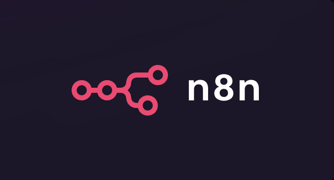
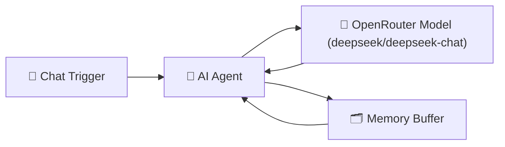

# 🧩 Getting Started with n8n — The Open-Source Playground for AI Workflows
### **Learn how to automate anything** — from daily reports to AI-powered research agents — using n8n, the open-source orchestration tool that bridges automation and intelligence.

In a world full of no-code tools, n8n stands out as the open-source platform where automation meets intelligence. It’s not just another workflow builder — it’s a flexible orchestration system that lets you connect APIs, apps, and AI models using a simple visual interface.

You can automate repetitive tasks, experiment with AI agents, or even coordinate full-scale production systems — all without managing complex infrastructure.

## 🧠 What is n8n?

n8n (short for nodemation) combines “node” — for its modular Node.js foundation — and “mation” — for automation, its core purpose.

At its heart, n8n is a **visual workflow automation tool**. You drag nodes onto a canvas, connect them, and watch data flow through the system like logic made visible.

It’s open-source, extendable, and self-hostable — giving you full control over where and how your automations run.

### Why It’s Different

🧩 **No-code + code flexibility**: Build visually, and drop in JavaScript or Python when you need custom logic.

🌐 **Open-source & self-hostable**: Use it on the cloud or run it privately for full data ownership.

⚡ **AI-ready orchestration**: Combine LLMs, APIs, and human steps in the same workflow.

In short: n8n is the bridge between AI’s intelligence and automation’s reliability.

## ⚙️ Orchestration Over Autonomy

While AI agents can reason and act on their own, they often lack structure — leading to unpredictable results. n8n solves that by providing orchestration: a controlled environment where you can define when things run, what happens if something fails, and when a human should step in.

Think of it as the **nervous system** for your AI — connecting intelligent “brains” (like OpenAI or Anthropic models) to real-world actions, APIs, and data pipelines.

With n8n, you can:

- Schedule or trigger tasks automatically
- Retry failed steps or log outcomes
- Pass structured data between AI models and APIs
- Include human review loops where needed

## ☁️ How to Host n8n

You can use n8n in three main ways:

1. **n8n Cloud** (SaaS) — simplest way to start, hosted by n8n.io
2. **Self-host** via Docker (recommended)
3. **VPS Hosting** — for 24/7 uptime and full control (For example: Hostinger)

Once running, you’ll see the n8n Canvas, where you drag, drop, and connect nodes visually.

## 🧱 Core Building Blocks

Every n8n workflow is built from a few simple yet powerful components:

- **Nodes**: The core units of work — each node performs one action, like calling an API or sending an email.
- **Edges**: Connections that pass data from one node to another.
- **Triggers**: Nodes that start a workflow — such as a webhook, schedule, or manual input.
- **Workflows**: The overall blueprint tying everything together.

n8n includes nodes for almost every scenario:

- **Trigger Nodes**: Start processes automatically (e.g., schedule, webhook, or form submission).
- **Action Nodes**: Execute tasks like sending messages or creating records.
- **AI Nodes**: Run prompts, call chat models, or manage AI agents.
- **Utility Nodes**: Filter, merge, or transform data between steps.
- **Code Nodes**: Add JavaScript or Python logic when built-ins aren’t enough.
- **Human-in-the-Loop Nodes**: Pause the automation for approvals or input.

### 🔔 Trigger Nodes

Start workflows automatically:

- **Schedule Trigger** — run daily, weekly, hourly, etc.
- **Webhook Trigger** — start when an API call hits your endpoint
- **Manual Trigger** — start manually for testing

### 🤖 AI & Logic Nodes

- **Model** — send a prompt to an LLM (OpenAI, Anthropic, etc.)
- **AI Agent** — create an autonomous agent with memory and tools
- **If / Switch / Merge** — control logic and branches
- **Loop / Sub-workflow** — iterate or modularize logic

### ⚙️ Integration & Utility Nodes

- **HTTP Request** — call any API
- **Google Sheets** / Notion / Slack / Supabase / Airtable
- **Code Node** — run JavaScript/Python snippets
- **Wait** — manage flow timing

### 💬 Human-in-the-loop
Pause the workflow and wait for a human decision (approval or input) before continuing — a key pattern for AI-assisted automation.

## 💬 Hello n8n — Your First Agent Workflow
Let’s build your first automation to see n8n in action.

### ✨ Overview

This workflow demonstrates how a **chat message** can trigger an n8n workflow that talks to an **AI model via OpenRouter** and shows how prompt wording changes the response.

---

### 🚀 Key Features

- 💬 **Chat Trigger** — starts when you send a message in n8n chat.
- 🧠 **AI Agent** — the “brain” that follows simple communication rules.
- 🤖 **OpenRouter Model** — generates replies using the `deepseek/deepseek-chat` model.
- 🗂️ **Memory** — keeps short-term context for smoother, natural conversation flow.

---

### 🔄 How It Works

1. 💬 You send a message in n8n’s built-in Chat view.
2. 🧠 The **AI Agent** applies short, clear response rules.
3. 🤖 **OpenRouter**’s `deepseek/deepseek-chat` model generates a reply.
4. 🗂️ **Memory** retains recent chat turns so it feels continuous.

### ⚙️ Setup

1. 🗃️ Import **`start-here.json`** into your **n8n Cloud** or self-hosted workspace.
2. 🔑 Create an **OpenRouter API key** (free tier available) → [https://openrouter.ai/keys](https://openrouter.ai/keys)
3. In **n8n Credentials**, add:

   - **Credential Type:** `OpenRouter API`
   - **API Key:** paste your key

4. 🚀 Open the **Chat view** in n8n, and start typing to talk to your workflow.

### 🧩 Node Summary

| Node                         | Purpose                                       | Notes                                             |
| ---------------------------- | --------------------------------------------- | ------------------------------------------------- |
| 💬 **Chat Trigger**          | Starts when a message is received in n8n chat | No external trigger needed                        |
| 🧠 **AI Agent**              | Applies demo rules: short, simple, clear      | Highlights how prompt specificity changes answers |
| 🤖 **OpenRouter Chat Model** | Uses `deepseek/deepseek-chat`                 | Fast, inexpensive, OpenAI-compatible              |
| 🗂️ **Simple Memory**         | Keeps short conversation history              | Makes chat flow naturally                         |

---

### 📝 Try It Yourself

Type these messages in chat and compare how the AI adjusts:

- `Tell me about Paris`
- `Tell me about Paris as a foodie`
- `I have eggs and rice`

👉 Notice how the **specificity** of your prompt changes the **depth and tone** of the response.
👉 This is the foundation of understanding how **prompt engineering** affects output.

### 💡 Why OpenRouter?

OpenRouter is an open gateway that lets you access multiple AI models (like Anthropic, Mistral, DeepSeek, etc.) with a single API key.

**Benefits:**

- 🪙 Often free or cheaper per request
- 🔄 OpenAI-compatible API (drop-in replacement)
- 🧩 Works with n8n’s existing AI Agent node out of the box

✅ **You’ve now built your first AI workflow using OpenRouter!**
From here, you can connect it to external APIs, RAG pipelines, or webhooks to power real applications.

---

## Wrapping Up
n8n isn’t just another automation tool — it’s a bridge between AI and orchestration.
It gives you:
- A visual way to design and debug flows
- Native support for LLMs and agents
- Seamless integration with your entire app stack

Whether you’re automating reports, coordinating agents, or running production-grade RAG pipelines — **n8n is your starting point for AI-native workflows**.

---

Don’t forget to check out my **Agentic AI System Design for PMs** course on Maven if you are interested to be a part of something bigger.

