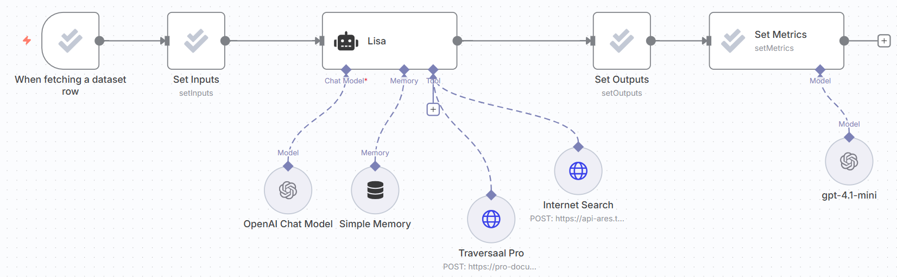

# 📊 LISA Evaluation Workflow

## Automated Evaluation Pipeline for AI Agents in n8n

The **Lisa Evaluation Workflow** is a demonstration workflow designed to showcase how to evaluate AI agents in n8n using the native Evaluation framework. It builds on the original [**LISA – Your First Agent**](https://github.com/traversaal-ai/agents-in-action/tree/main/Lisa-your-first-agent) workflow and introduces dataset-driven testing, automated metric calculation, and reproducible evaluation runs.

This workflow is ideal for classes, workshops, and teams looking to understand how to systematically assess AI agent quality instead of relying on manual testing.

---

## 🎯 Purpose

This workflow is part of our hands-on teaching material on **Agentic AI & n8n Evaluations**. It demonstrates how to:
- Evaluate an AI agent against a **ground-truth dataset**
- Run **batch evaluations** using Google Sheets
- Compare **expected vs actual answers**
- Automatically compute **evaluation metrics** using an LLM
- Teach best practices for **LLM evaluation in production workflows**

---

## 🌟 Key Features

- 📄 **Dataset-Driven Evaluation** using Google Sheets
- 🤖 **Same Agent, Different Context** – Reuses Lisa with evaluation constraints
- 🧠 **Short, Deterministic Answers** for easier comparison
- 🌐 **Tool-Aware Agent** (Internet Search + Traversaal Pro RAG)
- 📊 **Automated Metrics** using n8n Evaluation nodes
- 🔁 **Repeatable & Scalable** evaluation runs
- 🎓 **Perfect for Teaching** n8n Evaluations

---

## 🔄 How It Works

```bash
Google Sheets Dataset
        ↓
Evaluation Trigger
        ↓
Set Inputs (question)
        ↓
Lisa Agent
  ├── Internet Search (Ares)
  ├── Traversaal Pro (AWS Docs)
  ├── Memory (per user)
        ↓
Set Outputs (actual_answer)
        ↓
Set Metrics (LLM-based evaluation)
```

---

## 🏗️ Architecture



---

## 🧪 Evaluation Dataset

The workflow uses a **dummy evaluation dataset** stored in Google Sheets.

### Dataset Schema
| Column Name |	Description |
| ----------- | ----------- |
| `username` |	Unique user/session identifier |
| `query` |	Question sent to the agent |
| `ground_truth` |	Expected correct answer |
| `actual_answer` |	Filled automatically by workflow |

### Sample Rows
| username |	query |	ground_truth |
| user_1 |	What is Amazon S3 and what is it used for?	| S3 is a fast, scalable, and durable object-storage service used to store and retrieve any type and any amount of data. |
| user_5 |	What is the maximum execution time for Lambda functions? |	The maximum execution time for a Lambda function is 15 minutes. |
| user_10 |	What are DynamoDB secondary indexes used for?	| Secondary indexes provide the ability to query a table without using the primary key. |

### 📌 Note:
`actual_answer` is populated automatically during evaluation runs.

---

## ⚙️ Workflow Components

#### 1️⃣ Evaluation Trigger
- Reads one row at a time from Google Sheets
- Enables **batch evaluation**
- Each row becomes a single test case

### 2️⃣ Set Inputs
- Maps dataset fields to agent inputs
- Passes `query` → `question` for Lisa

### 3️⃣ Lisa (Evaluation Mode)
- Same agent logic as production
- **System prompt constrained**:
    - *“Answer the question in just one short sentence.”*
- This improves:
    - Determinism
    - Metric reliability
    - Reduced hallucinations

### 4️⃣ Tools Used by Lisa
- 🌐 **Ares Internet Search** – for general knowledge
- 📚 **Traversaal Pro RAG** – for AWS documentation
- 🧠 **Memory Buffer** – session-based using username

## 5️⃣ Set Outputs
- Captures Lisa’s response
- Writes it back to Google Sheets as `actual_answer`

## 6️⃣ Set Metrics
- Compares:
    - `ground_truth`
    - `actual_answer`
- Uses **GPT-4.1-mini** as an evaluation judge
- Enables semantic evaluation beyond string matching

---

## 🛠️ Setup Instructions

### Prerequisites
- n8n (Cloud or Self-Hosted)
- OpenAI API Key
- Traversaal API Access
- Google Sheets account

### 1️⃣ Import the Workflow
1. Copy the **Lisa Evaluation Workflow JSON**
2. In n8n → **Import Workflow**
3. Save as `Lisa Evaluation Workflow`

### 2️⃣ Configure Credentials
**OpenAI**

- Add OpenAI credentials in n8n
- Used by:
    - Lisa Agent
    - Metrics Evaluation Model
  
**Google Sheets**

- Connect Google Sheets OAuth
- Ensure read/write access to the dataset

**Traversaal APIs**

- Ares Internet Search
```bash
{
  "name": "x-api-key",
  "value": "your_ares_api_key"
}
```

- Traversaal Pro RAG
```bash
{
  "name": "Authorization",
  "value": "Bearer your_traversaal_token"
}
```

### 3️⃣ Link the Dataset
- Open **Evaluation Trigger**
- Select:
    - Google Sheet document
    - Sheet name
- Ensure columns match dataset schema

---

## ▶️ Running an Evaluation
1. Open **Lisa Evaluation Workflow**
2. Click **Execute Workflow**
3. n8n will:
    1. Fetch each dataset row
    2. Run Lisa
    3. Store actual answers
    4. Compute evaluation metrics
4. Results appear in:
    - Google Sheets
    - n8n execution logs

---

## 📈 What This Teaches

This workflow is intentionally designed for **learning**:
- Why **evaluation datasets** matter
- How to separate **agent logic from evaluation**
- How to avoid brittle string matching
- How to scale AI testing beyond manual prompts
- How n8n Evaluations fit into real AI systems

---

## 🔧 Customization Ideas
- Add more columns (difficulty, category, source)
- Swap AWS docs with your own RAG corpus
- Add multiple agents for A/B testing
- Introduce grading rubrics (correctness, clarity)
- Store metrics in a database instead of Sheets

---

## 🔝 Best Practices Highlighted

- Keep evaluation prompts **short & constrained**
- Use **semantic metrics**, not exact matches
- Separate **production** and **evaluation** workflows
- Always version your datasets
- Re-run evaluations after prompt or model changes

---

## 🐛 Troubleshooting

- **No answers written** → Check Google Sheets write permissions
- **Wrong tool usage** → Inspect agent reasoning logs
- **Low scores** → Review prompt constraints and ground truth
- **API errors** → Validate keys and quotas
Enable **debug mode** in n8n for deeper inspection.

---

## 🤝 Contributing

Contributions are welcome!

- Improve evaluation metrics
- Add multi-agent comparison
- Extend dataset templates
- Create visualization workflows
- Submit PRs with clear explanations.

---

## 🎓 Ready to Level-Up?

Join our courses on Maven and never stop learning:
- 🤖 [Agentic AI System Design for PMs — _For Leaders, Managers & Career Builders_](https://maven.com/boring-bot/ml-system-design?promoCode=201OFF)
- 💻 [Agent Engineering Bootcamp: Developers Edition — _For Developers, Engineers & Researchers_](https://maven.com/boring-bot/advanced-llm?promoCode=200OFF)

---

## Happy Evaluating! 🚀
