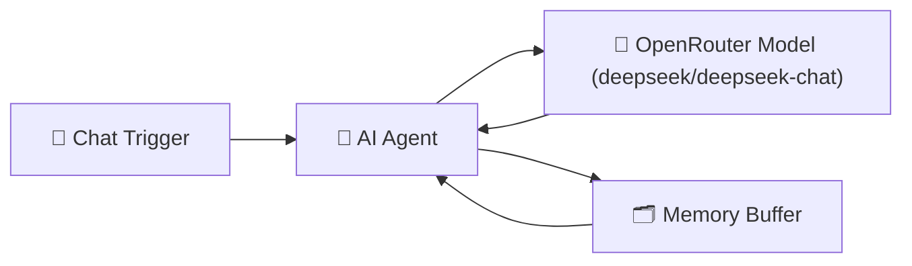

# 💬 Start Here — Your First AI Workflow in n8n

This folder contains the **“Hello World” AI Workflow** for n8n — now updated to use **OpenRouter** instead of OpenAI.
It’s the simplest way to see how n8n can connect to a free or low-cost AI model and respond to your messages.

---

## ✨ Overview

This workflow demonstrates how a **chat message** can trigger an n8n workflow that talks to an **AI model via OpenRouter** and shows how prompt wording changes the response.

---

## 🚀 Key Features

- 💬 **Chat Trigger** — starts when you send a message in n8n chat.
- 🧠 **AI Agent** — the “brain” that follows simple communication rules.
- 🤖 **OpenRouter Model** — generates replies using the `deepseek/deepseek-chat` model.
- 🗂️ **Memory** — keeps short-term context for smoother, natural conversation flow.

---

## 🔄 How It Works

1. 💬 You send a message in n8n’s built-in Chat view.
2. 🧠 The **AI Agent** applies short, clear response rules.
3. 🤖 **OpenRouter**’s `deepseek/deepseek-chat` model generates a reply.
4. 🗂️ **Memory** retains recent chat turns so it feels continuous.

---

## ⚙️ Setup

1. 🗃️ Import **`start-here.json`** into your **n8n Cloud** or self-hosted workspace.
2. 🔑 Create an **OpenRouter API key** (free tier available) → [https://openrouter.ai/keys](https://openrouter.ai/keys)
3. In **n8n Credentials**, add:

   - **Credential Type:** `OpenRouter API`
   - **API Key:** paste your key

4. 🚀 Open the **Chat view** in n8n, and start typing to talk to your workflow.

---

## 🧩 Node Summary

| Node                         | Purpose                                       | Notes                                             |
| ---------------------------- | --------------------------------------------- | ------------------------------------------------- |
| 💬 **Chat Trigger**          | Starts when a message is received in n8n chat | No external trigger needed                        |
| 🧠 **AI Agent**              | Applies demo rules: short, simple, clear      | Highlights how prompt specificity changes answers |
| 🤖 **OpenRouter Chat Model** | Uses `deepseek/deepseek-chat`                 | Fast, inexpensive, OpenAI-compatible              |
| 🗂️ **Simple Memory**         | Keeps short conversation history              | Makes chat flow naturally                         |

---

## 📝 Try It Yourself

Type these messages in chat and compare how the AI adjusts:

- `Tell me about Paris`
- `Tell me about Paris as a foodie`
- `I have eggs and rice`

👉 Notice how the **specificity** of your prompt changes the **depth and tone** of the response.
👉 This is the foundation of understanding how **prompt engineering** affects output.

---

## 💡 Why OpenRouter?

OpenRouter is an open gateway that lets you access multiple AI models (like Anthropic, Mistral, DeepSeek, etc.) with a single API key.

**Benefits:**

- 🪙 Often free or cheaper per request
- 🔄 OpenAI-compatible API (drop-in replacement)
- 🧩 Works with n8n’s existing AI Agent node out of the box

---

## 📚 References

- 📘 [OpenRouter API Docs](https://openrouter.ai/docs)
- 🧩 [n8n LangChain Nodes Overview](https://docs.n8n.io/integrations/builtin/ai/langchain/)
- 🧠 [DeepSeek-Chat Model Card](https://openrouter.ai/models/deepseek/deepseek-chat)

---

## 🎓 Learn More

Want to go beyond “Hello World”?
Check out:

- [AI Bootcamp — _For Leaders & Managers_](https://maven.com/boring-bot/ml-system-design?promoCode=201OFF)
- [Agent Engineering Bootcamp — _For Developers & Engineers_](https://maven.com/boring-bot/advanced-llm?promoCode=200OFF)

👉 These courses expand on this workflow and teach you how to build **production-grade AI agents** and **connect them to real data and APIs** using n8n.

---

✅ **You’ve now built your first AI workflow using OpenRouter!**
From here, you can connect it to external APIs, RAG pipelines, or webhooks to power real applications.

---
