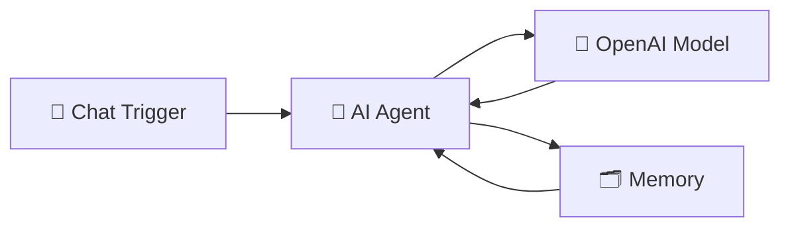

# 💬 Start Here — Your First AI Workflow in n8n

This folder contains the **“Hello World” AI Workflow** for n8n.
It’s the simplest way to see how n8n can connect to an AI model and respond to your messages.

---

## ✨ Overview

This workflow demonstrates how a **chat message** can trigger an n8n workflow that talks to **OpenAI GPT** and shows how prompt wording changes the response.

---

## 🚀 Key Features

- 💬 **Chat Trigger** — starts when you send a message in n8n chat.
- 🧠 **AI Agent** — the “brain” that handles conversation rules.
- 🤖 **OpenAI Model** — generates responses using GPT (e.g. `gpt-4o-mini`).
- 🗂️ **Memory** — remembers what you said earlier for smoother replies.

---

## 🔄 How It Works

1. 💬 **Send a message** in n8n chat.
2. 🧠 **AI Agent** receives it.
3. 🤖 **OpenAI** generates a reply.
4. 🗂️ **Memory node** keeps track of context so the AI can recall earlier messages.

---

## ⚙️ Setup

1. 🗃️ Import `start-here.json` into your **n8n Cloud** workspace.
2. 🔑 Add your **OpenAI API key** in n8n Credentials.
3. 🚀 Open the **Chat view** in n8n and start typing.

---

## 📝 Try It Yourself

Here are some prompts to test how wording changes answers:

- `Tell me about Paris`
- `Tell me about Paris as a foodie`
- `I have eggs and rice`

👉 Notice how the more **specific your prompt**, the more **tailored the answer**.

👉 Each example shows how vague vs. specific prompts change the answer.

---

## 💡 Inspiration

- With just 4 nodes, you’ve built a working **AI agent workflow**.

---

## 📚 References

- 📖 [n8n Documentation — Getting Started](https://docs.n8n.io/try-it-out/quickstart/)

---

## 🎓 Learn More

Ready to go deeper?  
Check out these courses:

- [AI Bootcamp: _For Leaders & Managers_](https://maven.com/boring-bot/ml-system-design?promoCode=201OFF)
- [Agent Engineering Bootcamp: _For Developers & Engineers_](https://maven.com/boring-bot/advanced-llm?promoCode=200OFF)

👉 These resources expand on the workflows here and show how to apply AI + n8n in real projects.
