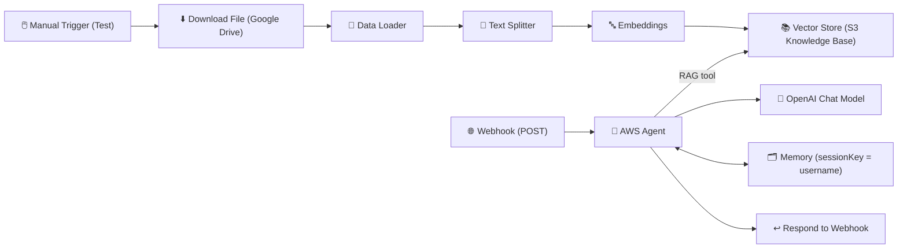

# 🪣 301 — Webhook + RAG (AWS Agent)

This folder contains the **Webhook + Retrieval-Augmented Generation (RAG)** workflow for n8n.
It introduces **document retrieval** into the loop: the agent first checks an **S3 knowledge base** for answers, then falls back to the model for other AWS topics.

---

## ✨ Overview

This workflow expands on the **201-basic** pattern by adding **document loading, text splitting, embeddings, and a vector store**.
It creates an **AWS Agent** that:

- 📂 Uses RAG for **Amazon S3 questions**
- 🤖 Uses the LLM for **other AWS questions**
- 🙅 Politely refuses **non-AWS questions**

---

## 🔄 How It Works



1. **Webhook** receives a POST request (`query`, `username`).
2. **AWS Agent** decides:

   - If S3-related → query the **Vector Store** (RAG).
   - If another AWS service → use the model’s own knowledge.
   - If not AWS → politely refuse.

3. **Vector Store** is built from documents: downloaded → split → embedded.
4. **Memory** keeps per-username context.
5. **Respond to Webhook** returns the reply.

---

## 🛂 Inputs (JSON Body)

- `query` _(string, required)_ → User’s question.
- `username` _(string, recommended)_ → Stable ID for memory context.

**Example**

```json
{
  "query": "How do I create an S3 bucket policy for public read?",
  "username": "demo-user-1"
}
```

---

## 📤 Output

- HTTP 200 with the agent’s reply.
- Responses indicate which knowledge source was used:

  - **(Answer based on S3 knowledge base)**
  - **(Answer based on model knowledge)**

---

## ⚙️ Setup

1. **Import** `301-webhook-rag.json` into your n8n Cloud workspace.
2. **Credentials** → configure:

   - 🔑 OpenAI API
   - 🔑 Google Drive (for file download)

3. **Activate** the workflow to get the **Production Webhook URL**.
4. Update the **Download File** node’s `fileId` to point to your own AWS S3 reference doc in Google Drive.

---

## 🧪 Try It

### Option A — **Google Colab (Recommended)**

1. Open the instructor’s Colab:
   **[301 Webhook + RAG — Client (Colab)](https://colab.research.google.com/drive/1o66IjJDEQZ404gs5MNiItm2WqxcU2bzx?usp=sharing)**
2. Click **Copy to Drive** (or **File → Save a copy in Drive**) to make an editable copy.
3. In n8n, **activate** this workflow and copy the **Production Webhook URL** (from the Webhook node, not the Test URL).
4. In your Colab copy, find the webhook URL variable (`url` or `WEBHOOK_URL`) and **replace it with your Production Webhook URL**.
5. Run all cells. Try prompts like:

   - **S3 (RAG expected):** “How do I enable S3 versioning?”
   - **Other AWS (model expected):** “How do I resize an EC2 instance?”
   - **Non-AWS (refusal expected):** “Tell me about Paris.”

> 💡 Use the same `username` value in the payload to see memory continuity; change it to start a fresh session.

### Option B — cURL

```bash
WEBHOOK_URL="https://<your-n8n>/webhook/<id>"   # Paste the Production URL
curl -X POST "$WEBHOOK_URL" \
  -H "Content-Type: application/json" \
  -d '{"query":"How do I enable S3 versioning?","username":"demo-user-1"}'
```

### Option C — Postman

1. Create a new **POST** request to your **Production Webhook URL**.

2. Body → **raw** → **JSON**:

   ```json
   {
     "query": "How do I enable S3 versioning?",
     "username": "demo-user-1"
   }
   ```

3. Send → See the reply.

---

## 🧠 What to Notice (Teaching Points)

- Learners see how **retrieval changes answers** (RAG vs model).
- Workflow demonstrates **conditional tool use** inside the Agent.
- Introduces **document ingestion** (Download → Split → Embed → Store).
- Shows clear refusal logic for out-of-scope questions.

---

## 📚 References

- 📖 [Amazon S3 Getting Started Guide](https://cdn2.hubspot.net/hubfs/4423734/marketing/vendor%20insights/AWS/White%20papers/S3-Getting%20Started%20Guide.pdf)
- 📖 [n8n — Simple Vector Store node](https://docs.n8n.io/integrations/builtin/cluster-nodes/root-nodes/n8n-nodes-langchain.vectorstoreinmemory/)
- 📖 [n8n — RAG in n8n](https://docs.n8n.io/advanced-ai/rag-in-n8n/)

---

## 🎓 Learn More

Ready to go deeper?  
Check out these courses:

- [AI Bootcamp: _For Leaders & Managers_](https://maven.com/boring-bot/ml-system-design?promoCode=201OFF)
- [Agent Engineering Bootcamp: _For Developers & Engineers_](https://maven.com/boring-bot/advanced-llm?promoCode=200OFF)

👉 These resources expand on the workflows here and show how to apply AI + n8n in real projects.
