# 🪝 Webhook Extended → OpenAI (with Memory) + RAG + Internet Search

This folder contains an **extended n8n workflow** that demonstrates a more realistic **AI Agent backend** pattern:

  **HTTP in → AI Agent → Tools (RAG + Internet) → OpenAI → HTTP out**,  
  with **per-user memory** and **prompt sensitivity** built in.

This workflow is designed as a **production-ready reference** for showing how:
- Prompt wording changes AI responses
- Context is preserved across requests
- External knowledge (RAG + live search) is integrated cleanly

---

## ✨ Overview

Send a `POST` request to an n8n **Webhook** with a user query.
The **AI Agent** analyzes how specific or vague the prompt is, optionally calls tools, and returns a short, clear response.

This workflow is ideal for:
- Prompt engineering demos
- AI backend prototypes
- RAG + tool-calling examples
- Teaching agentic workflows in n8n

---

## 🚀 Key Features

- 🌐 **Webhook Trigger** — HTTP POST entry point.
- 🧠 **AI Agent** — demonstrates how wording affects responses.
- 🤖 **OpenAI Chat Model** — `gpt-4.1-mini` (fast + strong instruction following).
- 🗂️ **Memory (Window)** — per-user session via `username`.
- 📚 **RAG Tool** — retrieves structured knowledge from documents.
- 🔍 **Internet Search Tool** — optional live information lookup.
- ↩️ **Respond to Webhook** — returns AI output to the client.

---

## 🔄 How It Works

```mermaid
graph LR
  A["🌐 Webhook (POST)"] --> B["🧠 AI Agent"]
  B --> C["🤖 OpenAI Chat Model (gpt-4.1-mini)"]
  B <--> D["🗂️ Memory (sessionKey = username)"]
  B --> E["📚 RAG Tool"]
  B --> F["🔍 Internet Search"]
  B --> G["↩️ Respond to Webhook"]
```

---

### Step-by-step

1. Client sends a **POST** request with JSON payload.
2. **Webhook** extracts `body.query` and `body.username`.
3. **AI Agent**:
    - Evaluates prompt specificity
    - Applies response rules
    - Calls tools if needed (RAG / Internet)
4. **OpenAI** model generates the final response.
5. **Memory** preserves context per user.
6. Response is returned to the caller.

---

## 🧠 AI Agent Behavior (Core Logic)

The agent is explicitly instructed to **demonstrate prompt sensitivity**:
- **Vague prompt** → general answer + suggestion to be more specific
- **Specific prompt** → focused, tailored response
- Uses clear, everyday language
- Keeps responses short and readable (2–3 sentences)

---

## 🏛️ Architecture

---

## 🛂 Inputs (JSON Body)

### Required

- `query` *(string)* — the user’s prompt or question

### Recommended

- `username` *(string)* — used as the session key for memory

### Example Request

`{
  "query": "Tell me about AWS S3 storage classes",
  "username": "demo-user-1"
}`

---

## 📤 Output

- HTTP **200 OK**
- Body contains the AI-generated reply
- Typically plain text (can be wrapped in JSON if desired)

---

## ⚙️ Setup Instructions

### 1️⃣ Import Workflow

Import the JSON file into your **n8n workspace**

### 2️⃣ Configure Credentials

**OpenAI**
- Model: `gpt-4.1-mini`
- Ensure API key is configured

**RAG Tool**
- Set Authorization header (`Bearer <token>`)

**Internet Search Tool**
- Add `x-api-key`

### 3️⃣ Activate Workflow
- Click **Activate** (top-right)
- Open the **Webhook** node
- Copy the **Production Webhook URL**

⚠️ Always use the **Production URL**. 
The Test URL is temporary and will not work for real clients.

---

## 🧪 Try It Out

### 🔹 Option A — cURL

WEBHOOK_URL="https://<your-n8n>/webhook/cc748180-1392-4012-bdb8-48453dcb87dd"

`
curl -X POST "$WEBHOOK_URL" \
  -H "Content-Type: application/json" \
  -d '{
    "query": "What are best practices for a PM role?",
    "username": "demo-user-1"
  }'
`

### 🔹 Option B — Postman

1. Method: **POST**
2. URL: Production Webhook URL
3. Headers:
  - `Content-Type: application/json`
4. Body → raw → JSON:
`
{
  "query": "Explain AWS S3 in simple terms",
  "username": "demo-user-1"
}
`

---

## 🧰 Troubleshooting

| Issue |	Likely Cause |
|------|--------------|
| 404 / 405 | Workflow not active or wrong HTTP method |
| No response | Missing `query` in JSON |
| Memory not working | `username` missing or changing |
| Tool not called | Prompt not specific enough |
| Auth errors | Missing API keys in credentials |

---

## 🧠 Teaching & Learning Takeaways

- Prompt wording directly affects:
  - Tool usage
  - Answer depth
  - Relevance
- Memory enables **true conversational context**
- RAG + Internet tools show **real-world AI augmentation**
- This pattern is foundational for:
  - AI assistants
  - Chatbots
  - Product demos
  - Agentic AI systems

---

## 🎓 Ready to Level-Up?
Join our courses on Maven and never stop learning:
- 🤖 [Agentic AI System Design for PMs — _For Leaders, Managers & Career Builders_](https://maven.com/boring-bot/ml-system-design?promoCode=201OFF)
- 💻 [Agent Engineering Bootcamp: Developers Edition — _For Developers, Engineers & Researchers_](https://maven.com/boring-bot/advanced-llm?promoCode=200OFF)

These courses go deeper into:
- Multi-agent systems
- RAG pipelines
- Evaluation strategies
- Real-world deployment patterns

---

🚀 **This workflow is a strong foundation for building serious AI products with n8n.**

Copy it, extend it, and adapt it to your own use cases.
