# 🛰️ 401 — Webhook + RAG + Internet Search (AWS Knowledge Agent)

This folder contains the **Webhook + RAG + Internet Search** workflow for n8n.
It extends `301` by adding a **web search fallback** for **non-S3 AWS** questions, while still using a **vector store (RAG)** for **S3** queries, and politely refusing **non-AWS** topics.

---

## ✨ Overview

This workflow demonstrates **tool-routed answering** inside an n8n Agent:

- 📦 **S3 questions → RAG** (vector store built from your S3 docs)
- 🌐 **Other AWS questions → Internet Search** (up-to-date info)
- 🚫 **Non-AWS** → respectful refusal

Learners see how an agent can **classify**, **choose tools**, and **ground answers**.

---

## 🔄 How It Works

### Ingestion (one-time / as needed)

```mermaid
graph LR
  MT["🖱️ Manual Trigger"] --> GD["⬇️ Google Drive: Download File"]
  GD --> DL["📂 Data Loader"]
  DL --> TS["📄 Text Splitter"]
  TS --> EM["🔤 Embeddings"]
  EM --> VS["📚 Vector Store (S3 KB)"]
```



### Runtime (per request)

```mermaid
graph LR
  WB["🌐 Webhook (POST)"] --> AG["🧠 AI Agent (Router)"]
  AG --> MEM["💾 Memory (sessionKey = username)"]
  AG --> LLM["🤖 OpenAI Chat Model"]
  AG --> S3["📦 s3_knowledge_base (RAG)"]
  AG --> NET["🌐 internet_search (HTTP Tool)"]
  AG --> RSP["↩️ Respond to Webhook"]
```



1. **Webhook** receives `{ query, username }`.
2. **AI Agent** classifies:

   - If **S3** → query **s3_knowledge_base** (RAG) and answer.
   - If **AWS but not S3** → call **internet_search** and answer from results.
   - If **non-AWS** → refuse.

3. **Memory** keeps context per `username`.
4. **Respond to Webhook** returns the final answer.

---

## 🛂 Inputs (JSON Body)

- `query` _(string, required)_ — user question.
- `username` _(string, recommended)_ — stable ID for memory.

**Example**

```json
{
  "query": "What's the difference between S3 Standard and S3 Glacier?",
  "username": "demo-user-1"
}
```

---

## 📤 Output

- HTTP 200 with the agent’s answer.
- Replies indicate source:

  - **(Answer based on S3 knowledge base)**
  - **(Answer enriched with Internet Search results)**
  - **(Refusal: non-AWS topic)**

---

## ⚙️ Setup

1. **Import** `401-webhook-rag-search.json` into **n8n Cloud**.
2. **Credentials**

   - 🔑 **OpenAI** (for the Agent’s LLM)
   - 🔑 **Google Drive** (document download for S3 KB)
   - 🔑 **Internet Search** tool (set `x-api-key` header in the HTTP Request Tool)

3. **Activate** the workflow and copy the **Production Webhook URL**.
4. (Optional) Update **Google Drive → fileId** to your own S3 reference doc and run the **Manual Trigger** to rebuild the vector store.

> ✅ **Tip:** Keep **temperature low (0.1–0.2)** in the OpenAI node so the agent follows tool rules reliably.

---

## 🧪 Try It

### Option A — **Google Colab (Recommended)**

1. Open the instructor’s Colab:
   **[201/301/401 Webhook Client (Colab)](https://colab.research.google.com/drive/1o66IjJDEQZ404gs5MNiItm2WqxcU2bzx?usp=sharing)**
2. Click **Copy to Drive** to make it editable.
3. In n8n, **Activate** this 401 workflow and copy the **Production Webhook URL** (not the Test URL).
4. In your Colab copy, replace the webhook variable (`url` or `WEBHOOK_URL`) with the **Production URL**.
5. Run all cells. Try:

   - **S3 (RAG expected):** “How do I enable S3 versioning?”
   - **AWS non-S3 (Search expected):** “What is AWS Lambda?”
   - **Non-AWS (Refusal):** “Tell me about Paris.”

> 💡 Use the same `username` to observe memory continuity.

### Option B — cURL

```bash
WEBHOOK_URL="https://<your-n8n>/webhook/<id>"  # Production URL
curl -X POST "$WEBHOOK_URL" \
  -H "Content-Type: application/json" \
  -d '{"query":"What is AWS Lambda?","username":"demo-user-1"}'
```

### Option C — Postman

- New **POST** → Production Webhook URL
- Body → **raw** → **JSON**:

  ```json
  { "query": "How do I enable S3 versioning?", "username": "demo-user-1" }
  ```

- Send → view response.

---

## 🧠 Teaching Notes

- **Routing pattern:** Students see _S3 → RAG_ vs _other AWS → search_.
- **Guardrails:** Non-AWS questions are politely declined.
- **Grounding:** Answers always cite source mode in the closing tag.
- **Maintainability:** Docs can be refreshed without changing the runtime flow.

---

## 🩹 Troubleshooting

- **Refuses AWS question:** Ensure tool names in the Agent match node names (`s3_knowledge_base`, `internet_search`) and the Internet Search API key is set.
- **Schema errors:** Internet Search expects `{"query": ["..."]}` (array of strings). The S3 tool expects `{"query": "..."}` (string).
- **No response / 404:** Workflow may not be **Active**; use **Production** webhook URL.

---

## 📚 References

- 📖 [Amazon S3 Getting Started Guide](https://cdn2.hubspot.net/hubfs/4423734/marketing/vendor%20insights/AWS/White%20papers/S3-Getting%20Started%20Guide.pdf)
- 📖 [n8n — Simple Vector Store node](https://docs.n8n.io/integrations/builtin/cluster-nodes/root-nodes/n8n-nodes-langchain.vectorstoreinmemory/)
- 📖 [n8n — RAG in n8n](https://docs.n8n.io/advanced-ai/rag-in-n8n/)
- 📖 [n8n — Http Request node](https://docs.n8n.io/integrations/builtin/core-nodes/n8n-nodes-base.httprequest/)
- ⬢ [traversaal.ai — Ares API Documentation](https://docs.traversaal.ai/docs/intro)

---

## 🎓 Learn More

Ready to go deeper?  
Check out these courses:

- [AI Bootcamp: _For Leaders & Managers_](https://maven.com/boring-bot/ml-system-design?promoCode=201OFF)
- [Agent Engineering Bootcamp: _For Developers & Engineers_](https://maven.com/boring-bot/advanced-llm?promoCode=200OFF)

👉 These resources expand on the workflows here and show how to apply AI + n8n in real projects.
